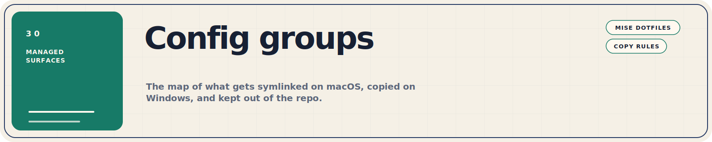
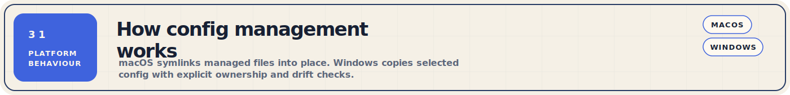
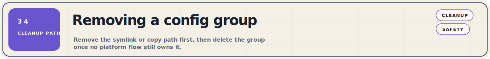

This directory contains all managed dotfile groups. Each subdirectory mirrors
the target location in `$HOME` — tuckr (macOS) symlinks individual files into
place, while the Windows personal bootstrap copies them.

Use [../README.md](../README.md) for the public bootstrap entrypoints and
[../Other/scripts/README.md](../Other/scripts/README.md) for the detailed
bootstrap and repair flow. Stay on this page when you need to know which config
group owns a file, how it lands on each platform, or how to add a new managed
surface.

The repo root also contains a separate `mise.toml` for contributor tooling.
That file powers the README asset pipeline and is distinct from the managed
`mise` config group documented on this page.



### macOS — Tuckr Symlinks

[Tuckr](https://github.com/RaphGL/Tuckr) reads each subdirectory here and
creates symlinks from `$HOME` back into this repo. For example,
`Configs/git/.gitconfig` is symlinked to `~/.gitconfig`.

```bash
# Apply all config groups
cd ~/.dotfiles && tuckr add \*

# Apply a single group
tuckr add git

# Remove a group's symlinks
tuckr rm git

# Check current symlink status
tuckr status
```

Tuckr symlinks **individual files**, not directories. The bootstrap pre-creates
`~/.ssh/` (mode 700), `~/.config/`, and `~/.codex/` before running tuckr so it
does not absorb entire directories that may contain other files.

### Windows — Selective copy

The Windows personal bootstrap
([`Other/scripts/windows/personal-bootstrap-windows.ps1`](../Other/scripts/windows/personal-bootstrap-windows.ps1))
copies
specific config groups into `$HOME` using SHA256 hash comparison to avoid
unnecessary overwrites. Currently managed:

- `git/.gitconfig` → `$HOME\.gitconfig`
- `ssh/.ssh/config` → `$HOME\.ssh\config`
- `mise/.config/mise/` → `$HOME\.config\mise\` (config.toml, .env, scripts/)
- `opencode/.config/opencode/` → `$HOME\.config\opencode\` (opencode.json, plugins/)

Each copy target is gated by an `ENABLE_*` environment variable (default:
`true`) and supports dry-run via `-DryRun`.


| Group | Target Path | Platform | Description |
|-------|-------------|----------|-------------|
| `aerospace` | `~/.aerospace.toml` | macOS | Aerospace tiling window manager configuration |
| `bash` | `~/.bashrc`, `~/.bash_profile`, `~/.hushlogin` | Both | Bash shell configuration with mise, zoxide, and worktrunk activation |
| `borders` | `~/.config/borders/bordersrc` | macOS | Window border styling for the borders utility |
| `brew` | Used by `brew bundle` | macOS | Brewfile with all Homebrew formulae, casks, and taps. Supports `HOMEBREW_GUI`, `HOMEBREW_WORK_APPS`, and `HOMEBREW_HOME_APPS` conditionals |
| `claude` | `~/.claude/settings.json` | Both | Claude Code permissions, environment variables, and skill directories. Note: `~/.claude.json` (MCP servers) is **not** managed — see [Unmanaged tools](../README.md#unmanaged-tools) |
| `codex` | `~/.codex/config.toml` | macOS | Codex CLI configuration including model defaults, approvals, sandbox settings, trust levels, and shared MCP definitions. Runtime state under `~/.codex/` is **not** managed — see [Unmanaged tools](../README.md#unmanaged-tools) |
| `fish` | `~/.config/fish/` | macOS | Fish shell config, plugins (Fisher), and variables |
| `gemini` | `~/settings.json` | Both | Gemini CLI settings including MCP server definitions |
| `ghostty` | `~/.config/ghostty/config` | macOS | Ghostty terminal emulator configuration |
| `git` | `~/.gitconfig` | Both | Git configuration (default branch, colour, push, pull, user, URL rewriting) |
| `hypr` | `~/.config/hypr/hyprland.conf` | Linux | Hyprland Wayland compositor configuration (future) |
| `mise` | `~/.config/mise/` | Both | Managed mise runtime config (`config.toml`), environment variables (`.env`), example env (`.example.env`), and task scripts (`scripts/`). This is separate from the repo-root `mise.toml` used for local contributor tasks |
| `nvim` | `~/.config/nvim/` | macOS | Neovim configuration based on Kickstart.nvim, including `init.lua`, lazy-lock, and stylua config |
| `opencode` | `~/.config/opencode/` | Both | Opencode AI assistant configuration (`opencode.json`) and plugins (mise integration) |
| `pitchfork` | `~/.config/pitchfork/` | macOS | Pitchfork configuration (Caddyfile and config.toml) |
| `ssh` | `~/.ssh/config` | Both | SSH client configuration for hosts, identity files, and tunnels. Keys are **not** included in this repo |
| `tmux` | `~/.tmux.conf` | macOS | Tmux terminal multiplexer configuration |
| `worktrunk` | `~/.config/worktrunk/config.toml` | macOS | Worktrunk (`wt`) worktree manager configuration including worktree path template and post-start hooks |
| `yazi` | `~/.config/yazi/theme.toml` | macOS | Yazi file manager theme configuration |
| `zsh` | `~/.zshrc`, `~/.zprofile` | Both | Zsh shell configuration with mise, zoxide, and worktrunk activation |


1. Create a new directory under `Configs/` named after the tool (e.g., `Configs/starship/`)
2. Mirror the target directory structure inside it. For example, if the config lives at `~/.config/starship/starship.toml`, create `Configs/starship/.config/starship/starship.toml`
3. On macOS, run `tuckr add starship` to symlink it into place
4. On Windows, if the config should be copied by the personal bootstrap, add a new `Apply-*` function in [`Other/scripts/windows/personal-bootstrap-windows.ps1`](../Other/scripts/windows/personal-bootstrap-windows.ps1) following the existing pattern (source path, destination path, SHA256 comparison, `Invoke-OrDry` gate)
5. Commit and push — tuckr and the bootstrap will pick it up on the next run



```bash
# Remove symlinks for a group
tuckr rm <group-name>

# Then delete the directory if no longer needed
rm -rf Configs/<group-name>
```

On Windows, remove the corresponding `Apply-*` function from
[`Other/scripts/windows/personal-bootstrap-windows.ps1`](../Other/scripts/windows/personal-bootstrap-windows.ps1).
