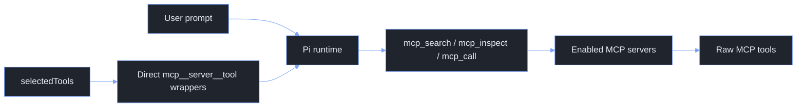

# Pi Agent Extensions

This directory contains the local Pi extensions used to add web search, web fetch, MCP routing, inline bash expansion (`!{...}`), `/btw`, and small command utilities without forking Pi itself.

The design goal is to stay close to Pi's native extension model. Extensions register Pi tools, slash commands, or lifecycle hooks, while the Pi runtime still owns sessions, model calls, rendering, and tool execution.

## Quick Start

The live extension directory is normally symlinked from the tuckr-managed dotfiles source:

```sh
~/.pi/agent/extensions -> ~/.dotfiles/Configs/pi/.pi/agent/extensions
```

After changing these files, refresh the tuckr package:

```sh
cd ~/.dotfiles
tuckr add pi
```

Check Pi can still load the extensions:

```sh
PI_CODING_AGENT_DIR=~/.pi/agent pi --offline --list-models
```

The sandbox may warn about a Pi lock file when this check is run from restricted tooling. That warning is not an extension load failure.

## Extension Map

| File | Surface | Purpose |
| --- | --- | --- |
| `mcp.ts` | Tools and `/mcp` command | Routes enabled MCP servers through search, inspect, and call tools. Can expose selected MCP tools directly to the model. |
| `websearch.ts` | `websearch` tool | Searches current web content through Exa when available, with DuckDuckGo HTML search as a no-key fallback. |
| `webfetch.ts` | `webfetch` tool | Fetches an HTTP(S) URL and returns markdown, text, or raw HTML with bounded output. |
| `bang.ts` | Inline expansion | Expands `!{command}` patterns inside user prompts before they reach the LLM (e.g. `What's in !{pwd}?`). |
| `btw.ts` | `/btw` command | Runs a throw-away sidecar question that is not added to the current session context. |
| `utils.ts` | Commands and hooks | Adds `/clear`, `/steer`, `/queue`, mise-aware bash hot reload, and documents Pi context-control hooks. |

## How Pi Prompt Exposure Works

Pi separates registration from exposure.

- A registered tool exists in the runtime and can be activated later.
- An active tool can be sent to the model as a callable tool.
- Active tools with `promptSnippet` and `promptGuidelines` are included in Pi's system prompt section.

This matters for MCP. The MCP extension can register many direct MCP tool wrappers, but only active tools are exposed to the model. The current MCP contract intentionally keeps direct tool exposure narrow.

## MCP Extension

`mcp.ts` reads `~/.pi/agent/mcp.json` and provides two layers:

- Router tools are always available to the model when at least one MCP server is enabled.
- Direct MCP tools are only exposed when a server explicitly lists them in `selectedTools`.

The router tools are:

| Tool | Purpose |
| --- | --- |
| `mcp_search` | Search enabled MCP servers for relevant tools. |
| `mcp_inspect` | Inspect a single MCP tool schema before calling it. |
| `mcp_call` | Call a tool on an enabled MCP server. |

Disabled servers are not available to the router and should not be launched.

### MCP Configuration

MCP servers live in `~/.pi/agent/mcp.json`.

```json
{
  "servers": {
    "google-developer-knowledge": {
      "type": "remote",
      "description": "Search and retrieve official Google developer documentation.",
      "url": "https://developerknowledge.googleapis.com/mcp",
      "headers": {
        "X-Goog-Api-Key": "$env:GOOGLE_MCP_DEV_SERVER_API_KEY"
      },
      "enabled": true,
      "selectedTools": ["search", "fetch"]
    },
    "gopls": {
      "type": "stdio",
      "description": "Go language intelligence via gopls MCP.",
      "command": "gopls",
      "args": ["mcp"],
      "enabled": true
    }
  }
}
```

`selectedTools` is the only direct model-exposure switch.

- If `selectedTools` is missing or empty, the server is router-only. The model can still use `mcp_search`, `mcp_inspect`, and `mcp_call` against that enabled server.
- If `selectedTools` contains tool names, those MCP tools are also exposed as direct model-callable tools named `mcp__server__tool`.
- There is no global MCP mode. Server configuration is the source of truth.

Supported server fields:

| Field | Meaning |
| --- | --- |
| `enabled` | Set to `false` to disable a server. Disabled servers are excluded from routing and direct exposure. |
| `type` | `stdio`, `remote`, `http`, `streamable-http`, or `sse`. If omitted, `command` implies `stdio`; otherwise remote HTTP is assumed. |
| `description` | Human and model-facing description used in MCP status and router guidance. |
| `command`, `args`, `cwd`, `env` | Stdio MCP process configuration. Environment values may reference `$env:NAME`. |
| `url`, `baseUrl`, `headers`, `envHeaders`, `apiKeyEnv` | Remote MCP configuration. Header values may reference `$env:NAME`. |
| `timeoutMs` | Per-server timeout, clamped by the extension. |
| `enabledTools` / `allowedTools` | Optional allow-list for inventory results from that server. |
| `disabledTools` | Optional deny-list for inventory results from that server. |
| `selectedTools` | Optional direct-exposure list. These raw MCP tool names become `mcp__server__tool` wrappers. |

### MCP Commands

Use these commands inside Pi:

```text
/mcp
/mcp status
/mcp reload
/mcp search [query]
/mcp inspect <server> <tool>
/mcp call <server> <tool> [json args]
/mcp tools <server>
/mcp load <server> <tool>
/mcp unload <mcp__server__tool>
```

`/mcp` opens the selector UI. It lets you enable or disable servers and choose direct `selectedTools` for a server.

`/mcp status` opens a detailed diagnostic report with loaded servers, searchable tools, selected direct tools, direct surfaces, and inventory errors.

`/mcp reload` clears cached inventory, closes MCP clients, reloads configuration, and re-syncs active Pi tools.

### MCP Data Flow



## Web Search

`websearch.ts` registers the `websearch` model tool.

It supports:

- `provider: "auto"` which tries Exa first and falls back to DuckDuckGo HTML search.
- `provider: "exa"` to require Exa.
- `provider: "duckduckgo"` to use DuckDuckGo directly.

Parameters:

| Parameter | Meaning |
| --- | --- |
| `query` | Search query. |
| `numResults` | Number of results, default `8`, max `10`. |
| `provider` | `auto`, `exa`, or `duckduckgo`. |
| `type` | Exa mode: `auto`, `fast`, or `deep`. |
| `livecrawl` | Exa livecrawl mode: `fallback`, `preferred`, `always`, or `never`. |
| `contextMaxCharacters` | Maximum Exa context characters. |

Exa uses `EXA_API_KEY` when set. DuckDuckGo does not require an API key.

## Web Fetch

`webfetch.ts` registers the `webfetch` model tool.

It fetches HTTP(S) URLs and returns bounded text:

| Parameter | Meaning |
| --- | --- |
| `url` | HTTP or HTTPS URL to fetch. |
| `format` | `markdown`, `text`, or `html`. Defaults to markdown for HTML and text for other textual content. |
| `timeoutSeconds` | Request timeout, max `120`. |
| `maxCharacters` | Maximum returned characters. Long output keeps the head and tail and truncates the middle. |

The extension refuses non-HTTP(S) URLs, caps response bytes, strips noisy HTML, and returns a clear message for non-text content.

## BTW Sidecar

`btw.ts` adds:

```text
/btw <question>
/btw --tools <question>
/btw -t <question>
```

`/btw` is a throw-away sidecar. Its answer is shown to the user but is not added to the active session context.

Modes:

- Direct mode uses the current selected model without tools.
- Tool mode spawns a read-only child Pi process with `read`, `grep`, `find`, `ls`, `websearch`, `webfetch`, `mcp_search`, and `mcp_inspect`.

Useful environment variable:

```sh
PI_BTW_TIMEOUT_MS=120000
```

The sidecar is intentionally read-only. It should not edit files, mutate sessions, or run shell commands.

## Utilities

`utils.ts` adds small operational behaviours.

Commands:

```text
/clear <none>
/steer <message>
/queue <message>
```

`/clear` is an alias for Pi's `/new` flow.

`/steer` sends a steering message while Pi is working. It is delivered before the next model turn.

`/queue` sends a follow-up message that waits until the active agent work finishes.

The extension also hot-reloads mise for bash:

- On session start, it registers a bash tool with `eval "$(mise env -s bash)"` as the command prefix.
- On user bash operations, it wraps execution with the same mise environment refresh.
- Before agent start, it appends a short system prompt note so the model understands bash commands already run with the refreshed mise environment.

`utils.ts` also documents the Pi context-control hooks we may use later:

- `before_agent_start` may return a modified `systemPrompt` for a model turn.
- Active tools with `promptSnippet` and `promptGuidelines` appear in Pi's tool prompt section.

The removed `skills-context.ts` extension used those hooks to strip and re-seed skills. We now rely on native Pi skills by default.

## Operational Notes

Keep extension behaviour boring and explicit.

- Prefer slash commands for user-driven actions.
- Prefer Pi model tools only when the model should call the capability autonomously.
- Keep MCP direct tool exposure small by using `selectedTools` only for tools that deserve to appear in every turn's model tool surface.
- Use `/mcp status` before debugging model behaviour. It shows whether a server is enabled, whether inventory failed, and which direct tools are exposed.
- Use `PI_CODING_AGENT_DIR=~/.pi/agent pi --offline --list-models` after editing extensions to catch load-time failures quickly.

