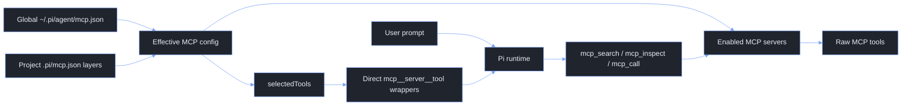

# Pi Agent Extensions

This directory contains the local Pi extensions used to add web search, web fetch, MCP routing, client-credentials OAuth for provider gateways, ratio-based context compaction, background Pi jobs, inline bash expansion (`!{...}`), `/btw`, and small command utilities without forking Pi itself.

The design goal is to stay close to Pi's native extension model. Extensions register Pi tools, slash commands, or lifecycle hooks, while the Pi runtime still owns sessions, model calls, rendering, and tool execution.

## Quick Start

The live extension directory is normally symlinked from the tuckr-managed dotfiles source:

```sh
~/.pi/agent/extensions -> ~/.dotfiles/Configs/pi/.pi/agent/extensions
```

After changing these files, refresh the tuckr package:

```sh
cd ~/.dotfiles
tuckr add pi
```

Check Pi can still load the extensions:

```sh
PI_CODING_AGENT_DIR=~/.pi/agent pi --offline --list-models
```

The sandbox may warn about a Pi lock file when this check is run from restricted tooling. That warning is not an extension load failure.

## Extension Map

| File | Surface | Purpose |
| --- | --- | --- |
| `oauth.ts` | Fetch interceptor and `/cc-*` commands | Injects OAuth 2.0 client_credentials Bearer tokens into matching provider gateway requests. |
| `mcp.ts` | Tools and `/mcp` command | Routes enabled MCP servers through search, inspect, and call tools. Can expose selected MCP tools directly to the model. |
| `websearch.ts` | `websearch` tool | Searches current web content through Exa when available, with DuckDuckGo HTML search as a no-key fallback. |
| `webfetch.ts` | `webfetch` tool | Fetches an HTTP(S) URL and returns markdown, text, or raw HTML with bounded output. |
| `bang.ts` | Inline expansion | Expands `!{command}` patterns inside user prompts before they reach the LLM (e.g. `What's in !{pwd}?`). |
| `btw.ts` | `/btw` command | Runs a throw-away sidecar question that is not added to the current session context. |
| `compaction.ts` | Status item, `/compact-ratio`, and compaction hook | Triggers compaction when context crosses a configured percentage of the active model context window. |
| `jobs.ts` | `spawn_pi` tool, `/jobs`, and custom result messages | Spawns isolated headless Pi child processes synchronously or as background jobs only when explicitly requested; completed jobs queue bounded output for the next user prompt without interrupting scrollback. |
| `utils.ts` | Commands and hooks | Adds `/clear`, `/steer`, `/queue`, mise-aware bash hot reload, and documents Pi context-control hooks. |

## How Pi Prompt Exposure Works

Pi separates registration from exposure.

- A registered tool exists in the runtime and can be activated later.
- An active tool can be sent to the model as a callable tool.
- Active tools with `promptSnippet` and `promptGuidelines` are included in Pi's system prompt section.

This matters for MCP. The MCP extension can register many direct MCP tool wrappers, but only active tools are exposed to the model. The current MCP contract intentionally keeps direct tool exposure narrow.

## Historical: Skills Context Reduction

The removed `skills-context.ts` extension reduced intermediate system prompt size
using Pi's native `before_agent_start` hook. Keep this note so the approach is
quick to recreate if native skill exposure becomes too noisy again.

Pi already discovers skills before each model turn. The hook does not need to
re-scan files. It receives both:

- `event.systemPrompt`: the current generated prompt, including any changes from
  earlier `before_agent_start` hooks.
- `event.systemPromptOptions.skills`: structured skill metadata that Pi loaded
  from the normal skill discovery pipeline.

The old pattern was:

1. Let Pi load skills normally so `/skill:name` and explicit skill loading still
   work.
2. In `before_agent_start`, remove Pi's generated `<available_skills>...</available_skills>`
   block from `event.systemPrompt`.
3. Re-seed the prompt with a smaller custom routing block built from
   `event.systemPromptOptions.skills`.
4. Tell the model that the block is routing metadata only, and that it must read
   the relevant `SKILL.md` before following a skill.
5. Return the modified `systemPrompt` for that turn.

Minimal recreation:

```ts
import type { ExtensionAPI } from "@mariozechner/pi-coding-agent";

function stripNativeSkillsBlock(prompt: string): string {
  return prompt
    .replace(/\n?<available_skills>[\s\S]*?<\/available_skills>\n?/g, "\n")
    .replace(/\n{3,}/g, "\n\n")
    .trim();
}

function xml(value: string): string {
  return value
    .replaceAll("&", "&amp;")
    .replaceAll("<", "&lt;")
    .replaceAll(">", "&gt;")
    .replaceAll('"', "&quot;");
}

export default function skillsContext(pi: ExtensionAPI) {
  pi.on("before_agent_start", (event) => {
    const skills = event.systemPromptOptions.skills ?? [];
    if (!skills.length) return;

    const compactSkills = skills
      .map((skill) => {
        const description = skill.description ?? "";
        return `  <skill name="${xml(skill.name)}">${xml(description)}</skill>`;
      })
      .join("\n");

    const reducedPrompt = stripNativeSkillsBlock(event.systemPrompt);

    return {
      systemPrompt: `${reducedPrompt}

<available_skills compact="true">
${compactSkills}
</available_skills>

Skill metadata is for routing only. When a task matches a skill, read that
skill's SKILL.md before following it. Do not treat this compact list as the full
skill instructions.`,
    };
  });
}
```

To restore it:

1. Add `skills-context.ts` to `~/.pi/agent/extensions` or this dotfiles
   directory.
2. Keep the hook after extensions that intentionally add system-prompt context,
   because `event.systemPrompt` is chained across hooks.
3. Run `PI_CODING_AGENT_DIR=~/.pi/agent pi --offline --list-models` to catch
   extension load errors.
4. Use `/reload` in an interactive Pi session.

Use this only when the skill metadata block becomes materially noisy. Native Pi
skills are still the default because they are simpler and progressive-disclosure
friendly.

## Client Credentials OAuth

`oauth.ts` supports non-interactive OAuth 2.0 `client_credentials` authentication for model providers that sit behind an OAuth-protected gateway.

It does not register a model-facing tool. Instead, it patches `globalThis.fetch` at extension load time and intercepts outgoing provider HTTP requests whose URL starts with a configured `baseUrls` prefix:

```text
provider serializer / SDK -> globalThis.fetch -> OAuth interceptor -> gateway
```

The extension then:

1. Reads `~/.pi/agent/client-credentials.json` first.
2. Falls back to `.pi/client-credentials.json` in the current working directory for project-local setups outside this dotfiles repo.
3. Requests a token from the configured `tokenUrl` using `grant_type=client_credentials`.
4. Replaces the matching provider request's auth header with `Bearer <access_token>`.
5. Clears the cached token and retries once when the gateway reports an invalid token.

Keep `client-credentials.json` machine-local. It contains credential references and should not be committed.

Example `~/.pi/agent/client-credentials.json`:

```jsonc
{
  "providers": [
    {
      "name": "corp-openai",
      "baseUrls": ["https://gateway.example.com/openai/v1"],
      "tokenUrl": "https://auth.example.com/oauth2/token",
      "clientId": "${APIGEE_CLIENT_ID}",
      "clientSecret": "${APIGEE_CLIENT_SECRET}",
      "clientAuthMethod": "client_secret_basic",
      "scope": "llm.invoke",
      "audience": "https://gateway.example.com"
    }
  ]
}
```

Example provider configuration using the OAuth-managed gateway:

```jsonc
{
  "providers": {
    "corp-openai": {
      "baseUrl": "https://gateway.example.com/openai/v1",
      "api": "openai-completions",
      "apiKey": "oauth-managed",
      "models": [
        {
          "id": "gpt-4o",
          "name": "GPT-4o via Corp Gateway",
          "reasoning": false,
          "input": ["text", "image"],
          "cost": { "input": 0, "output": 0, "cacheRead": 0, "cacheWrite": 0 },
          "contextWindow": 128000,
          "maxTokens": 4096
        }
      ]
    }
  }
}
```

`apiKey` only needs to satisfy Pi's provider config shape. The OAuth extension overwrites the outgoing auth header before the request reaches the gateway.

Useful commands inside Pi:

```text
/cc-status
/cc-refresh
```

`/cc-status` shows whether the fetch interceptor is installed and whether tokens are cached. `/cc-refresh` clears cached tokens and immediately reacquires them for every configured provider.

## MCP Extension

`mcp.ts` layers MCP configuration using the same convention as Pi project settings:

```text
~/.pi/agent/mcp.json       global toolbox: what exists by default
<ancestor>/.pi/mcp.json    project override layers, applied from outermost to nearest cwd
```

The effective MCP config is a deep merge where nearer project values win. Pi walks upward from the current working directory, loads every `.pi/mcp.json` it finds, applies them from outermost to nearest, and lets the global file keep most MCP servers disabled while a project opts into the small set it needs.

The extension provides two model-facing layers:

- Router tools are available to the model when at least one effective MCP server is enabled.
- Direct MCP tools are exposed only when an effective server lists raw tool names in `selectedTools`.

The router tools are:

| Tool | Purpose |
| --- | --- |
| `mcp_search` | Search enabled MCP servers for relevant tools. |
| `mcp_inspect` | Inspect a single MCP tool schema before calling it. |
| `mcp_call` | Call a tool on an enabled MCP server. |

Disabled servers are not available to the router and should not be launched.

### MCP Quick Start Examples

The convention is: keep a global MCP catalogue, disable most servers globally,
and enable the smallest useful set in each project with `.pi/mcp.json`.

Start inside a project:

```text
/mcp init
/mcp status
```

Then edit `.pi/mcp.json`, run `/mcp reload`, and verify with `/mcp status`.

#### Example 1: enable browser debugging for one repo

Use router-only mode first. The model can search, inspect, and call Chrome
DevTools tools through `mcp_search`, `mcp_inspect`, and `mcp_call`, but no raw
Chrome tools are always exposed in every prompt.

```jsonc
// .pi/mcp.json
{
  "servers": {
    "chrome-dev-tools": {
      "enabled": true
    }
  }
}
```

Useful follow-up commands:

```text
/mcp reload
/mcp search console errors
/mcp tools chrome-dev-tools
/mcp inspect chrome-dev-tools <tool>
/mcp call chrome-dev-tools <tool> { }
```

#### Example 2: Google documentation with direct search tools

Use direct exposure only for tools that are useful in most turns. Raw tool names
come from `/mcp tools <server>`.

```jsonc
// .pi/mcp.json
{
  "servers": {
    "google-developer-knowledge": {
      "enabled": true,
      "selectedTools": [
        "search_documents",
        "get_documents"
      ]
    }
  }
}
```

Effective direct tools exposed to the model:

```text
mcp__google-developer-knowledge__search_documents
mcp__google-developer-knowledge__get_documents
```

Leave `selectedTools` empty or omit it when router-only mode is enough.

#### Example 3: project-specific Google Cloud and Firebase environment

Keep the shared command globally, but remap environment variables per project.
Do not put secrets or credentials directly in JSON; point to host environment
variables with `$env:NAME`.

```jsonc
// .pi/mcp.json
{
  "servers": {
    "gcloud": {
      "enabled": true,
      "env": {
        "GOOGLE_CLOUD_PROJECT": "$env:MY_APP_GCP_PROJECT",
        "GOOGLE_APPLICATION_CREDENTIALS": "$env:MY_APP_GCP_CREDS"
      }
    },
    "firebase": {
      "enabled": true,
      "env": {
        "FIREBASE_PROJECT": "$env:MY_APP_FIREBASE_PROJECT"
      }
    }
  }
}
```

#### Example 4: Atlassian for one work repo

Enable the global Atlassian server only in repos that need Jira or Confluence.
The global config owns the command; the project override owns whether it is on
and which host environment variables feed it.

```jsonc
// .pi/mcp.json
{
  "servers": {
    "atlassian": {
      "enabled": true,
      "env": {
        "JIRA_URL": "$env:WORK_JIRA_URL",
        "JIRA_USERNAME": "$env:WORK_ATLASSIAN_USERNAME",
        "JIRA_API_TOKEN": "$env:WORK_ATLASSIAN_API_TOKEN",
        "CONFLUENCE_URL": "$env:WORK_CONFLUENCE_URL",
        "CONFLUENCE_USERNAME": "$env:WORK_ATLASSIAN_USERNAME",
        "CONFLUENCE_API_TOKEN": "$env:WORK_ATLASSIAN_API_TOKEN"
      }
    }
  }
}
```

#### Example 5: remove inherited config locally

Use `null` to remove an inherited object key from the effective config.

```jsonc
// .pi/mcp.json
{
  "servers": {
    "gcloud": {
      "enabled": true,
      "env": {
        "GOOGLE_APPLICATION_CREDENTIALS": null
      }
    }
  }
}
```

#### Example 6: add a new global server to the catalogue

Add full server definitions globally, usually disabled. Projects then opt in
with a tiny override.

```jsonc
// ~/.pi/agent/mcp.json
{
  "servers": {
    "my-internal-docs": {
      "type": "stdio",
      "description": "Search internal engineering docs through the docs MCP server.",
      "command": "npx",
      "args": ["-y", "@company/docs-mcp"],
      "env": {
        "DOCS_TOKEN": "$env:COMPANY_DOCS_TOKEN"
      },
      "enabled": false
    }
  }
}
```

Then opt in from a project:

```jsonc
// .pi/mcp.json
{
  "servers": {
    "my-internal-docs": {
      "enabled": true
    }
  }
}
```

### MCP Configuration Layers

Global config belongs in `~/.pi/agent/mcp.json`. Project config belongs in `.pi/mcp.json` at any useful project boundary. Pi walks upward from `ctx.cwd` and combines every project MCP file it finds, so monorepo root config and app-specific config can both participate.

Recommended workflow:

1. Define shared MCP servers globally.
2. Set most of them to `enabled: false` globally.
3. Run `/mcp init` at the project boundary that should own local overrides.
4. Add small project overrides to that `.pi/mcp.json`. Nearest overrides win when multiple project files are found.

Example global config:

```jsonc
{
  "servers": {
    "gcloud": {
      "type": "stdio",
      "description": "Run Google Cloud CLI workflows through gcloud MCP.",
      "command": "npx",
      "args": ["-y", "@google-cloud/gcloud-mcp"],
      "env": {
        "GOOGLE_CLOUD_PROJECT": "$env:DEFAULT_GCP_PROJECT",
        "GOOGLE_APPLICATION_CREDENTIALS": "$env:DEFAULT_GCP_CREDS"
      },
      "enabled": false
    }
  }
}
```

Example project override:

```jsonc
{
  "servers": {
    "gcloud": {
      "enabled": true,
      "env": {
        "GOOGLE_CLOUD_PROJECT": "$env:MY_APP_GCP_PROJECT",
        "FIREBASE_PROJECT": "$env:MY_APP_FIREBASE_PROJECT"
      },
      "selectedTools": ["list_projects"]
    }
  }
}
```

Effective result:

- `gcloud` is enabled for this project only.
- `command`, `args`, and unchanged env mappings are inherited from global config.
- `GOOGLE_CLOUD_PROJECT` uses the project-specific host env var.
- `FIREBASE_PROJECT` is added only for this project.
- `selectedTools` exposes `mcp__gcloud__list_projects` directly to the model.

### Merge Rules

| Field shape | Rule |
| --- | --- |
| Objects | Deep merge by key. Project values override global values. |
| `env`, `headers`, `envHeaders` | Deep merge by key, so projects can add or remap MCP process env/header inputs. |
| Scalars | Project value replaces global value. |
| Arrays | Project array replaces global array. This keeps `args`, `selectedTools`, and allow/deny lists predictable. |
| `null` object values | Remove the inherited key from the effective config. |

Unset an inherited env mapping with `null`:

```jsonc
{
  "servers": {
    "gcloud": {
      "env": {
        "GOOGLE_APPLICATION_CREDENTIALS": null
      }
    }
  }
}
```

This changes the MCP spawn configuration only. It does not modify shell environment variables. Values written as `$env:NAME` are resolved from the host environment; other string values are passed through as raw literals.

### Direct Tool Exposure

`selectedTools` is the intended user-facing direct exposure switch.

- If `selectedTools` is missing or empty, the server is router-only. The model can still use `mcp_search`, `mcp_inspect`, and `mcp_call` against that enabled server.
- If `selectedTools` contains tool names, those raw MCP tools are exposed as direct model-callable tools named `mcp__server__tool`.
- Pi discovers schemas and hydrates direct surfaces at startup or reload; `selectedTools` remains the durable user-facing config.

Supported server fields:

| Field | Meaning |
| --- | --- |
| `enabled` | Set to `false` to disable a server. Project config can override global `enabled` in either direction. |
| `type` | `stdio`, `remote`, `http`, `streamable-http`, or `sse`. If omitted, `command` implies `stdio`; otherwise remote HTTP is assumed. |
| `description` | Human and model-facing description used in MCP status and router guidance. |
| `command`, `args`, `cwd`, `env` | Stdio MCP process configuration. Environment values may reference `$env:NAME`. |
| `url`, `baseUrl`, `headers`, `envHeaders`, `apiKeyEnv` | Remote MCP configuration. Header values may reference `$env:NAME`; `envHeaders` maps header names to host env var names. |
| `timeoutMs` | Per-server timeout, clamped by the extension. |
| `enabledTools` / `allowedTools` | Optional allow-list for inventory results from that server. |
| `disabledTools` | Optional deny-list for inventory results from that server. |
| `selectedTools` | Optional direct-exposure list. These raw MCP tool names become `mcp__server__tool` wrappers. |

### MCP Commands

Use these commands inside Pi:

```text
/mcp
/mcp init
/mcp status
/mcp reload
/mcp search [query]
/mcp inspect <server> <tool>
/mcp call <server> <tool> [json args]
/mcp tools <server>
/mcp load <server> <tool>
/mcp unload <mcp__server__tool>
```

`/mcp init` creates `.pi/mcp.json` in the current working directory with an empty override scaffold.

`/mcp` opens the selector UI. It shows the effective merged server list, including global servers and all project layers found while walking upward. If any project `.pi/mcp.json` exists, the selector asks where to persist changes on the first toggle, not on open. The nearest project MCP file is recommended, and the current directory can be selected to create a local override. Choosing a project target writes small local overrides, so a global server can become project-local without copying the whole global definition.

`/mcp status` opens a detailed diagnostic report with all config layer paths, validation diagnostics, server source, env/header presence checks, loaded servers, searchable tools, selected direct tools, direct surfaces, and inventory errors. Long paths are middle-compacted so the head and tail stay visible. Diagnostics also flag direct tool namespace collisions and enabled servers that share the same MCP runtime target, which helps prevent duplicate MCP processes for one service.

`/mcp reload` clears cached inventory, closes MCP clients, reloads global and upward project configuration layers, and re-syncs active Pi tools.

### MCP Data Flow



## Web Search

`websearch.ts` registers the `websearch` model tool.

It supports:

- `provider: "auto"` which tries Exa first and falls back to DuckDuckGo HTML search.
- `provider: "exa"` to require Exa.
- `provider: "duckduckgo"` to use DuckDuckGo directly.

Parameters:

| Parameter | Meaning |
| --- | --- |
| `query` | Search query. |
| `numResults` | Number of results, default `8`, max `10`. |
| `provider` | `auto`, `exa`, or `duckduckgo`. |
| `type` | Exa mode: `auto`, `fast`, or `deep`. |
| `livecrawl` | Exa livecrawl mode: `fallback`, `preferred`, `always`, or `never`. |
| `contextMaxCharacters` | Maximum Exa context characters. |

Exa uses `EXA_API_KEY` when set. DuckDuckGo does not require an API key.

## Web Fetch

`webfetch.ts` registers the `webfetch` model tool.

It fetches HTTP(S) URLs and returns bounded text:

| Parameter | Meaning |
| --- | --- |
| `url` | HTTP or HTTPS URL to fetch. |
| `format` | `markdown`, `text`, or `html`. Defaults to markdown for HTML and text for other textual content. |
| `timeoutSeconds` | Request timeout, max `120`. |
| `maxCharacters` | Maximum returned characters. Long output keeps the head and tail and truncates the middle. |

The extension refuses non-HTTP(S) URLs, caps response bytes, strips noisy HTML, and returns a clear message for non-text content.

## Compaction Percentage

`compaction.ts` backports the ratio-based compaction trigger while the core
feature waits to be upstreamed.

It uses Pi's native `ctx.getContextUsage()` and `ctx.compact()` extension
surfaces. After each turn it compares current context usage with a model-relative
ratio and starts compaction when the threshold is crossed.

Default global setting:

```jsonc
{
  "compaction": {
    "trigger": {
      "type": "contextRatio",
      "ratio": 0.75
    }
  }
}
```

`ratio` is relative to the active model's context window. `0.75` means compact
at 75% whether the selected model has a 128k, 272k, or 1M token window. The
extension clamps ratios to `0.01`-`0.99` and respects `compaction.enabled:
false`.

Configuration precedence:

1. `PI_CONTEXT_COMPACTION_RATIO` or `PI_COMPACTION_RATIO`
2. Project `.pi/settings.json`
3. Global `~/.pi/agent/settings.json`
4. Built-in extension default `0.75`

Supported project override:

```jsonc
{
  "compaction": {
    "enabled": true,
    "trigger": { "type": "contextRatio", "ratio": 0.70 }
  }
}
```

The footer shows the ratio threshold inline after Pi's native context segment,
for example:

```text
42.0%/272k (auto) ctx 42%/75%
```

Useful command:

```text
/compact-ratio
/compact-ratio now
```

`/compact-ratio` reports the active threshold, source, token estimate, and model
context window. `/compact-ratio now` forces compaction immediately.

When Pi core gains native `compaction.trigger` support, remove this extension and
keep the same settings JSON.

## Inline Bang Expansion

`bang.ts` expands inline `!{command}` snippets in user prompts before the prompt reaches the model.

Examples:

```text
What's in !{pwd}?
The current branch is !{git branch --show-current}.
My node version is !{node --version}.
```

The transformed prompt contains the command output in place of each `!{...}` expression. When the UI is available, the extension shows a short expansion summary notification.

Operational boundaries:

- Whole-line `!command` and `!!command` are left alone for Pi's native user-bash handling.
- Inline commands run through `pi.exec("bash", ["-c", command])` with a 30 second timeout.
- Failed commands are replaced with a `[bang error: ...]` marker so the model sees that expansion failed.
- Use this for small, read-style command substitutions. Avoid long-running, destructive, or noisy commands inside prompts.

## BTW Sidecar

`btw.ts` adds:

```text
/btw <question>
/btw --tools <question>
/btw -t <question>
```

`/btw` is a throw-away sidecar. Its answer is shown to the user but is not added to the active session context.

Modes:

- Direct mode uses the current selected model without tools.
- Tool mode spawns a read-only child Pi process with `read`, `grep`, `find`, `ls`, `websearch`, `webfetch`, `mcp_search`, and `mcp_inspect`.

Useful environment variable:

```sh
PI_BTW_TIMEOUT_MS=120000
```

The sidecar is intentionally read-only. It should not edit files, mutate sessions, or run shell commands.

## Utilities

`utils.ts` adds small operational behaviours.

Commands:

```text
/clear <none>
/steer <message>
/queue <message>
```

`/clear` is an alias for Pi's `/new` flow.

`/steer` sends a steering message while Pi is working. It is delivered before the next model turn.

`/queue` sends a follow-up message that waits until the active agent work finishes.

The extension also hot-reloads mise for bash:

- On session start, it registers a bash tool with `eval "$(mise env -s bash)"` as the command prefix.
- On user bash operations, it wraps execution with the same mise environment refresh.
- Before agent start, it appends a short system prompt note so the model understands bash commands already run with the refreshed mise environment.

`utils.ts` also uses the Pi context-control hooks described in
[Historical: Skills Context Reduction](#historical-skills-context-reduction):

- `before_agent_start` may return a modified `systemPrompt` for a model turn.
- Active tools with `promptSnippet` and `promptGuidelines` appear in Pi's tool prompt section.

The removed `skills-context.ts` extension used those hooks to strip and re-seed
skills. We now rely on native Pi skills by default.

## Operational Notes

Keep extension behaviour boring and explicit.

- Prefer slash commands for user-driven actions.
- Prefer Pi model tools only when the model should call the capability autonomously.
- Keep MCP direct tool exposure small by using `selectedTools` only for tools that deserve to appear in every turn's model tool surface.
- Prefer global server definitions plus small project overrides over copying complete MCP server blocks into each repository.
- Use `/mcp status` before debugging model behaviour. It shows config layers, server source, enabled state, inventory failures, and exposed direct tools.
- Use `PI_CODING_AGENT_DIR=~/.pi/agent pi --offline --list-models` after editing extensions to catch load-time failures quickly.

