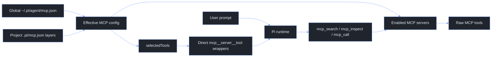

# Pi Agent Extensions

This directory contains the local Pi extensions used to add web search, web fetch, MCP routing, client-credentials OAuth for provider gateways, inline bash expansion (`!{...}`), fish-backed user shell commands, `/side`, and small command utilities without forking Pi itself.

The design goal is to stay close to Pi's native extension model. Extensions register Pi tools, slash commands, or lifecycle hooks, while the Pi runtime still owns sessions, model calls, rendering, and tool execution.

## Quick Start

The live extension directory is normally symlinked from the tuckr-managed dotfiles source:

```sh
~/.pi/agent/extensions -> ~/.dotfiles/Configs/pi/.pi/agent/extensions
```

After changing these files, refresh the tuckr package:

```sh
cd ~/.dotfiles
tuckr add pi
```

Check Pi can still load the extensions:

```sh
PI_CODING_AGENT_DIR=~/.pi/agent pi --offline --list-models
```

The sandbox may warn about a Pi lock file when this check is run from restricted tooling. That warning is not an extension load failure.

## Extension Config Files

Keep Pi's core `settings.json` boring and valid for a no-extension Pi runner. Extension-owned configuration belongs in a sibling `<extension>.json` file instead of custom keys in `settings.json`.

Current extension-owned files:

| File | Owner | Purpose |
| --- | --- | --- |
| `mcp.json` | `mcp.ts` | Global MCP server catalogue and direct-tool selections. |
| `oauth.json` | `oauth.ts` | Optional two-legged OAuth / client-credentials provider config. |
| `side.json` | `side.ts` | `/side --tools` timeout, output limit, and read-only child-tool list. |
| `git-status-widget.json` | `git-status-widget.ts` | Git widget enable flag and refresh/time-out budgets. |
| `workflow.json` | `workflow.ts` | Durable workflow controller limits such as auto-continue turns. |

Global config lives at `~/.pi/agent/<extension>.json`. Project overrides live at `.pi/<extension>.json` and are discovered upward from the current working directory by extensions that support project layers. Merge semantics are: objects deep-merge, arrays and scalars replace, and `null` removes inherited object keys.

Use `settings.json` only for Pi-native settings such as model defaults, transport, packages, resource paths, theme, sessions, retry, and compaction.

## Extension Map

| File | Surface | Purpose |
| --- | --- | --- |
| `oauth.ts` | Fetch interceptor and `/cc-*` commands | Injects OAuth 2.0 client_credentials Bearer tokens into matching provider gateway requests. |
| `mcp.ts` | Tools and `/mcp` command | Routes enabled MCP servers through search, inspect, and call tools. Can expose selected MCP tools directly to the model. |
| `websearch.ts` | `websearch` tool | Searches current web content through Exa when available, with DuckDuckGo HTML search as a no-key fallback. |
| `webfetch.ts` | `webfetch` tool | Fetches an HTTP(S) URL and returns markdown, text, or raw HTML with bounded output. |
| `common-core/` | Shared helpers | Provides small shared tool-result, timeout, number clamp, entity decoding, and MCP JSON/SSE/text helpers used by web and MCP extensions. |
| `bang.ts` | Inline expansion | Expands `!{command}` patterns inside user prompts before they reach the LLM (e.g. `What's in !{pwd}?`). |
| `inline-dollar.ts` | Inline command expansion | Adds `$:` autocomplete inside long prompts and expands `$:skill`, `$:prompt`, and `$:tool:<name>` markers before the prompt reaches the LLM. |
| `fish-user-bash.ts` | `user_bash` hook | Runs user-triggered `!`/`!!` shell commands through fish and hot-reloads mise with `mise env -s fish`. |
| `side.ts` | `/side` command | Runs a one-shot side question that is not added to the main session context. |
| `status.ts` | `/status` command | Shows current Pi session, model, context, workflow, tools, commands, and git status. |
| `usage.ts` + `usage-core/` | `/usage` command | Shows Pi and Codex usage/cost windows using the shared HUD overlay and markdown fallback. |
| `ui-core/` | Shared TUI primitives | Provides the shared HUD overlay flow, close/markdown key handling, panel/table helpers, and default overlay placement used by `/status` and `/usage`. |
| `workflow.ts` + `workflow-core/` | `/goal`, `/review`, `/autoresearch`, `/workflow`, workflow tools | Provides a shared durable workflow core with goal, review, and autoresearch controller layers. |
| `git-status-widget.ts` | Below-editor widget | Shows live git branch, ahead/behind, staged, unstaged, and untracked counts without replacing the custom footer. |
| `tps-tracker.ts` | Footer status item | Shows live and final assistant output speed as tokens/second through the existing footer status aggregation. |
| `yeet.ts` | `/yeet` command | Adds all changes, commits them with a generated clear message, and pushes the current branch/upstream. |
| `utils.ts` | Commands and hooks | Adds `/clear`, `/steer`, `/queue`, mise-aware bash hot reload, and documents Pi context-control hooks. |

## How Pi Prompt Exposure Works

Pi separates registration from exposure.

- A registered tool exists in the runtime and can be activated later.
- An active tool can be sent to the model as a callable tool.
- Active tools with `promptSnippet` and `promptGuidelines` are included in Pi's system prompt section.

This matters for MCP. The MCP extension can register many direct MCP tool wrappers, but only active tools are exposed to the model. The current MCP contract intentionally keeps direct tool exposure narrow.

## Historical: Skills Context Reduction

The removed `skills-context.ts` extension reduced intermediate system prompt size
using Pi's native `before_agent_start` hook. Keep this note so the approach is
quick to recreate if native skill exposure becomes too noisy again.

Pi already discovers skills before each model turn. The hook does not need to
re-scan files. It receives both:

- `event.systemPrompt`: the current generated prompt, including any changes from
  earlier `before_agent_start` hooks.
- `event.systemPromptOptions.skills`: structured skill metadata that Pi loaded
  from the normal skill discovery pipeline.

The old pattern was:

1. Let Pi load skills normally so `/skill:name` and explicit skill loading still
   work.
2. In `before_agent_start`, remove Pi's generated `<available_skills>...</available_skills>`
   block from `event.systemPrompt`.
3. Re-seed the prompt with a smaller custom routing block built from
   `event.systemPromptOptions.skills`.
4. Tell the model that the block is routing metadata only, and that it must read
   the relevant `SKILL.md` before following a skill.
5. Return the modified `systemPrompt` for that turn.

Minimal recreation:

```ts
import type { ExtensionAPI } from "@earendil-works/pi-coding-agent";

function stripNativeSkillsBlock(prompt: string): string {
  return prompt
    .replace(/\n?<available_skills>[\s\S]*?<\/available_skills>\n?/g, "\n")
    .replace(/\n{3,}/g, "\n\n")
    .trim();
}

function xml(value: string): string {
  return value
    .replaceAll("&", "&amp;")
    .replaceAll("<", "&lt;")
    .replaceAll(">", "&gt;")
    .replaceAll('"', "&quot;");
}

export default function skillsContext(pi: ExtensionAPI) {
  pi.on("before_agent_start", (event) => {
    const skills = event.systemPromptOptions.skills ?? [];
    if (!skills.length) return;

    const compactSkills = skills
      .map((skill) => {
        const description = skill.description ?? "";
        return `  <skill name="${xml(skill.name)}">${xml(description)}</skill>`;
      })
      .join("\n");

    const reducedPrompt = stripNativeSkillsBlock(event.systemPrompt);

    return {
      systemPrompt: `${reducedPrompt}

<available_skills compact="true">
${compactSkills}
</available_skills>

Skill metadata is for routing only. When a task matches a skill, read that
skill's SKILL.md before following it. Do not treat this compact list as the full
skill instructions.`,
    };
  });
}
```

To restore it:

1. Add `skills-context.ts` to `~/.pi/agent/extensions` or this dotfiles
   directory.
2. Keep the hook after extensions that intentionally add system-prompt context,
   because `event.systemPrompt` is chained across hooks.
3. Run `PI_CODING_AGENT_DIR=~/.pi/agent pi --offline --list-models` to catch
   extension load errors.
4. Use `/reload` in an interactive Pi session.

Use this only when the skill metadata block becomes materially noisy. Native Pi
skills are still the default because they are simpler and progressive-disclosure
friendly.

## Client Credentials OAuth

`oauth.ts` supports non-interactive two-legged OAuth 2.0 `client_credentials` authentication for model providers that sit behind an OAuth-protected gateway. It uses a client ID and client secret to get access tokens from `tokenUrl`; it does not require or use refresh tokens or a refresh endpoint.

It does not register a model-facing tool. Instead, it patches `globalThis.fetch` at extension load time and intercepts outgoing provider HTTP requests whose URL starts with a configured `baseUrls` prefix:

```text
provider serializer / SDK -> globalThis.fetch -> OAuth interceptor -> gateway
```

The extension then:

1. Reads `~/.pi/agent/oauth.json` first.
2. Falls back to `.pi/oauth.json` in the current working directory for project-local setups outside this dotfiles repo.
3. Requests a token from the configured `tokenUrl` using `grant_type=client_credentials`.
4. Replaces the matching provider request's auth header with `Bearer <access_token>`.
5. Clears the cached token and retries once when the gateway reports an invalid token.

Keep `oauth.json` machine-local when it contains real client ID / client secret references.

Reference examples live next to the real config files and are intentionally named so Pi does not load them automatically:

- `~/.pi/agent/example.oauth.json` — copy to `oauth.json`, then set provider URLs and environment variable names.
- `~/.pi/agent/example.model.json` — copy or merge into `models.json`, then set model IDs and metadata.

Example `~/.pi/agent/oauth.json`:

```jsonc
{
  "providers": [
    {
      "name": "corp-openai",
      "baseUrls": ["https://gateway.example.com/openai/v1"],
      "tokenUrl": "https://auth.example.com/oauth2/token",
      "clientId": "${CORP_OAUTH_CLIENT_ID}",
      "clientSecret": "${CORP_OAUTH_CLIENT_SECRET}",
      "clientAuthMethod": "client_secret_basic",
      "scope": "llm.invoke",
      "audience": "https://gateway.example.com"
    }
  ]
}
```

Example provider configuration using the OAuth-managed gateway, as in `example.model.json`:

```jsonc
{
  "providers": {
    "corp-openai": {
      "baseUrl": "https://gateway.example.com/openai/v1",
      "api": "openai-completions",
      "apiKey": "oauth-managed",
      "models": [
        {
          "id": "gpt-4o",
          "name": "GPT-4o via Corp Gateway",
          "reasoning": false,
          "input": ["text", "image"],
          "cost": { "input": 0, "output": 0, "cacheRead": 0, "cacheWrite": 0 },
          "contextWindow": 128000,
          "maxTokens": 4096
        }
      ]
    }
  }
}
```

`apiKey` only needs to satisfy Pi's provider config shape. The OAuth extension overwrites the outgoing auth header before the request reaches the gateway.

Useful commands inside Pi:

```text
/cc-status
/cc-refresh
```

`/cc-status` shows whether the fetch interceptor is installed and whether tokens are cached. `/cc-refresh` clears cached tokens and immediately reacquires them for every configured provider.

## MCP Extension

`mcp.ts` layers MCP configuration using the same convention as Pi project settings:

```text
~/.pi/agent/mcp.json       global toolbox: what exists by default
<ancestor>/.pi/mcp.json    project override layers, applied from outermost to nearest cwd
```

The effective MCP config is a deep merge where nearer project values win. Pi walks upward from the current working directory, loads every `.pi/mcp.json` it finds, applies them from outermost to nearest, and lets the global file keep most MCP servers disabled while a project opts into the small set it needs.

The extension provides two model-facing layers:

- Router tools are available to the model when at least one effective MCP server is enabled.
- Direct MCP tools are exposed only when an effective server lists raw tool names in `selectedTools`.

The router tools are:

| Tool | Purpose |
| --- | --- |
| `mcp_search` | Search enabled MCP servers for relevant tools. |
| `mcp_inspect` | Inspect a single MCP tool schema before calling it. |
| `mcp_call` | Call a tool on an enabled MCP server. |

Disabled servers are not available to the router and should not be launched.

### MCP Quick Start Examples

The convention is: keep a global MCP catalogue, disable most servers globally,
and enable the smallest useful set in each project with `.pi/mcp.json`.

Start inside a project:

```text
/mcp init
/mcp status
```

Then edit `.pi/mcp.json`, run `/mcp reload`, and verify with `/mcp status`.

#### Example 1: enable browser debugging for one repo

Use router-only mode first. The model can search, inspect, and call Chrome
DevTools tools through `mcp_search`, `mcp_inspect`, and `mcp_call`, but no raw
Chrome tools are always exposed in every prompt.

```jsonc
// .pi/mcp.json
{
  "servers": {
    "chrome-dev-tools": {
      "enabled": true
    }
  }
}
```

Useful follow-up commands:

```text
/mcp reload
/mcp search console errors
/mcp tools chrome-dev-tools
/mcp inspect chrome-dev-tools <tool>
/mcp call chrome-dev-tools <tool> { }
```

#### Example 2: Google documentation with direct search tools

Use direct exposure only for tools that are useful in most turns. Raw tool names
come from `/mcp tools <server>`.

```jsonc
// .pi/mcp.json
{
  "servers": {
    "google-developer-knowledge": {
      "enabled": true,
      "selectedTools": [
        "search_documents",
        "get_documents"
      ]
    }
  }
}
```

Effective direct tools exposed to the model:

```text
mcp__google-developer-knowledge__search_documents
mcp__google-developer-knowledge__get_documents
```

Leave `selectedTools` empty or omit it when router-only mode is enough.

#### Example 3: project-specific Google Cloud and Firebase environment

Keep the shared command globally, but remap environment variables per project.
Do not put secrets or credentials directly in JSON; point to host environment
variables with `$env:NAME`.

```jsonc
// .pi/mcp.json
{
  "servers": {
    "gcloud": {
      "enabled": true,
      "env": {
        "GOOGLE_CLOUD_PROJECT": "$env:MY_APP_GCP_PROJECT",
        "GOOGLE_APPLICATION_CREDENTIALS": "$env:MY_APP_GCP_CREDS"
      }
    },
    "firebase": {
      "enabled": true,
      "env": {
        "FIREBASE_PROJECT": "$env:MY_APP_FIREBASE_PROJECT"
      }
    }
  }
}
```

#### Example 4: Atlassian for one work repo

Enable the global Atlassian server only in repos that need Jira or Confluence.
The global config owns the command; the project override owns whether it is on
and which host environment variables feed it.

```jsonc
// .pi/mcp.json
{
  "servers": {
    "atlassian": {
      "enabled": true,
      "env": {
        "JIRA_URL": "$env:WORK_JIRA_URL",
        "JIRA_USERNAME": "$env:WORK_ATLASSIAN_USERNAME",
        "JIRA_API_TOKEN": "$env:WORK_ATLASSIAN_API_TOKEN",
        "CONFLUENCE_URL": "$env:WORK_CONFLUENCE_URL",
        "CONFLUENCE_USERNAME": "$env:WORK_ATLASSIAN_USERNAME",
        "CONFLUENCE_API_TOKEN": "$env:WORK_ATLASSIAN_API_TOKEN"
      }
    }
  }
}
```

#### Example 5: remove inherited config locally

Use `null` to remove an inherited object key from the effective config.

```jsonc
// .pi/mcp.json
{
  "servers": {
    "gcloud": {
      "enabled": true,
      "env": {
        "GOOGLE_APPLICATION_CREDENTIALS": null
      }
    }
  }
}
```

#### Example 6: add a new global server to the catalogue

Add full server definitions globally, usually disabled. Projects then opt in
with a tiny override.

```jsonc
// ~/.pi/agent/mcp.json
{
  "servers": {
    "my-internal-docs": {
      "type": "stdio",
      "description": "Search internal engineering docs through the docs MCP server.",
      "command": "npx",
      "args": ["-y", "@company/docs-mcp"],
      "env": {
        "DOCS_TOKEN": "$env:COMPANY_DOCS_TOKEN"
      },
      "enabled": false
    }
  }
}
```

Then opt in from a project:

```jsonc
// .pi/mcp.json
{
  "servers": {
    "my-internal-docs": {
      "enabled": true
    }
  }
}
```

### MCP Configuration Layers

Global config belongs in `~/.pi/agent/mcp.json`. Project config belongs in `.pi/mcp.json` at any useful project boundary. Pi walks upward from `ctx.cwd` and combines every project MCP file it finds, so monorepo root config and app-specific config can both participate.

Recommended workflow:

1. Define shared MCP servers globally.
2. Set most of them to `enabled: false` globally.
3. Run `/mcp init` at the project boundary that should own local overrides.
4. Add small project overrides to that `.pi/mcp.json`. Nearest overrides win when multiple project files are found.

Example global config:

```jsonc
{
  "servers": {
    "gcloud": {
      "type": "stdio",
      "description": "Run Google Cloud CLI workflows through gcloud MCP.",
      "command": "npx",
      "args": ["-y", "@google-cloud/gcloud-mcp"],
      "env": {
        "GOOGLE_CLOUD_PROJECT": "$env:DEFAULT_GCP_PROJECT",
        "GOOGLE_APPLICATION_CREDENTIALS": "$env:DEFAULT_GCP_CREDS"
      },
      "enabled": false
    }
  }
}
```

Example project override:

```jsonc
{
  "servers": {
    "gcloud": {
      "enabled": true,
      "env": {
        "GOOGLE_CLOUD_PROJECT": "$env:MY_APP_GCP_PROJECT",
        "FIREBASE_PROJECT": "$env:MY_APP_FIREBASE_PROJECT"
      },
      "selectedTools": ["list_projects"]
    }
  }
}
```

Effective result:

- `gcloud` is enabled for this project only.
- `command`, `args`, and unchanged env mappings are inherited from global config.
- `GOOGLE_CLOUD_PROJECT` uses the project-specific host env var.
- `FIREBASE_PROJECT` is added only for this project.
- `selectedTools` exposes `mcp__gcloud__list_projects` directly to the model.

### Merge Rules

| Field shape | Rule |
| --- | --- |
| Objects | Deep merge by key. Project values override global values. |
| `env`, `headers`, `envHeaders` | Deep merge by key, so projects can add or remap MCP process env/header inputs. |
| Scalars | Project value replaces global value. |
| Arrays | Project array replaces global array. This keeps `args`, `selectedTools`, and allow/deny lists predictable. |
| `null` object values | Remove the inherited key from the effective config. |

Unset an inherited env mapping with `null`:

```jsonc
{
  "servers": {
    "gcloud": {
      "env": {
        "GOOGLE_APPLICATION_CREDENTIALS": null
      }
    }
  }
}
```

This changes the MCP spawn configuration only. It does not modify shell environment variables. Values written as `$env:NAME` are resolved from the host environment; other string values are passed through as raw literals.

### Direct Tool Exposure

`selectedTools` is the intended user-facing direct exposure switch.

- If `selectedTools` is missing or empty, the server is router-only. The model can still use `mcp_search`, `mcp_inspect`, and `mcp_call` against that enabled server.
- If `selectedTools` contains tool names, those raw MCP tools are exposed as direct model-callable tools named `mcp__server__tool`.
- Pi discovers schemas and hydrates direct surfaces at startup or reload; `selectedTools` remains the durable user-facing config.

Supported server fields:

| Field | Meaning |
| --- | --- |
| `enabled` | Set to `false` to disable a server. Project config can override global `enabled` in either direction. |
| `type` | `stdio`, `remote`, `http`, `streamable-http`, or `sse`. If omitted, `command` implies `stdio`; otherwise remote HTTP is assumed. |
| `description` | Human and model-facing description used in MCP status and router guidance. |
| `command`, `args`, `cwd`, `env` | Stdio MCP process configuration. Environment values may reference `$env:NAME`. |
| `url`, `baseUrl`, `headers`, `envHeaders`, `apiKeyEnv` | Remote MCP configuration. Header values may reference `$env:NAME`; `envHeaders` maps header names to host env var names. |
| `timeoutMs` | Per-server timeout, clamped by the extension. |
| `enabledTools` / `allowedTools` | Optional allow-list for inventory results from that server. |
| `disabledTools` | Optional deny-list for inventory results from that server. |
| `selectedTools` | Optional direct-exposure list. These raw MCP tool names become `mcp__server__tool` wrappers. |

### MCP Commands

Use these commands inside Pi:

```text
/mcp
/mcp init
/mcp status
/mcp reload
/mcp search [query]
/mcp inspect <server> <tool>
/mcp call <server> <tool> [json args]
/mcp tools <server>
/mcp load <server> <tool>
/mcp unload <mcp__server__tool>
```

`/mcp init` creates `.pi/mcp.json` in the current working directory with an empty override scaffold.

`/mcp` opens the selector UI. It shows the effective merged server list, including global servers and all project layers found while walking upward. If any project `.pi/mcp.json` exists, the selector asks where to persist changes on the first toggle, not on open. The nearest project MCP file is recommended, and the current directory can be selected to create a local override. Choosing a project target writes small local overrides, so a global server can become project-local without copying the whole global definition.

`/mcp status` opens a detailed diagnostic report with all config layer paths, validation diagnostics, server source, env/header presence checks, loaded servers, searchable tools, selected direct tools, direct surfaces, and inventory errors. Long paths are middle-compacted so the head and tail stay visible. Diagnostics also flag direct tool namespace collisions and enabled servers that share the same MCP runtime target, which helps prevent duplicate MCP processes for one service.

`/mcp reload` clears cached inventory, closes MCP clients, reloads global and upward project configuration layers, and re-syncs active Pi tools.

### MCP Data Flow



## Web Search

`websearch.ts` registers the `websearch` model tool.

It supports:

- `provider: "auto"` which tries Exa first and falls back to DuckDuckGo HTML search.
- `provider: "exa"` to require Exa.
- `provider: "duckduckgo"` to use DuckDuckGo directly.

Parameters:

| Parameter | Meaning |
| --- | --- |
| `query` | Search query. |
| `numResults` | Number of results, default `8`, max `10`. |
| `provider` | `auto`, `exa`, or `duckduckgo`. |
| `type` | Exa mode: `auto`, `fast`, or `deep`. |
| `livecrawl` | Exa livecrawl mode: `fallback`, `preferred`, `always`, or `never`. |
| `contextMaxCharacters` | Maximum Exa context characters. |

Exa uses `EXA_API_KEY` when set. DuckDuckGo does not require an API key.

## Web Fetch

`webfetch.ts` registers the `webfetch` model tool.

It fetches HTTP(S) URLs and returns bounded text:

| Parameter | Meaning |
| --- | --- |
| `url` | HTTP or HTTPS URL to fetch. |
| `format` | `markdown`, `text`, or `html`. Defaults to markdown for HTML and text for other textual content. |
| `timeoutSeconds` | Request timeout, max `120`. |
| `maxCharacters` | Maximum returned characters. Long output keeps the head and tail and truncates the middle. |

The extension refuses non-HTTP(S) URLs, caps response bytes, strips noisy HTML, and returns a clear message for non-text content.

## Inline Bang Expansion

`inline-dollar.ts` adds a middle-of-prompt command lane. Type `$:` anywhere in the editor to open completions for prompt templates, skills, and tools without moving to the start of the prompt. On submit:

- `$:skill:name` or `$:name` for a matching skill expands the skill file inline.
- `$:template` expands a prompt template inline.
- `$:tool:read` activates a registered tool and removes the marker.
- `${:template arg one "arg two"}` supports template arguments using Pi's `$1`, `$@`, `$ARGUMENTS`, and `${@:N[:L]}` substitutions.

Interactive slash commands that only make sense at the editor/UI level are represented as inline intent notes; run those as normal leading `/command` invocations when they need to mutate Pi UI state.

`bang.ts` expands inline `!{command}` snippets in user prompts before the prompt reaches the model.

Examples:

```text
What's in !{pwd}?
The current branch is !{git branch --show-current}.
My node version is !{node --version}.
```

The transformed prompt contains the command output in place of each `!{...}` expression. When the UI is available, the extension shows a short expansion summary notification.

Operational boundaries:

- Whole-line `!command` and `!!command` are left alone for Pi's native user-bash handling.
- Inline commands run through `pi.exec("bash", ["-c", command])` with a 30 second timeout.
- Failed commands are replaced with a `[bang error: ...]` marker so the model sees that expansion failed.
- Use this for small, read-style command substitutions. Avoid long-running, destructive, or noisy commands inside prompts.

## Side

`side.ts` adds:

```text
/side <question>
/side --tools <question>
/side -t <question>
```

`/side` is a one-shot side channel. Its answer is shown to the user but is not added to the main session context. Both modes read a snapshot of the active parent session context, so status questions such as "what are we doing?" can be answered from the current conversation.

Modes:

- Direct mode uses the current selected model without tools and passes the parent session snapshot to the model call.
- Tool mode writes a temporary snapshot of the current session branch, runs a read-only child Pi process against that snapshot, then deletes the temporary session. It enables `read`, `grep`, `find`, `ls`, `websearch`, `webfetch`, `mcp_search`, and `mcp_inspect`.

Config lives in `~/.pi/agent/side.json`, with project overrides at `.pi/side.json`:

```jsonc
{
  "timeoutMs": 60000,
  "maxOutputChars": 18000,
  "tools": ["read", "grep", "find", "ls", "websearch", "webfetch", "mcp_search", "mcp_inspect"],
  "transport": "sse"
}
```

`transport` is optional; when omitted, direct/no-tools side turns still honour Pi's native `transport` setting. `PI_SIDE_TIMEOUT_MS=120000` remains supported as an environment override for compatibility.

The side channel is intentionally read-only. It should not edit files, mutate sessions, or run shell commands.

## Status

`status.ts` adds:

```text
/status
```

`/status` opens a compact, read-only HUD without adding anything to the model context. It uses the shared `ui-core` HUD overlay and panel primitives, avoiding the multi-line editor dialog while rendering as a bordered, theme-backed panel with a small shadow, lower page position, fixed grid rows, and table-style model usage so it stands apart from the transcript without runover. Press `esc`, `ctrl+c`, or `q` to close it; press `m` or `e` to open the full markdown report. The HUD includes the current directory, session file, parent session, branch entry counts, model, thinking level, context usage, active workflow, active tools, command counts, and git branch / dirty state. It also computes live session stats from the active branch: start time, first/last activity, total elapsed time, idle/wall-gap time, inferred active time, approximate API/tool time, turn counts, message role counts, tool success counts, per-tool usage, and per-model token/cost totals.

`git-status-widget.ts` adds a compact live widget below the editor. It intentionally does not replace the footer; it uses the existing status aggregation instead. The widget refreshes on session start, input, tool completion, turn end, and a short interval. It shows:

```text
git  main ↑1 +2 ~3 ?1
```

Legend: `↑/↓` ahead/behind, `+` staged, `~` unstaged, `?` untracked. Clean repositories show `clean`; non-git directories hide the widget.

`git-status-widget.ts` reads `~/.pi/agent/git-status-widget.json`, with project overrides at `.pi/git-status-widget.json`:

```jsonc
{
  "enabled": true,
  "intervalMs": 2500,
  "gitTimeoutMs": 2000
}
```

`PI_GIT_STATUS_INTERVAL_MS` remains supported as an environment override for compatibility.

`tps-tracker.ts` publishes a `speed` footer status. During streaming it estimates output speed from deltas until provider usage arrives; at agent end it leaves the final tokens/second value. The existing custom footer automatically includes this status alongside other extension statuses.

## Yeet

`yeet.ts` adds:

```text
/yeet
/yeet <commit subject override>
```

`/yeet` is the local "ship this small change" command. It runs the git workflow directly rather than asking the model to do it:

1. verifies the current directory is inside a git worktree and on a branch,
2. runs `git add -A`,
3. inspects `git diff --cached --name-status --find-renames`,
4. generates a clear commit subject and body from the staged file operations,
5. commits with that message,
6. pushes to the existing upstream, or `git push -u <remote> <branch>` when no upstream exists,
7. reports the pushed URL, using a GitHub compare URL for non-`main` branches when possible.

If there is no remote, it commits locally and reports that push was skipped. Passing text after `/yeet` uses that text as the commit subject while keeping the generated body that lists changed files.

## Workflow core, Goal, Review, and Autoresearch

`workflow.ts` plus `workflow-core/` add a shared durable workflow core with three controller layers: `goal`, `review`, and `autoresearch`.

Commands:

```text
/goal <objective>
/goal status
/goal continue
/goal pause [note]
/goal resume [note]
/goal edit <new objective>
/goal complete [note]
/goal clear [note]

/review
/review status
/review continue
/review --base <branch>
/review --commit <sha>
/review <custom instructions>
/review clear [note]

/autoresearch <objective>
/autoresearch status
/autoresearch pause [note]
/autoresearch resume [note]
/autoresearch export
/autoresearch expand
/autoresearch collapse
/autoresearch fullscreen
/autoresearch finalize
/autoresearch clear

/workflow status
/workflow clear [controller]
```

Config lives in `~/.pi/agent/workflow.json`, with project overrides at `.pi/workflow.json`:

```jsonc
{
  "maxAutoTurns": 20
}
```

`PI_WORKFLOW_MAX_AUTO_TURNS` remains supported as an environment override for compatibility.

Model-facing tools:

```text
create_goal
update_goal
stop_goal
clear_goal
create_review
update_review
stop_review
clear_review
create_autoresearch
update_autoresearch
stop_autoresearch
clear_autoresearch
workflow_status
workflow_update
init_experiment
research_probe
run_preflight
run_experiment
log_experiment
finalize_autoresearch
```

The workflow core persists append-only events in the active session branch as custom entries, so state survives reloads and respects session branching. The `create_*`, `update_*`, `stop_*`, and `clear_*` tools let the agent start, revise, pause/complete/fail/budget-limit, and clear workflows itself from natural language requests. `stop_*` defaults to pausing so state is preserved; `clear_*` is for explicit removal.

When a workflow exists, the footer shows a small status-line badge with white text on a 20%-blend coloured background: gold for `goal`, burgundy/purple for `review`, and aqua for `autoresearch`. The badge stays visible for the latest non-cleared workflow between updates, including paused/complete/failed states, and clears only when the workflow is explicitly cleared or no workflow exists. It is refreshed from workflow-core state on session/tree/turn changes and after workflow slash commands.

Prompt sources:

- `goal` follows Codex `/goal` continuation, objective-update, and completion-audit doctrine: preserve full objective, work from evidence, avoid redefining success, and only complete after requirement-by-requirement verification.
- `review` follows Codex `/review` rubric: actionable bugs only, changed-line discipline, P0-P3 priorities, exact file/line locations, overall correctness, and no fixes unless requested.
- `autoresearch` follows `pi-autoresearch`'s skill and extension doctrine: write/resume from `autoresearch.md`, use `research_probe` for throwaway evidence gathering, use `run_preflight` for smoke tests, run `autoresearch.sh`, emit `METRIC name=value`, use `init_experiment`/`run_experiment`/`log_experiment`, keep winners, revert losers, maintain ideas/checks files, and loop until interrupted.

The `goal` controller keeps a durable objective visible in the main workflow and auto-continues while active until the model marks it complete, it is paused/cleared, or `PI_WORKFLOW_MAX_AUTO_TURNS` is reached. The `review` controller reviews current changes, base-branch diffs, commits, or custom instructions in the main session. The `autoresearch` controller runs measured experiment loops with `init_experiment`, `run_experiment`, and `log_experiment`; kept runs are committed when possible and failed/discarded runs are reverted while preserving autoresearch files.

Autoresearch workflow extras now include:

- live TUI widget sourced from `autoresearch.jsonl` and active workflow state,
- compact/expanded widget modes via `/autoresearch expand`, `/autoresearch collapse`, and `Ctrl+Shift+T`,
- fullscreen/editor dashboard via `/autoresearch fullscreen` and `Ctrl+Shift+F`,
- `/autoresearch export` local browser dashboard,
- confidence score using MAD-style noise estimation after enough runs,
- executable hook scripts at `autoresearch.hooks/before.sh` and `autoresearch.hooks/after.sh`, receiving JSON on stdin,
- hook log entries appended to `autoresearch.jsonl`,
- before-hook output included in the experiment result, and after-hook output queued back as steering context,
- autoresearch-specific compaction summary and post-compaction continuation,
- `/autoresearch finalize` and `finalize_autoresearch` report generation at `autoresearch.finalize.md`,
- `autoresearch.config.json` support for `workingDir`, `maxIterations`, `maxWallClockSeconds`, `maxExperimentSeconds`, `maxConsecutiveFailures`, `maxConsecutiveDiscards`, `maxConsecutiveCrashes`, `maxCommandRepeats`, and `requirePreflight`,
- `autoresearch.checks.sh` support that blocks `keep` on check failure,
- `autoresearch.preflight.sh` plus `run_preflight` for cheap smoke tests before expensive/batch/training runs,
- `research_probe`, which launches a throwaway `pi --mode json -p --no-session` scout with read/search tools for compact evidence gathering outside the main context,
- code-level anti-thrash guard that logs guard events and steers the model after repeated non-keeps, repeated descriptions, or repeated ASI hypotheses,
- ML Intern-inspired benchmark/evidence hygiene in the workflow prompt: source-grounded reconnaissance for stale domains, benchmark/data audits, smoke-first batch runs, anti-thrash loop breaks, and structured actionable side information (`asi`) on `log_experiment` entries.

Generic budget example:

```jsonc
// autoresearch.config.json
{
  "workingDir": ".",
  "maxIterations": 50,
  "maxWallClockSeconds": 14400,
  "maxExperimentSeconds": 900,
  "maxConsecutiveFailures": 5,
  "maxConsecutiveDiscards": 4,
  "maxConsecutiveCrashes": 2,
  "maxCommandRepeats": 20,
  "requirePreflight": false
}
```

### ML Intern review notes carried forward

Reviewing `huggingface/ml-intern` surfaced patterns worth keeping in Pi's autoresearch workflow without turning the extension into an ML-only agent:

- Research before implementation when the domain is stale or fast-moving. ML Intern's prompt starts ML work from papers, citation graphs, current docs, and working examples before code; the autoresearch prompt now asks for source-grounded reconnaissance and an `Evidence / Recipes` section in `autoresearch.md`.
- Benchmark and data audits should be explicit. ML Intern repeatedly validates dataset shape, current APIs, job preflights, and output persistence; autoresearch sessions now ask agents to record metric meaning, representative inputs, noise controls, and cheating risks.
- Loops need anti-thrash pressure. ML Intern has doom-loop and unfinished-plan guards; autoresearch now has a code-level anti-thrash guard plus prompt guidance to break repeated command/tool/idea patterns instead of retrying the same failure.
- Expensive fan-out should be smoke-tested first. ML Intern submits one job before a batch; autoresearch now has `run_preflight` and optional `autoresearch.preflight.sh`, with `requirePreflight` available in config.
- Each run should leave machine-readable learning behind. `log_experiment` now accepts optional `asi` fields such as `hypothesis`, `evidence`, `changed`, `learned`, `next_focus`, and `risk`, which are persisted to `autoresearch.jsonl` and included in finalization notes.

## Utilities

`utils.ts` adds small operational behaviours.

Commands:

```text
/clear <none>
/steer <message>
/queue <message>
```

`/clear` is an alias for Pi's `/new` flow.

`/steer` sends a steering message while Pi is working. It is delivered before the next model turn.

`/queue` sends a follow-up message that waits until the active agent work finishes.

The extension also hot-reloads mise for the model-facing bash tool:

- On session start, it registers a bash tool with `eval "$(mise env -s bash)"` as the command prefix.
- Before agent start, it appends a short system prompt note so the model understands bash commands already run with the refreshed mise environment.

`fish-user-bash.ts` handles user-triggered shell commands (`!`/`!!`). It is the local fish/mise version of the reference `zsh-user-bash` extension from `my-pi-setup`: it launches fish non-interactively, lets fish read the normal config, then runs `mise env -s fish | source` immediately before the user command so newly changed mise tools are available without restarting Pi.

`utils.ts` also uses the Pi context-control hooks described in
[Historical: Skills Context Reduction](#historical-skills-context-reduction):

- `before_agent_start` may return a modified `systemPrompt` for a model turn.
- Active tools with `promptSnippet` and `promptGuidelines` appear in Pi's tool prompt section.

The removed `skills-context.ts` extension used those hooks to strip and re-seed
skills. We now rely on native Pi skills by default.

## Operational Notes

Keep extension behaviour boring and explicit.

- Prefer slash commands for user-driven actions.
- Prefer Pi model tools only when the model should call the capability autonomously.
- Keep MCP direct tool exposure small by using `selectedTools` only for tools that deserve to appear in every turn's model tool surface.
- Prefer global server definitions plus small project overrides over copying complete MCP server blocks into each repository.
- Do not add extension-only keys to `settings.json`; use `<extension>.json` so `pi --no-extensions` can still consume core settings cleanly.
- Use `/mcp status` before debugging model behaviour. It shows config layers, server source, enabled state, inventory failures, and exposed direct tools.
- Use `PI_CODING_AGENT_DIR=~/.pi/agent pi --offline --list-models` after editing extensions to catch load-time failures quickly.
