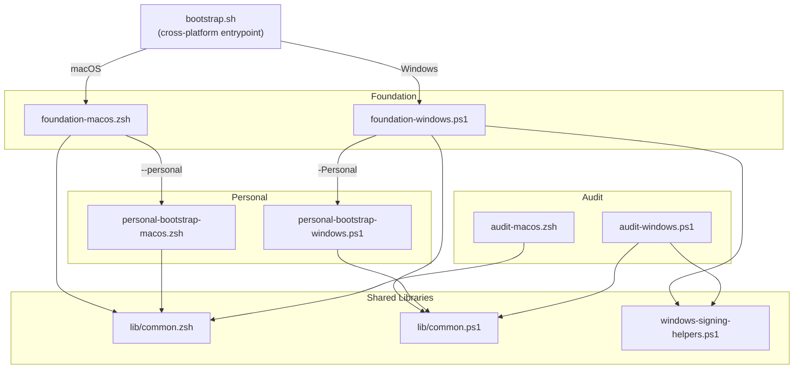

# 🔧 Bootstrap Scripts

This directory contains the bootstrap and configuration scripts for setting up
new machines. The bootstrap follows a two-layer architecture: a generic
**foundation** layer that any engineer can run, and an optional **personal**
layer that applies repository-specific dotfiles and preferences.

## 🏗️ Architecture Overview



## 📜 Script Catalogue

### `bootstrap.sh` (Cross-Platform Entrypoint)

**Location:** Repository root (`~/.dotfiles/bootstrap.sh`)

Cross-platform entrypoint with full flag parsing. Detects the operating system
and delegates to the appropriate platform-specific foundation script. Supports
`setup`, `ensure`, `update`, `personal`, and `audit` modes along with feature
flags for shell choice, device profile, and personal layer enablement.

**Usage:**

```bash
# Work machine with fish shell
./bootstrap.sh setup --shell fish --profile work --personal

# Home machine with zsh
./bootstrap.sh setup --shell zsh --profile home --personal

# Minimal server (no GUI, no defaults)
./bootstrap.sh setup --shell zsh --profile minimal --non-interactive

# Ensure current state is healthy
./bootstrap.sh ensure --personal

# Update all tools
./bootstrap.sh update

# Personal layer only
./bootstrap.sh personal --non-interactive --shell zsh
```

**Flags:**

| Flag | Description |
|------|-------------|
| `--shell <fish\|zsh>` | Set preferred shell (persisted to state file) |
| `--profile <work\|home\|minimal>` | Set device profile preset |
| `--personal` | Run the personal layer after foundation |
| `--non-interactive` | Disable all interactive prompts |
| `--dry-run` | Preview the full plan without making any changes |
| `--dotfiles-repo <url>` | Override dotfiles repository URL |
| `--personal-script <path>` | Override personal bootstrap script path |
| `--enable-<flag>` | Enable a feature flag (e.g. `--enable-zscaler`) |
| `--disable-<flag>` | Disable a feature flag (e.g. `--disable-work-apps`) |

**Dry-run example:**

```bash
# See exactly what would happen without touching the system
./bootstrap.sh setup --dry-run --shell fish --profile work --personal
```

---

### `foundation-macos.zsh` (macOS Foundation)

**Location:** `Other/scripts/foundation-macos.zsh`

macOS foundation bootstrap with feature flags, gum-driven status output, shell
choice, and Zscaler trust detection. Every function respects `RESOLVED_*` flags
from the shared library.

**Foundation phase order:**

1. Homebrew installation and activation
2. Foundation package installation (gum, git, gh, jq, yq, fzf, fd, ripgrep, zoxide, lazygit, openssl, gemini-cli, claude-code, codex)
3. Mise installation (Homebrew or shell installer — see note below)
4. Shell profile management (managed zsh/fish bootstrap block)
5. Mise seed config generation
6. Zscaler detection and trust bootstrap (when TLS probe detects active Zscaler chain)
7. Mise tool installation
8. Ensure-style validation
9. Optional handoff to personal layer

**Mise installation strategy:** mise is not part of the foundation Homebrew
packages because it can be installed via either Homebrew (`brew install mise`)
or the first-party shell installer (`curl https://mise.run | sh`). The
`ensure_mise()` function detects which method was used and handles updates
accordingly. Homebrew is preferred when available; the shell installer is the
fallback for minimal or non-Homebrew setups.

---

### `personal-bootstrap-macos.zsh` (macOS Personal Layer)

**Location:** `Other/scripts/personal-bootstrap-macos.zsh`

Personal layer driven by feature flags. Expects `RESOLVED_*` globals to be
populated by the shared library. Targets include dotfiles checkout, full brew
bundle with feature-flag environment variables, tuckr symlinking, shell default
change, macOS defaults, and Rosetta installation.

**Personal phase order:**

1. Dotfiles repo clone or update
2. Full brew bundle with feature-flag env vars (GUI conditional)
3. Tuckr symlink application
4. Shell default change (fish or zsh)
5. macOS system defaults
6. Rosetta 2 installation (Apple Silicon)

---

### `foundation-windows.ps1` (Windows Foundation)

**Location:** `Other/scripts/foundation-windows.ps1`

Windows foundation bootstrap with real Scoop implementation, Zscaler trust
detection, code signing certificate management, and mode differentiation
(work vs home vs minimal). Script signing is **conditional** — only performed
when the execution policy is `AllSigned`. Supports `-DryRun` for non-destructive
previews.

**Windows mise installation strategy:** Like macOS, mise is not part of the
foundation Scoop packages. The `Ensure-Mise` function chooses the install path
based on the execution policy:

| Policy | Zscaler | Mise install | Signing |
|--------|---------|-------------|---------|
| AllSigned | any | Scoop (required — shims need signing) | Sign Scoop + mise + profile |
| RemoteSigned/other | any | Scoop preferred, shell installer fallback | No signing needed |

Under AllSigned, every `.ps1` file created by Scoop or mise must be signed with
the local `CN=LocalScoopSigner` certificate. The `$RequiresSigning` variable is
detected at script startup and gates all `Sign-*` calls throughout the script.

---

### `personal-bootstrap-windows.ps1` (Windows Personal Layer)

**Location:** `Other/scripts/personal-bootstrap-windows.ps1`

Windows personal bootstrap. Sources `lib/common.ps1`, reads the state file, then
runs each target in sequence: dotfiles repo, git config, SSH config, mise config
(config.toml + .env + scripts), opencode config (opencode.json + plugins), and
PowerShell profile extras (aliases, tool integrations). All targets are
flag-gated via `ENABLE_*` env vars, idempotent (SHA256 hash comparison), and
support dry-run via `-DryRun`.

---

### `audit-macos.zsh` (macOS Machine State Audit)

**Location:** `Other/scripts/audit-macos.zsh`

Standalone, read-only audit of the current machine state. Sources `lib/common.zsh`
for shared helpers but runs independently of the foundation or personal scripts.
Use it before a bootstrap to see what's already in place, after a bootstrap to
verify everything landed correctly, or any time to diagnose drift.

**Sections:**

- **tools** — Package managers (Homebrew), foundation packages, mise, extra tools (tuckr, tmux, nvim, yazi, fish, lazygit)
- **shell** — Current login shell, shell binaries, /etc/shells registration, managed profile blocks, Fisher
- **configs** — Dotfiles repo (branch, working tree, remote), state file contents, mise config, certs, architecture, macOS version, Rosetta
- **personal** — Tuckr symlink status, brew bundle satisfaction, config file symlinks, macOS defaults spot-checks

**Usage:**

```bash
# Full audit
./audit-macos.zsh

# Single section
./audit-macos.zsh --section tools

# Machine-readable JSON output
./audit-macos.zsh --json

# Via bootstrap entrypoint
./bootstrap.sh audit
./bootstrap.sh audit --section configs
./bootstrap.sh audit --json
```

This script never installs, writes, or modifies anything.

---

### `audit-windows.ps1` (Windows Machine State Audit)

**Location:** `Other/scripts/audit-windows.ps1`

Standalone, read-only audit of the current Windows machine state. The Windows
parallel of `audit-macos.zsh`. Sources `lib/common.ps1` and
`windows-signing-helpers.ps1` for shared helpers.

**Sections:**

- **tools** — Scoop, foundation packages, mise (with install method), runtimes
- **shell** — Execution policy, profile existence/signature, managed block, activations
- **configs** — Dotfiles repo, state file contents, mise config, certs, system info
- **signing** — Code-signing cert, unsigned `.ps1` scan (Scoop, mise, profile)
- **zscaler** — Cert store scan, CA bundles, mise .env block, user-scope env vars, TLS tool checks

**Usage:**

```powershell
.\audit-windows.ps1                      # Full audit
.\audit-windows.ps1 -Section tools       # Single section
.\audit-windows.ps1 -Section signing     # Signing health only
.\audit-windows.ps1 -Json                # Machine-readable JSON
.\audit-windows.ps1 -PopulateState       # Full audit + write state file
```

The `-PopulateState` switch discovers the current machine state and writes it
into `~/.config/dotfiles/state.env`. This lets a subsequent bootstrap run use
detected values (shell, profile, Zscaler presence, mise status) as a baseline
instead of re-prompting. The state file is used by the resolution engine at
precedence level 3 (after CLI flags and environment variables).

---

### `windows-signing-helpers.ps1` (Code Signing Utilities)

**Location:** `Other/scripts/windows-signing-helpers.ps1`

Standalone code signing utility script for Windows. Manages certificate
generation, Scoop script signing, mise wrapper signing, and profile signing
under the AllSigned execution policy.

---

### `macos-defaults.sh` (macOS System Preferences)

**Location:** `Other/scripts/macos-defaults.sh`

Applies macOS system defaults and preferences. Called by the personal layer
but can be run independently. Uses proper quoting and groups all Dock changes
under a single `killall Dock` at the end.

**What it configures:**

- Hostname (ComputerName, HostName, LocalHostName)
- Dock (left side, auto-hide, no delay, remove default apps, remove recents)
- Battery (show percentage on menu bar)
- Mouse (disable acceleration)
- Power / Sleep (display, disk, and system sleep times)
- Finder (show path bar, status bar, all extensions, show ~/Library and /Volumes, no warnings)
- Screenshots (PNG format)

**Usage:**

```bash
~/.dotfiles/Other/scripts/macos-defaults.sh "computer-name"
```

**Note:** Some changes require logging out or restarting to take full effect.

---

### `lib/common.zsh` (Shared Zsh Library)

**Location:** `Other/scripts/lib/common.zsh`

Shared zsh library providing state management, setting resolution, status
output, dry-run infrastructure, and UI helpers. Sources the state file, resolves
all feature flags through the precedence chain, and provides `gum`-driven
interactive prompts.

**Key responsibilities:**

- State file read/write (`~/.config/dotfiles/state.env`)
- Setting resolution with the full precedence chain
- Device profile preset lookup
- `gum`-based interactive prompts and status output
- `RESOLVED_*` global population
- Dry-run gating via `run_or_dry()` and `dry_run_active()`
- Pre-flight inventory via `preflight_inventory()`
- Managed block writing via `write_managed_block()`

---

### `lib/common.ps1` (Shared PowerShell Library)

**Location:** `Other/scripts/lib/common.ps1`

Shared PowerShell library providing equivalent state management, resolution,
status output, dry-run infrastructure, and managed block writing for the Windows
scripts.

**Key responsibilities:**

- State file read/write (`~/.config/dotfiles/state.env`)
- Setting resolution with the full precedence chain (`Resolve-Setting`, `Resolve-AllFlags`)
- Device profile preset lookup (`Get-ProfileDefault`)
- Status output (`Write-StatusPass`, `Write-StatusFix`, `Write-StatusSkip`, `Write-StatusFail`, `Write-StatusSummary`)
- Dry-run gating via `Invoke-OrDry`, `Test-DryRun`, and `Write-DryRunLog`
- Managed block writing via `Write-ManagedBlock` (dry-run aware)

---

## 💾 State File

The bootstrap persists resolved settings to a state file so that subsequent
runs (ensure, update) remember previous choices without re-prompting.

**Location:** `~/.config/dotfiles/state.env`

**Format:**

```bash
PREFERRED_SHELL=fish
DEVICE_PROFILE=work
ENABLE_ZSCALER=auto
ENABLE_WORK_APPS=true
ENABLE_HOME_APPS=false
ENABLE_GUI=true
ENABLE_TUCKR=true
ENABLE_MACOS_DEFAULTS=true
ENABLE_ROSETTA=true
ENABLE_MISE_TOOLS=true
ENABLE_SHELL_DEFAULT=true
```

The state file is a plain key=value file sourced by `lib/common.zsh`. It is
created automatically by the resolution engine after the first run and updated
on every subsequent invocation.

---

## 🏷️ Feature Flag Catalogue

Every step in both the foundation and personal layers is gated by a resolved
feature flag. The `RESOLVED_*` globals are populated by `lib/common.zsh`
through the resolution precedence chain.

| Flag | Type | Description |
|------|------|-------------|
| `RESOLVED_SHELL` | `fish` / `zsh` | Preferred interactive shell |
| `RESOLVED_PROFILE` | `work` / `home` / `minimal` | Device profile preset |
| `RESOLVED_ZSCALER` | `auto` / `true` / `false` | Zscaler trust bootstrap |
| `RESOLVED_WORK_APPS` | `true` / `false` | Install work apps (Edge, Teams) |
| `RESOLVED_HOME_APPS` | `true` / `false` | Install home apps (databases, MAS) |
| `RESOLVED_GUI` | `true` / `false` | Install GUI applications via Brewfile |
| `RESOLVED_TUCKR` | `true` / `false` | Run tuckr symlink application |
| `RESOLVED_MACOS_DEFAULTS` | `true` / `false` | Apply macOS system defaults |
| `RESOLVED_ROSETTA` | `true` / `false` | Install Rosetta 2 (Apple Silicon) |
| `RESOLVED_MISE_TOOLS` | `true` / `false` | Install mise-managed tools |
| `RESOLVED_SHELL_DEFAULT` | `true` / `false` | Change default shell to preferred |

---

## 🔗 Resolution Precedence

Each feature flag is resolved through a six-level precedence chain. The first
non-empty value wins:

1. **CLI flag** — Explicit flag passed on the command line
2. **Environment variable** — Matching `ENABLE_*` env var exported in the shell
3. **State file** — Value persisted from a previous run (`~/.config/dotfiles/state.env`)
4. **Device profile preset** — Default from the selected profile (work/home/minimal)
5. **Interactive prompt** — `gum` prompt shown to the operator (skipped with `--non-interactive`)
6. **Hard-coded default** — Fallback value baked into the script

---

## 📊 Device Profile Presets

Profiles encode sensible defaults for each device role. The `--profile` flag
selects a preset; individual flags can still override any preset value.

| Flag | `work` | `home` | `minimal` |
|------|--------|--------|-----------|
| `ENABLE_ZSCALER` | auto | false | false |
| `ENABLE_WORK_APPS` | true | false | false |
| `ENABLE_HOME_APPS` | false | true | false |
| `ENABLE_GUI` | true | true | false |
| `ENABLE_TUCKR` | true | true | true |
| `ENABLE_MACOS_DEFAULTS` | true | true | false |
| `ENABLE_ROSETTA` | true | true | false |
| `ENABLE_MISE_TOOLS` | true | true | true |
| `ENABLE_SHELL_DEFAULT` | true | true | true |

---

## 🔍 Pre-Flight Inventory

Before making any changes, both the foundation and personal layers run a
**pre-flight inventory** that snapshots the current machine state into
`PREFLIGHT_*` global variables. This lets every subsequent step make informed
decisions about what to install, skip, or repair.

**What gets inventoried:**

- Tool availability (`brew`, `git`, `fish`, `zsh`, `mise`, `tuckr`, `gum`, `zoxide`, `fzf`)
- Shell state (current `$SHELL`, whether fish/zsh is in `/etc/shells`)
- macOS specifics (Rosetta installed, Zscaler detected, architecture)
- Configuration state (state file exists, mise config exists, dotfiles cloned)
- Runtime versions (Homebrew version, mise version)

Each inventory check is silent — it populates globals without printing output.
The results are used by `ensure_*` functions to decide whether to act or skip.
For example, `ensure_homebrew()` checks `PREFLIGHT_HAS_BREW` before attempting
installation.

---

## 🏃 Dry-Run Mode

### macOS

Pass `--dry-run` to preview the full bootstrap pipeline without making any
changes. Every destructive command is wrapped in `run_or_dry()` which logs what
*would* happen instead of executing it.

**What runs normally in dry-run:**

- Pre-flight inventory (all checks are read-only)
- Feature flag resolution (CLI → env → state → profile → prompt → default)
- Validation checks (verifying current state)
- Status output (every step still prints its pass/fix/skip/fail line)

**What is skipped in dry-run:**

- Package installation (`brew install`, `brew bundle`, `mise install`)
- File writes (state file, profile blocks, managed blocks, cert bundles)
- System changes (`chsh`, `/etc/shells` modification, macOS defaults, Rosetta)
- Git operations (`git clone`, `git pull`)
- Directory creation (`mkdir`)

**Status lines in dry-run** use `status_fix` with "would ..." phrasing:

```
  ✗ Homebrew                    — would install
  ✗ Foundation packages         — would install 12 packages
  ✗ Brew bundle                 — would install/update 47 packages
  ○ Zscaler trust               — disabled by flag
  ✗ Default shell               — would set to /opt/homebrew/bin/fish
```

The dry-run log is also written to stdout via `dry_run_log()` so you can see
the exact commands that would have been executed.

### Windows

On Windows, pass `-DryRun` to the foundation or personal scripts:

```powershell
.\Other\scripts\foundation-windows.ps1 -Mode setup -DryRun
.\Other\scripts\personal-bootstrap-windows.ps1 -DryRun
```

Or via `bootstrap.sh` which threads the flag into the suggested command:

```bash
./bootstrap.sh setup --dry-run   # Shows: pwsh -File ... -DryRun
```

The Windows dry-run uses `Invoke-OrDry` (parallel to `run_or_dry()`) and
`Test-DryRun` (parallel to `dry_run_active()`). All destructive operations —
Scoop installs, file copies, cert creation, signing, profile writes — are gated.
`Write-ManagedBlock` is also dry-run aware and logs what would change.

---

## ✅ Status Output System

Every step in the bootstrap emits a status line so you can see at a glance what
happened. Four status functions are available via `lib/common.zsh` (and their
`Write-Status*` equivalents in `lib/common.ps1`):

| Symbol | Function | Meaning |
|--------|----------|---------|
| `✓` (green) | `status_pass` / `Write-StatusPass` | Already correct, no action needed |
| `✗` (yellow) | `status_fix` / `Write-StatusFix` | Was wrong, corrective action taken |
| `○` (gray) | `status_skip` / `Write-StatusSkip` | Intentionally skipped (disabled by flag) |
| `✗` (red) | `status_fail` / `Write-StatusFail` | Failed — could not be corrected |

**Example output:**

```
  ✓ Homebrew installed                          (4.4.2)
  ✓ Foundation packages present                 (12/12)
  ✗ Fish not in /etc/shells                     — added
  ✓ Fish set as default shell                   (/opt/homebrew/bin/fish)
  ○ Zscaler trust                               — disabled by flag
  ✓ Mise tools installed                        (14 tools)
```

At the end of each layer, a **summary tally** is printed:

```
  ━━━━━━━━━━━━━━━━━━━━━━━━━━━━━━━━━━━━━━━━━━━━━━━━━━
  Foundation: 11 passed, 2 fixed, 1 skipped, 0 failed
  ━━━━━━━━━━━━━━━━━━━━━━━━━━━━━━━━━━━━━━━━━━━━━━━━━━
```

---

## 📖 Runbooks

Detailed manual runbooks are available for reference when the automated scripts
are not suitable or when debugging a failed bootstrap:

- **macOS:** [macos-foundation-bootstrap.md](macos-foundation-bootstrap.md)
- **Windows:** [windows-bootstrap.md](windows-bootstrap.md)

---

## 🔄 Manual Recovery Steps

If the bootstrap script fails or you need to manually get things working:

### 1. Get Basic Shell Working

```bash
# If stuck without tools, manually install:
/bin/bash -c "$(curl -fsSL https://raw.githubusercontent.com/Homebrew/install/HEAD/install.sh)"
eval "$(/opt/homebrew/bin/brew shellenv)"
brew install git fish
```

### 2. Get Dotfiles

```bash
git clone https://github.com/benjaminwestern/dotfiles ~/.dotfiles
cd ~/.dotfiles
git remote set-url origin git@github.com:benjaminwestern/dotfiles.git
```

### 3. Install Core Tools

```bash
brew bundle --file=~/.dotfiles/Configs/brew/Brewfile
```

### 4. Setup Shell

```bash
# Add fish to shells
sudo sh -c 'echo /opt/homebrew/bin/fish >> /etc/shells'
chsh -s /opt/homebrew/bin/fish

# Pre-create directories
mkdir -p ~/.ssh && chmod 700 ~/.ssh
mkdir -p ~/.config

# Symlink dotfiles
tuckr add \*
```

### 5. Get Mise Working

```bash
curl https://mise.run | sh
export PATH="$HOME/.local/bin:$PATH"
eval "$(mise activate bash)"  # or zsh/fish
mise up
```

### 6. Activate Everything

```bash
# Restart terminal or
exec /opt/homebrew/bin/fish

# Verify
mise doctor
tuckr status
```

---

## 🧰 Core Tool Stack

### Present Tools (All Implemented)

| Tool | Purpose | Install Method | Config Location |
|------|---------|----------------|-----------------|
| **Fish** | Shell | Homebrew | `Configs/fish/.config/fish/` |
| **Tuckr** | Dotfile manager | Homebrew | This repo |
| **Mise** | Dev environment | Homebrew / curl / Scoop | `Configs/mise/.config/mise/` |
| **Homebrew** | Package manager (macOS) | curl installer | `Configs/brew/Brewfile` |
| **Scoop** | Package manager (Windows) | PowerShell installer | N/A |
| **Gum** | Interactive CLI prompts and status output | Homebrew / Scoop | Dracula theme via env vars |
| **Tmux** | Terminal multiplexer | Homebrew | `Configs/tmux/.tmux.conf` |
| **Neovim** | Editor | Homebrew | `Configs/nvim/.config/nvim/` |
| **Zoxide** | Smart cd | Homebrew / Scoop | Activated in all shells |
| **FZF** | Fuzzy finder | Homebrew / Scoop | Activated in all shells |

### Deprecated / Replaced

| Old Tool | Replacement | Reason |
|----------|-------------|---------|
| **Stow** | Tuckr | Better conflict detection, Rust-based |
| **setup-osx.sh** | bootstrap.sh | Unified cross-platform entry |
| **macos-bootstrap.sh** | foundation-macos.zsh + personal-bootstrap-macos.zsh | Two-layer architecture with feature flags |
