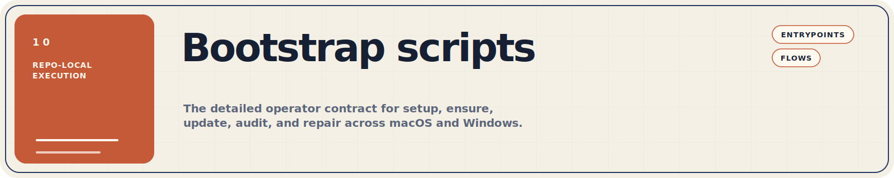

This directory contains the repo-local bootstrap, audit, and repair scripts
for macOS and Windows. Start with the public loaders at the repository root for
normal use. Use the scripts here when you need to inspect the flow, run a
single stage directly, or debug a failed run. Repository-maintainer tooling now
lives separately under [`../repository/`](../repository/).

Regenerate the README banner set with `mise run readme-assets`, or refresh the
headers and D2 diagrams together with `mise run readme-refresh`. The repo-local
[`../../mise.toml`](../../mise.toml) installs the Python and D2 tooling for
that pipeline. The task calls
[`generate_readme_banners.py`](../repository/generate_readme_banners.py)
and writes the SVGs to `assets/readme/`.

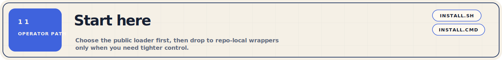

Use the public loaders first because they make sure the repo exists locally and
then hand off to the correct repo-local entrypoint for the task you requested.

| Goal | macOS | Windows | Why |
| --- | --- | --- | --- |
| First run or routine rerun | [`install.sh`](../../install.sh) | [`install.cmd`](../../install.cmd) | Safest path from a fresh machine |
| Read-only audit | `./install.sh audit ...` | `.\install.cmd audit ...` | Uses the same public contract as setup |
| Direct repo-local control | [`macos/bootstrap-macos.zsh`](macos/bootstrap-macos.zsh) | [`windows/bootstrap-windows.cmd`](windows/bootstrap-windows.cmd) | Useful when debugging or iterating locally |
| Signing repair | Not needed | [`windows/resign-windows.cmd`](windows/resign-windows.cmd) | Repairs local PowerShell signing drift |

> **Important**
> On Windows, use `install.cmd` or the repo-local `.cmd` entrypoints for a
> first run. They create or reuse the local signing certificate, sign the
> repo-local PowerShell scripts, and keep the PowerShell 5.x to `pwsh` bridge
> intact.

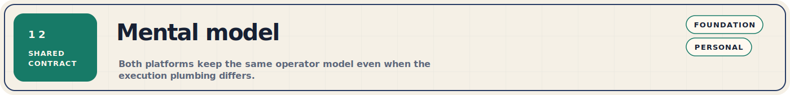

Both platforms share the same operator model even though the plumbing differs.

- The root [`install.sh`](../../install.sh) and
  [`install.cmd`](../../install.cmd) files are the public loaders.
- The foundation layer installs or repairs shared tooling and can optionally
  hand off to the personal layer.
- The personal layer applies repo-specific preferences such as dotfiles,
  defaults, shell choices, and copied config.
- The audit path is read-only by default. Windows also exposes a repair path
  for signing drift.
- Settings resolve through the same precedence chain on both platforms: CLI
  flag, environment variable, state file, device profile, interactive prompt,
  then hard-coded default.

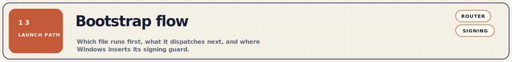

The bootstrap flow answers the first operator question: which file do you run,
and what does it launch next? The diagram below shows the normal path on each
platform before the platform-specific foundation or audit work begins.

The diagram below is rendered from
[`../../assets/bootstrap-flow.d2`](../../assets/bootstrap-flow.d2).


macOS delegates directly from the public loader into the repo-local `zsh`
router. Windows adds a guarded hop through
[`windows/bootstrap-windows.cmd`](windows/bootstrap-windows.cmd) so the local PowerShell
implementation can be signed before it runs.

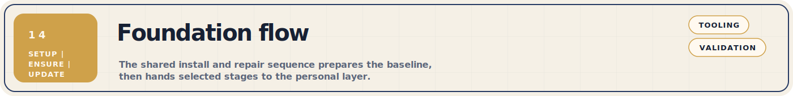

The foundation flow answers the next question: what actually happens during
`setup`, `ensure`, or `update`? This is the shared layer that installs the base
tooling, repairs shell activation, seeds `mise`, applies trust settings, and
then optionally enters the personal layer.

The diagram below is rendered from
[`../../assets/foundation-flow.d2`](../../assets/foundation-flow.d2).


`setup` and `ensure` follow the sequence above. `update` adds package-manager
upgrade steps before it falls back into the same ensure-style validation and
optional personal handoff.

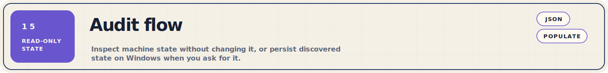

The audit flow is the safest way to understand the current machine state before
you change anything. It is read-only on macOS. On Windows, `-PopulateState`
adds one optional write after the terminal report so you can capture
discovered values in the shared state file.

The diagram below is rendered from
[`../../assets/audit-flow.d2`](../../assets/audit-flow.d2).


Use `--json` on macOS. On Windows, use `--json` and `--populate-state`
through [`install.cmd`](../../install.cmd), or use `-Json` and
`-PopulateState` when you call the repo-local wrappers directly.

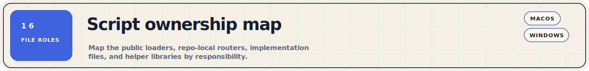

Treat this as an operator-facing entrypoint map. The table shows what you run
for each stage. On Windows, the `.cmd` wrappers are the normal entry surface.
The `.ps1` files sit behind them and only matter when you are debugging the
implementation layer directly.

| Stage | macOS entrypoint | Windows entrypoint | Use when |
| --- | --- | --- | --- |
| Public loader | [`install.sh`](../../install.sh) | [`install.cmd`](../../install.cmd) | First run or normal rerun from the repo root |
| Repo-local router | [`macos/bootstrap-macos.zsh`](macos/bootstrap-macos.zsh) | [`windows/bootstrap-windows.cmd`](windows/bootstrap-windows.cmd) | Platform-local dispatch and focused debugging |
| Foundation | [`macos/foundation-macos.zsh`](macos/foundation-macos.zsh) | [`windows/foundation-windows.cmd`](windows/foundation-windows.cmd) | `setup`, `ensure`, or `update` |
| Personal layer | [`macos/personal-bootstrap-macos.zsh`](macos/personal-bootstrap-macos.zsh) | [`windows/personal-bootstrap-windows.cmd`](windows/personal-bootstrap-windows.cmd) | Personal-only reconciliation after foundation |
| Audit | [`macos/audit-macos.zsh`](macos/audit-macos.zsh) | [`windows/audit-windows.cmd`](windows/audit-windows.cmd) | Read-only inspection of machine state |
| Repair | Not needed | [`windows/resign-windows.cmd`](windows/resign-windows.cmd) | PowerShell signing drift on Windows |

Windows PowerShell implementation files:
- [`windows/foundation-windows.ps1`](windows/foundation-windows.ps1)
- [`windows/personal-bootstrap-windows.ps1`](windows/personal-bootstrap-windows.ps1)
- [`windows/audit-windows.ps1`](windows/audit-windows.ps1)
- [`windows/resign-windows.ps1`](windows/resign-windows.ps1)

Support libraries:
- [`macos/lib/common.zsh`](macos/lib/common.zsh)
- [`windows/lib/common.ps1`](windows/lib/common.ps1)
- [`windows/lib/windows-precursor.ps1`](windows/lib/windows-precursor.ps1)
- [`windows/lib/signing-helpers-windows.ps1`](windows/lib/signing-helpers-windows.ps1)

The naming convention is purpose-first and OS-suffixed:
`bootstrap-<os>`, `foundation-<os>`, `personal-bootstrap-<os>`, and
`audit-<os>`. Windows keeps `.cmd` as the operator-facing wrapper layer and
`.ps1` as the implementation layer. The directory split now mirrors that model:
`macos/`, `windows/`, and later `linux/` if a third platform lands.

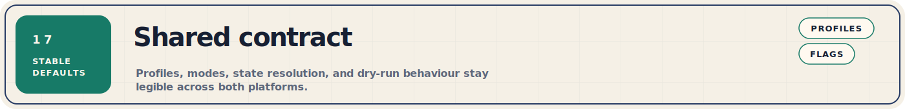

These defaults and conventions stay stable across both platforms, so you can
reason about the bootstrap without memorising every implementation detail.

| Contract | Value |
| --- | --- |
| State file | `~/.config/dotfiles/state.env` |
| Resolution precedence | CLI flag, environment variable, state file, device profile, interactive prompt, hard-coded default |
| Modes | `setup`, `ensure`, `update`, `personal`, `audit` |
| Dry-run | `--dry-run` on macOS, `-DryRun` on Windows |
| Profiles | `work`, `home`, `minimal` |
| First-run recommendation | Use the public loaders, not the direct implementation files |

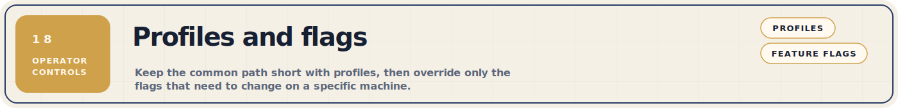

Profiles keep the common path short. Individual flags let you override that
path when a machine needs something different.

| Platform | Scope | Flags |
| --- | --- | --- |
| macOS | Foundation and package selection | `zscaler`, `work-apps`, `home-apps`, `gui`, `mise-tools` |
| macOS | Personal layer | `tuckr`, `macos-defaults`, `rosetta`, `shell-default` |
| Windows | Foundation | `zscaler`, `mise-tools` |
| Windows | Personal layer | `git-config`, `ssh-config`, `mise-config`, `opencode-config`, `profile-extras` |

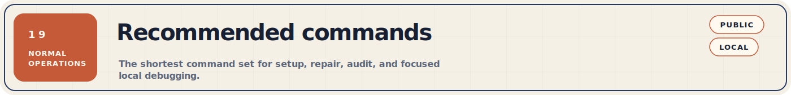

These commands cover the common operator paths without dropping into the
implementation files too early.

### macOS

Use the root loader for normal setup and audit work. Drop to the repo-local
router only when you need to inspect or debug a local stage directly.

```bash
./install.sh setup --shell fish --profile work --personal
./install.sh ensure --personal
./install.sh update
./install.sh audit --json
./Other/scripts/macos/bootstrap-macos.zsh ensure --shell fish --profile work
```

### Windows

Use the root loader for normal setup and audit work. Use the repo-local `.cmd`
wrappers when you want a single-purpose entrypoint or a local repair path.

```powershell
.\install.cmd setup --profile work --personal
.\install.cmd ensure
.\install.cmd audit --populate-state
.\Other\scripts\windows\bootstrap-windows.cmd audit -Section tools
.\Other\scripts\windows\resign-windows.cmd
```

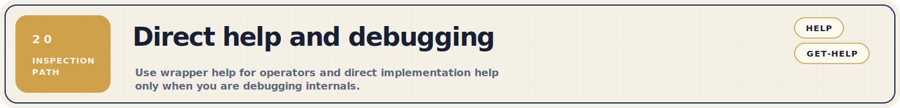

The fastest way to inspect a single entrypoint is to use its built-in help
surface. The `.cmd` wrappers are the normal Windows help path. `Get-Help` is
for inspecting the PowerShell implementation layer directly.

<details>
<summary>Show direct help commands</summary>

```bash
./Other/scripts/macos/bootstrap-macos.zsh --help
./Other/scripts/macos/foundation-macos.zsh --help
./Other/scripts/macos/personal-bootstrap-macos.zsh --help
./Other/scripts/macos/audit-macos.zsh --help
```

```powershell
.\Other\scripts\windows\bootstrap-windows.cmd --help
.\Other\scripts\windows\foundation-windows.cmd --help
.\Other\scripts\windows\audit-windows.cmd --help
.\Other\scripts\windows\personal-bootstrap-windows.cmd --help
.\Other\scripts\windows\resign-windows.cmd --help
Get-Help .\Other\scripts\windows\foundation-windows.ps1 -Detailed
Get-Help .\Other\scripts\windows\personal-bootstrap-windows.ps1 -Detailed
Get-Help .\Other\scripts\windows\audit-windows.ps1 -Detailed
Get-Help .\Other\scripts\windows\resign-windows.ps1 -Detailed
```

</details>

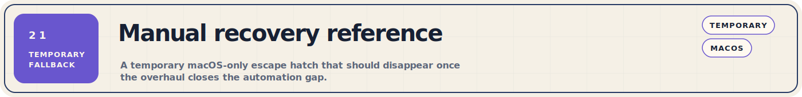

This section is a temporary macOS fallback. It exists while the macOS overhaul
is still closing the remaining automation gaps, and it should disappear once
the normal bootstrap path no longer needs a manual escape hatch.

<details>
<summary>Show manual macOS recovery steps</summary>

Use this only as a last resort. The normal Windows recovery path still depends
on the signed `.cmd` wrappers documented elsewhere in this README.

1. Install the basic prerequisites.

   ```bash
   xcode-select --install
   /bin/bash -c "$(curl -fsSL https://raw.githubusercontent.com/Homebrew/install/HEAD/install.sh)"
   eval "$(/opt/homebrew/bin/brew shellenv)"
   brew install git fish
   ```

2. Clone the repo and move the remote to SSH if you plan to push changes.

   ```bash
   git clone https://github.com/benjaminwestern/dotfiles ~/.dotfiles
   cd ~/.dotfiles
   git remote set-url origin git@github.com:benjaminwestern/dotfiles.git
   ```

3. Install the base package layer and `mise`.

   ```bash
   brew bundle --file=~/.dotfiles/Configs/brew/Brewfile
   curl https://mise.run | sh
   export PATH="$HOME/.local/bin:$PATH"
   eval "$(mise activate bash)"
   ```

4. Prepare the shell and config directories before you symlink anything.

   ```bash
   sudo sh -c 'echo /opt/homebrew/bin/fish >> /etc/shells'
   chsh -s /opt/homebrew/bin/fish
   mkdir -p ~/.ssh && chmod 700 ~/.ssh
   mkdir -p ~/.config
   mkdir -p ~/.codex
   ```

5. Apply the managed dotfiles and language toolchain.

   ```bash
   cd ~/.dotfiles && tuckr add \*
   mise install
   mise doctor
   tuckr status
   ```

6. Apply the machine-specific finishing steps.

   ```bash
   ~/.dotfiles/Other/scripts/macos/defaults-macos.sh "$(hostname -s)"
   /usr/sbin/softwareupdate --install-rosetta --agree-to-license
   exec /opt/homebrew/bin/fish
   ```

</details>

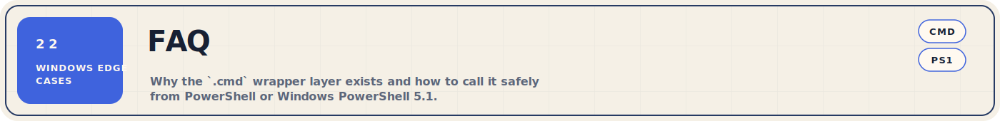

These are the questions that usually come up once you understand the normal
flow but want to know why Windows looks more defensive than macOS.

### Can I launch the Windows `.cmd` entrypoints from PowerShell or Windows PowerShell 5.1?

Yes. PowerShell can invoke the `.cmd` wrappers directly by path, for example
`& .\Other\scripts\windows\foundation-windows.cmd -Mode ensure`. The wrapper then runs
under `cmd.exe`, which is the intended first hop for the Windows bootstrap.

### Why does Windows keep both `.cmd` and `.ps1` files?

Windows uses `.cmd` as the operator-facing layer and `.ps1` as the
implementation layer. That split avoids a chicken-and-egg problem on fresh
machines or `AllSigned` machines where direct PowerShell execution can fail
before the local signing and PowerShell 7 precursor logic has run.

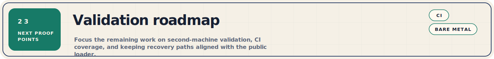

The bootstrap contract is in place on macOS and Windows. The remaining work is
mostly about proving the current flow on real machines and in CI, not
redesigning the current two-layer model.

- Validate the macOS foundation flow on a true bare Mac and tighten pre-flight
  checks, validation, and repair paths from the results.
- Validate the Windows personal layer on a real Windows machine so the repo
  copy, profile, SSH, Git, and config flows are proven outside dry-run paths.
- Add CI coverage on ephemeral macOS and Windows runners so `setup`, `ensure`,
  `update`, and `audit` stay exercised continuously.
- Add Linux only after the current macOS and Windows contract is stable enough
  to copy forward without introducing a third naming or flow variant.
