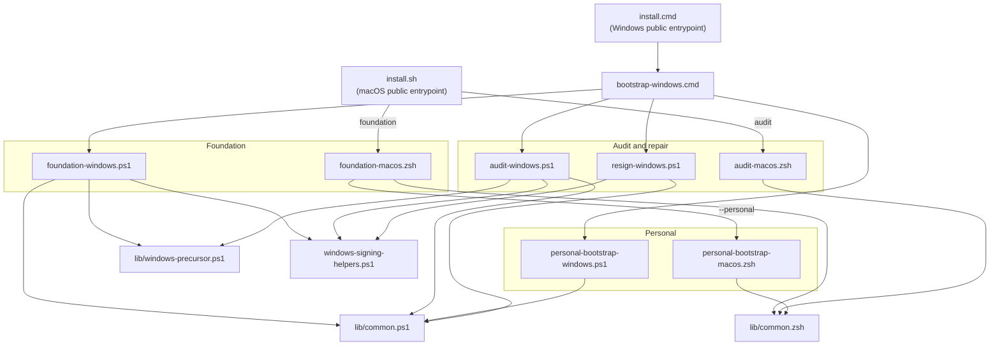

# 🔧 Bootstrap scripts

This directory contains the repo-local bootstrap and audit scripts for macOS
and Windows. The public loaders live at the repository root:

- `install.sh` is the macOS and Unix-facing entrypoint.
- `install.cmd` is the Windows-facing entrypoint.

Those loaders resolve or clone the repo, export the selected flags, and then
delegate to the repo-local scripts in this directory. The actual foundation and
personal behaviour lives here.

## 🏗️ Architecture overview



## 📜 Script catalogue

### `install.sh` and `install.cmd` (public entrypoints)

**Location:** Repository root (`~/.dotfiles/install.sh`,
`~/.dotfiles/install.cmd`)

These are the only public bootstrap entrypoints. They reuse an existing local
checkout when possible, clone the repo when it is missing, and can run once
from a temporary GitHub archive when `git` is unavailable. After that, they
delegate to the repo-local platform bootstrap.

**Supported modes**

- `setup` runs the full foundation flow and can optionally hand off to the
  personal layer.
- `ensure` repairs drift without assuming a clean machine.
- `update` upgrades package-manager-managed state and then re-runs ensure.
- `personal` runs the personal layer only.
- `audit` runs the read-only machine audit.

**Usage**

```bash
# macOS
./install.sh setup --shell fish --profile work --personal
./install.sh ensure --personal
./install.sh update
./install.sh audit --json
```

```powershell
# Windows
.\install.cmd setup --profile work --personal
.\install.cmd ensure
.\install.cmd update
.\install.cmd audit --populate-state
```

The public loaders do not implement foundation logic themselves. They exist to
make the bootstrap safe and convenient from a fresh machine.

---

### `foundation-macos.zsh` (macOS foundation)

**Location:** `Other/scripts/foundation-macos.zsh`

This is the repo-local macOS foundation orchestrator. It owns the shared,
machine-safe setup layer: Homebrew, baseline CLI packages, `mise`, managed
shell activation, Zscaler trust, `mise` seed config, and validation.

**Foundation flow**

1. Ensure Homebrew exists and activate it in the current shell.
2. Ensure the foundation Homebrew package set is present.
3. Ensure `mise` is installed, preferring Homebrew and falling back to the
   first-party shell installer.
4. Write or repair the managed `zsh` or `fish` activation block.
5. Activate the current shell session.
6. Create or update the managed `mise` seed block.
7. Detect Zscaler via TLS probe and repair trust if needed.
8. Run `mise install` when `ENABLE_MISE_TOOLS=true`.
9. Validate the resulting toolchain and optionally hand off to the personal
   layer.

The macOS foundation package list is `git`, `gh`, `jq`, `yq`, `fzf`, `fd`,
`ripgrep`, `zoxide`, `lazygit`, `openssl`, and `gum`. `mise` is managed
separately because it has both Homebrew and shell-installer paths.

---

### `personal-bootstrap-macos.zsh` (macOS personal layer)

**Location:** `Other/scripts/personal-bootstrap-macos.zsh`

This is the repo-specific macOS layer. It expects the shared library to have
resolved all flags and then runs dotfiles checkout, Brewfile reconciliation,
Tuckr symlinking, default-shell changes, macOS defaults, and Rosetta
installation.

Use this layer when you want the full workstation customisation on top of a
healthy foundation. Use the foundation only when you need a reusable,
shareable base machine configuration.

---

### `audit-macos.zsh` (macOS machine audit)

**Location:** `Other/scripts/audit-macos.zsh`

This is the read-only audit for macOS. It reports current tool state, shell
state, config state, and personal-layer outcomes without installing or
modifying anything.

**Usage**

```bash
./audit-macos.zsh
./audit-macos.zsh --section tools
./audit-macos.zsh --json

# Or via the public loader
./install.sh audit
./install.sh audit --section configs
```

---

### `bootstrap-windows.cmd` (Windows repo-local entrypoint)

**Location:** `Other/scripts/bootstrap-windows.cmd`

This is the first repo-local Windows entrypoint. It exists because Windows can
start in Windows PowerShell 5.x and, on some machines, under an effective
`AllSigned` policy with unsigned local `.ps1` files.

`bootstrap-windows.cmd` normalises the script root, creates the local
`LocalScoopSigner` certificate if needed, signs the repo-local Windows `.ps1`
bootstrap files, and then launches the selected PowerShell target with
`powershell.exe -File`.

**Supported targets**

- `foundation`
- `audit`
- `personal`
- `resign`

**Usage**

```powershell
.\Other\scripts\bootstrap-windows.cmd foundation -Mode ensure -DryRun
.\Other\scripts\bootstrap-windows.cmd audit -Json
.\Other\scripts\bootstrap-windows.cmd resign
```

Use this wrapper for first-run or repair scenarios. Direct `pwsh -File` usage
is fine on an already-bootstrapped machine, but it bypasses the unsigned-script
protection this wrapper provides.

---

### `lib/windows-precursor.ps1` (Windows PowerShell 5 bridge)

**Location:** `Other/scripts/lib/windows-precursor.ps1`

This shared precursor is loaded by both `foundation-windows.ps1` and
`audit-windows.ps1`. When the current host is already PowerShell 7 or later, it
returns immediately. When the current host is Windows PowerShell 5.x, it
ensures Scoop exists, ensures `pwsh` exists, signs the local script tree, and
re-runs the same target under PowerShell 7.

That keeps the real foundation and audit logic in `pwsh` without requiring the
operator to solve the first-run PowerShell upgrade path manually.

---

### `foundation-windows.ps1` (Windows foundation)

**Location:** `Other/scripts/foundation-windows.ps1`

This is the repo-local Windows foundation orchestrator. After the precursor
hands it off to `pwsh`, it owns the Windows foundation layer: Scoop, baseline
packages, `mise`, managed PowerShell profile repair, current-shell activation,
Windows Terminal default profile repair, `mise` seed config, staged Zscaler
trust, and validation.

**Foundation flow**

1. Ensure Scoop and the required buckets are present.
2. Ensure the Windows foundation package set is present.
3. Ensure `mise` is installed.
4. Write or repair the managed PowerShell profile block.
5. Activate `mise` in the current `pwsh` session with `pwsh --shims`.
6. Set Windows Terminal's default profile to `pwsh`.
7. Create or update the managed `mise` seed config.
8. Configure stage-1 Zscaler trust before `mise install`.
9. Run `mise install`.
10. Refresh TLS trust with Python `certifi` after `mise install`.
11. Validate the resulting toolchain and optionally hand off to the personal
    layer.

**Signing behaviour**

- Under `AllSigned`, the foundation creates `LocalScoopSigner` and signs Scoop,
  `mise`, dotfiles scripts, and the PowerShell profile where required.
- Under `RemoteSigned`, unsigned local scripts are acceptable and the audit
  reports unsigned profile or script counts as informational.

**Advanced direct invocation**

```powershell
pwsh -NoLogo -NoProfile -File .\Other\scripts\foundation-windows.ps1 -Mode ensure
pwsh -NoLogo -NoProfile -File .\Other\scripts\foundation-windows.ps1 -Mode ensure -TakeoverMiseConfig
```

`-TakeoverMiseConfig` is intentionally an advanced repo-local option. It is not
currently exposed through `install.cmd`.

---

### `resign-windows.cmd` and `resign-windows.ps1` (Windows signing repair)

**Location:** `Other/scripts/resign-windows.cmd`,
`Other/scripts/resign-windows.ps1`

These scripts provide the local repair path for Windows signing drift.
`resign-windows.cmd` is the muscle-memory wrapper and
`resign-windows.ps1` performs the work.

The repair flow ensures `LocalScoopSigner` exists, then re-signs:

- Scoop-managed PowerShell scripts
- `mise`-managed PowerShell scripts
- repo-local Windows bootstrap scripts under `~/.dotfiles/Other/scripts`
- the current PowerShell profile, when one exists

**Usage**

```powershell
.\Other\scripts\resign-windows.cmd
.\Other\scripts\resign-windows.cmd -DryRun
```

---

### `personal-bootstrap-windows.ps1` (Windows personal layer)

**Location:** `Other/scripts/personal-bootstrap-windows.ps1`

This is the repo-specific Windows layer. It reads the resolved state, then
reconciles the dotfiles checkout, Git config, SSH config, `mise` config,
Opencode config, and PowerShell profile extras.

All targets are idempotent, file-hash-aware, and dry-run capable. The script
does not change package-manager-managed foundation state.

---

### `audit-windows.ps1` (Windows machine audit)

**Location:** `Other/scripts/audit-windows.ps1`

This is the read-only audit for Windows. It shares the same PowerShell 5 to
PowerShell 7 precursor path as foundation, so it can start safely from a fresh
machine as long as you enter via `install.cmd` or `bootstrap-windows.cmd`.

**Sections**

- `tools` reports Scoop, foundation package coverage, `mise`, and runtime
  availability.
- `shell` reports execution policy, managed profile state, `mise` activation,
  `mise doctor`, and Windows Terminal default profile state.
- `configs` reports dotfiles checkout state, state file contents, `mise`
  config, `mise` `.env`, and system information.
- `signing` reports cert presence plus Scoop, `mise`, dotfiles, and profile
  signing state.
- `zscaler` reports live TLS detection, cert-store evidence, CA bundles,
  `mise` `.env` state, user env vars, and TLS client configuration.

**Usage**

```powershell
.\Other\scripts\bootstrap-windows.cmd audit
.\Other\scripts\bootstrap-windows.cmd audit -Section signing
.\Other\scripts\bootstrap-windows.cmd audit -Json
.\Other\scripts\bootstrap-windows.cmd audit -PopulateState
```

On an already-bootstrapped machine, direct `pwsh -File audit-windows.ps1` is
also fine. The audit never installs or modifies machine state, apart from the
optional `-PopulateState` write to `~/.config/dotfiles/state.env`.

The `-PopulateState` switch discovers the current machine state and writes it
into `~/.config/dotfiles/state.env`. This lets a subsequent bootstrap run use
detected values (shell, profile, Zscaler presence, mise status) as a baseline
instead of re-prompting. The state file is used by the resolution engine at
precedence level 3 (after CLI flags and environment variables).

---

### `windows-signing-helpers.ps1` (Code Signing Utilities)

**Location:** `Other/scripts/windows-signing-helpers.ps1`

Shared Windows signing library. It manages lookup and creation of the local
`LocalScoopSigner` certificate, imports that certificate into the required user
stores, and exposes the signing helpers used by foundation, audit, and the
re-sign repair flow.

The helper surface covers Scoop scripts, `mise` scripts, repo-local Windows
dotfiles scripts, and the current PowerShell profile. All helpers skip tiny
files so placeholder or empty `.ps1` files do not generate noisy audit output.

---

### `macos-defaults.sh` (macOS System Preferences)

**Location:** `Other/scripts/macos-defaults.sh`

Applies macOS system defaults and preferences. Called by the personal layer
but can be run independently. Uses proper quoting and groups all Dock changes
under a single `killall Dock` at the end.

**What it configures:**

- Hostname (ComputerName, HostName, LocalHostName)
- Dock (left side, auto-hide, no delay, remove default apps, remove recents)
- Battery (show percentage on menu bar)
- Mouse (disable acceleration)
- Power / Sleep (display, disk, and system sleep times)
- Finder (show path bar, status bar, all extensions, show ~/Library and /Volumes, no warnings)
- Screenshots (PNG format)

**Usage:**

```bash
~/.dotfiles/Other/scripts/macos-defaults.sh "computer-name"
```

**Note:** Some changes require logging out or restarting to take full effect.

---

### `lib/common.zsh` (Shared Zsh Library)

**Location:** `Other/scripts/lib/common.zsh`

Shared zsh library providing state management, setting resolution, status
output, dry-run infrastructure, and UI helpers. Sources the state file, resolves
all feature flags through the precedence chain, and provides `gum`-driven
interactive prompts.

**Key responsibilities:**

- State file read/write (`~/.config/dotfiles/state.env`)
- Setting resolution with the full precedence chain
- Device profile preset lookup
- `gum`-based interactive prompts and status output
- `RESOLVED_*` global population
- Dry-run gating via `run_or_dry()` and `dry_run_active()`
- Pre-flight inventory via `preflight_inventory()`
- Managed block writing via `write_managed_block()`

---

### `lib/common.ps1` (Shared PowerShell Library)

**Location:** `Other/scripts/lib/common.ps1`

Shared PowerShell library providing equivalent state management, resolution,
status output, dry-run infrastructure, and managed block writing for the Windows
scripts.

**Key responsibilities:**

- State file read/write (`~/.config/dotfiles/state.env`)
- Setting resolution with the full precedence chain (`Resolve-Setting`, `Resolve-AllFlags`)
- Device profile preset lookup (`Get-ProfileDefault`)
- Scoop and `mise` installation detection (`Test-ScoopPackageInstalled`,
  `Get-MiseInstallMethod`)
- Windows Terminal settings discovery and profile lookup
- `mise doctor` helpers and stale `mise\installs\...` PATH cleanup
- Zscaler live-TLS detection, cert-store detection, and effective setting
  resolution
- Status output (`Write-StatusPass`, `Write-StatusFix`, `Write-StatusSkip`, `Write-StatusFail`, `Write-StatusSummary`)
- Dry-run gating via `Invoke-OrDry`, `Test-DryRun`, and `Write-DryRunLog`
- Managed block writing via `Write-ManagedBlock` (dry-run aware)

---

## 💾 State File

The bootstrap persists resolved settings to a state file so that subsequent
runs (ensure, update) remember previous choices without re-prompting.

**Location:** `~/.config/dotfiles/state.env`

**Format:**

```bash
PREFERRED_SHELL=fish
DEVICE_PROFILE=work
ENABLE_ZSCALER=auto
ENABLE_WORK_APPS=true
ENABLE_HOME_APPS=false
ENABLE_GUI=true
ENABLE_TUCKR=true
ENABLE_MACOS_DEFAULTS=true
ENABLE_ROSETTA=true
ENABLE_MISE_TOOLS=true
ENABLE_SHELL_DEFAULT=true
```

The state file is a plain key=value file read by both `lib/common.zsh` and
`lib/common.ps1`. It is created automatically by the resolution engine after
the first run and updated on every subsequent invocation.

---

## 🏷️ Feature Flag Catalogue

Every step in both the foundation and personal layers is gated by a resolved
feature flag. The `RESOLVED_*` globals are populated by `lib/common.zsh`
through the resolution precedence chain.

| Flag | Type | Description |
|------|------|-------------|
| `RESOLVED_SHELL` | `fish` / `zsh` | Preferred interactive shell |
| `RESOLVED_PROFILE` | `work` / `home` / `minimal` | Device profile preset |
| `RESOLVED_ZSCALER` | `auto` / `true` / `false` | Zscaler trust bootstrap |
| `RESOLVED_WORK_APPS` | `true` / `false` | Install work apps (Edge, Teams) |
| `RESOLVED_HOME_APPS` | `true` / `false` | Install home apps (databases, MAS) |
| `RESOLVED_GUI` | `true` / `false` | Install GUI applications via Brewfile |
| `RESOLVED_TUCKR` | `true` / `false` | Run tuckr symlink application |
| `RESOLVED_MACOS_DEFAULTS` | `true` / `false` | Apply macOS system defaults |
| `RESOLVED_ROSETTA` | `true` / `false` | Install Rosetta 2 (Apple Silicon) |
| `RESOLVED_MISE_TOOLS` | `true` / `false` | Install mise-managed tools |
| `RESOLVED_SHELL_DEFAULT` | `true` / `false` | Change default shell to preferred |

---

## 🔗 Resolution Precedence

Each feature flag is resolved through a six-level precedence chain. The first
non-empty value wins:

1. **CLI flag** — Explicit flag passed on the command line
2. **Environment variable** — Matching `ENABLE_*` env var exported in the shell
3. **State file** — Value persisted from a previous run (`~/.config/dotfiles/state.env`)
4. **Device profile preset** — Default from the selected profile (work/home/minimal)
5. **Interactive prompt** — `gum` prompt shown to the operator (skipped with `--non-interactive`)
6. **Hard-coded default** — Fallback value baked into the script

---

## 📊 Device Profile Presets

Profiles encode sensible defaults for each device role. The `--profile` flag
selects a preset; individual flags can still override any preset value.

| Flag | `work` | `home` | `minimal` |
|------|--------|--------|-----------|
| `ENABLE_ZSCALER` | auto | false | false |
| `ENABLE_WORK_APPS` | true | false | false |
| `ENABLE_HOME_APPS` | false | true | false |
| `ENABLE_GUI` | true | true | false |
| `ENABLE_TUCKR` | true | true | true |
| `ENABLE_MACOS_DEFAULTS` | true | true | false |
| `ENABLE_ROSETTA` | true | true | false |
| `ENABLE_MISE_TOOLS` | true | true | true |
| `ENABLE_SHELL_DEFAULT` | true | true | true |

---

## 🔍 Pre-Flight Inventory

Before making any changes, both the foundation and personal layers run a
**pre-flight inventory** that snapshots the current machine state into
`PREFLIGHT_*` global variables. This lets every subsequent step make informed
decisions about what to install, skip, or repair.

**What gets inventoried:**

- Tool availability (`brew`, `git`, `fish`, `zsh`, `mise`, `tuckr`, `gum`, `zoxide`, `fzf`)
- Shell state (current `$SHELL`, whether fish/zsh is in `/etc/shells`)
- macOS specifics (Rosetta installed, Zscaler detected, architecture)
- Configuration state (state file exists, mise config exists, dotfiles cloned)
- Runtime versions (Homebrew version, mise version)

Each inventory check is silent — it populates globals without printing output.
The results are used by `ensure_*` functions to decide whether to act or skip.
For example, `ensure_homebrew()` checks `PREFLIGHT_HAS_BREW` before attempting
installation.

---

## 🏃 Dry-Run Mode

### macOS

Pass `--dry-run` to preview the full bootstrap pipeline without making any
changes. Every destructive command is wrapped in `run_or_dry()` which logs what
*would* happen instead of executing it.

**What runs normally in dry-run:**

- Pre-flight inventory (all checks are read-only)
- Feature flag resolution (CLI → env → state → profile → prompt → default)
- Validation checks (verifying current state)
- Status output (every step still prints its pass/fix/skip/fail line)

**What is skipped in dry-run:**

- Package installation (`brew install`, `brew bundle`, `mise install`)
- File writes (state file, profile blocks, managed blocks, cert bundles)
- System changes (`chsh`, `/etc/shells` modification, macOS defaults, Rosetta)
- Git operations (`git clone`, `git pull`)
- Directory creation (`mkdir`)

**Status lines in dry-run** use `status_fix` with "would ..." phrasing:

```
  ✗ Homebrew                    — would install
  ✗ Foundation packages         — would install 12 packages
  ✗ Brew bundle                 — would install/update 47 packages
  ○ Zscaler trust               — disabled by flag
  ✗ Default shell               — would set to /opt/homebrew/bin/fish
```

The dry-run log is also written to stdout via `dry_run_log()` so you can see
the exact commands that would have been executed.

### Windows

On Windows, prefer the repo-local CMD wrapper for first-run-safe dry-runs:

```powershell
.\Other\scripts\bootstrap-windows.cmd foundation -Mode setup -DryRun
.\Other\scripts\resign-windows.cmd -DryRun
```

Direct PowerShell dry-runs are also available on an already-bootstrapped
machine:

```powershell
.\Other\scripts\foundation-windows.ps1 -Mode setup -DryRun
.\Other\scripts\personal-bootstrap-windows.ps1 -DryRun
```

Or via `install.cmd`, which threads the flag into the repo-local Windows
bootstrap:

```powershell
.\install.cmd setup --dry-run
```

The Windows dry-run uses `Invoke-OrDry` (parallel to `run_or_dry()`) and
`Test-DryRun` (parallel to `dry_run_active()`). All destructive operations —
Scoop installs, file copies, cert creation, signing, profile writes — are gated.
`Write-ManagedBlock` is also dry-run aware and logs what would change.

---

## ✅ Status Output System

Every step in the bootstrap emits a status line so you can see at a glance what
happened. macOS and Windows share the same pass, skip, and fail semantics. The
Windows scripts use a dedicated `!` fix marker, while the macOS scripts still
render fix lines with a yellow `✗`.

| Symbol | Function | Meaning |
|--------|----------|---------|
| `✓` (green) | `status_pass` / `Write-StatusPass` | Already correct, no action needed |
| `✗` or `!` (yellow) | `status_fix` / `Write-StatusFix` | Was wrong, corrective action taken |
| `○` (gray) | `status_skip` / `Write-StatusSkip` | Intentionally skipped (disabled by flag) |
| `✗` (red) | `status_fail` / `Write-StatusFail` | Failed — could not be corrected |

**Example output:**

```
  ✓ Homebrew installed                          (4.4.2)
  ✓ Foundation packages present                 (12/12)
  ✗ Fish not in /etc/shells                     — added
  ✓ Fish set as default shell                   (/opt/homebrew/bin/fish)
  ○ Zscaler trust                               — disabled by flag
  ✓ Mise tools installed                        (14 tools)
```

At the end of each layer, a **summary tally** is printed:

```
  ━━━━━━━━━━━━━━━━━━━━━━━━━━━━━━━━━━━━━━━━━━━━━━━━━━
  Foundation: 11 passed, 2 fixed, 1 skipped, 0 failed
  ━━━━━━━━━━━━━━━━━━━━━━━━━━━━━━━━━━━━━━━━━━━━━━━━━━
```

---

## 📖 Runbooks

Detailed manual runbooks are available for reference when the automated scripts
are not suitable or when debugging a failed bootstrap:

- **macOS:** [macos-foundation-bootstrap.md](macos-foundation-bootstrap.md)
- **Windows:** [windows-bootstrap.md](windows-bootstrap.md)

---

## 🔄 Manual Recovery Steps

If the bootstrap script fails or you need to manually get things working:

### 1. Get Basic Shell Working

```bash
# If stuck without tools, manually install:
/bin/bash -c "$(curl -fsSL https://raw.githubusercontent.com/Homebrew/install/HEAD/install.sh)"
eval "$(/opt/homebrew/bin/brew shellenv)"
brew install git fish
```

### 2. Get Dotfiles

```bash
git clone https://github.com/benjaminwestern/dotfiles ~/.dotfiles
cd ~/.dotfiles
git remote set-url origin git@github.com:benjaminwestern/dotfiles.git
```

### 3. Install Core Tools

```bash
brew bundle --file=~/.dotfiles/Configs/brew/Brewfile
```

### 4. Setup Shell

```bash
# Add fish to shells
sudo sh -c 'echo /opt/homebrew/bin/fish >> /etc/shells'
chsh -s /opt/homebrew/bin/fish

# Pre-create directories
mkdir -p ~/.ssh && chmod 700 ~/.ssh
mkdir -p ~/.config

# Symlink dotfiles
tuckr add \*
```

### 5. Get Mise Working

```bash
curl https://mise.run | sh
export PATH="$HOME/.local/bin:$PATH"
eval "$(mise activate bash)"  # or zsh/fish
mise install
```

### 6. Activate Everything

```bash
# Restart terminal or
exec /opt/homebrew/bin/fish

# Verify
mise doctor
tuckr status
```

---

## 🧰 Core Tool Stack

### Present Tools (All Implemented)

| Tool | Purpose | Install Method | Config Location |
|------|---------|----------------|-----------------|
| **Fish** | Shell | Homebrew | `Configs/fish/.config/fish/` |
| **Tuckr** | Dotfile manager | Homebrew | This repo |
| **Mise** | Dev environment | Homebrew / curl / Scoop | `Configs/mise/.config/mise/` |
| **Homebrew** | Package manager (macOS) | curl installer | `Configs/brew/Brewfile` |
| **Scoop** | Package manager (Windows) | PowerShell installer | N/A |
| **Gum** | Interactive CLI prompts and status output | Homebrew / Scoop | Dracula theme via env vars |
| **Tmux** | Terminal multiplexer | Homebrew | `Configs/tmux/.tmux.conf` |
| **Neovim** | Editor | Homebrew | `Configs/nvim/.config/nvim/` |
| **Zoxide** | Smart cd | Homebrew / Scoop | Activated in all shells |
| **FZF** | Fuzzy finder | Homebrew / Scoop | Activated in all shells |

### Deprecated / Replaced

| Old Tool | Replacement | Reason |
|----------|-------------|---------|
| **Stow** | Tuckr | Better conflict detection, Rust-based |
| **setup-osx.sh** | install.sh | Unified macOS public entry |
| **macos-bootstrap.sh** | foundation-macos.zsh + personal-bootstrap-macos.zsh | Two-layer architecture with feature flags |
