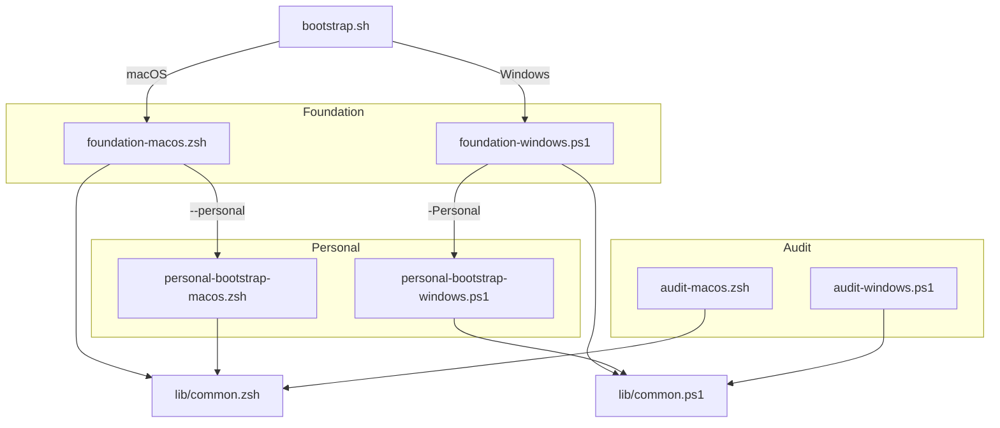

# 🏠 Dotfiles

Cross-platform development environment configuration for macOS, Windows, and
(future) Linux. One command takes a bare machine to a fully functional workspace
in under 15 minutes.

macOS uses [Tuckr](https://github.com/RaphGL/Tuckr) for dotfile symlinking,
while Windows uses native PowerShell plus Scoop and selective config copying.

## 🤔 What This Repo Does

This repository sets up a complete development environment from a fresh
installation to a fully functional workspace. The bootstrap follows a
**two-layer architecture** controlled by feature flags:

- **Foundation layer** installs the core tooling that any engineer needs —
  package manager, CLI utilities, shell activation, gum, mise, seed config, and
  Zscaler trust when detected. It is generic, repeatable, and safe to share
  across teams.
- **Personal layer** applies repository-specific preferences — dotfile
  symlinking, brew bundle, tuckr, shell default, macOS defaults, and Rosetta.
  Triggered by passing `--personal`.

For Windows, there is a documented user-space bootstrap workflow for native
PowerShell plus Scoop under an effective `AllSigned` execution policy. See
[Other/scripts/README.md](Other/scripts/README.md) for the Windows-specific
process, including the required code-signing and re-signing steps for
Scoop-managed `.ps1` files, the same signing requirement for `mise` wrappers
and the PowerShell profile, the Windows Zscaler certificate flow, and the
current `mise` setup pattern of storing certificate environment variables in
either `.env` or `config.toml`, with `config.toml` preferred on Windows when
dotenv parsing is unreliable. The Windows notes also cover the signed PowerShell
profile pattern, `zoxide` startup, copying `git` and `opencode` configs, and a
phased bootstrap style inspired by `EmileHofsink/dotfiles` and
`withriley/engineer-enablement`.

Both layers are fully idempotent, dry-runnable, and gated by feature flags that
resolve through a six-level precedence chain (CLI → env → state file → device
profile → interactive prompt → default).

### 📦 Managed by Homebrew (Brewfile)

**Core infrastructure tools** that need to be available immediately:

- **Shell** — Fish (with Fisher plugin manager)
- **Terminal** — Ghostty, Tmux (with TPM)
- **Editors** — Neovim
- **CLI Tools** — git, lazygit, zoxide, fzf, fd, ripgrep, jq, yq, gh, gitleaks, tree, htop
- **AI Tools** — terraform-mcp-server, mcp-toolbox, gemini-cli, claude-code, codex
- **System** — Aerospace (window manager), borders (gated by `HOMEBREW_GUI`)
- **Dotfile Manager** — tuckr

### 🔧 Managed by Mise (mise.toml)

**Development environments and language runtimes:**

- **Languages** — Go, Node.js, Deno, Bun, Python, Rust, Lua, Terraform
- **Go Tools** — cloud-sql-proxy, air, golangci-lint, gofumpt, swag, sqlc, d2, glow, freeze, vhs
- **Node Tools** — pnpm, dataform-cli, opencode-ai, playwright
- **Python Tools** — uv, pipx, sqlfluff
- **Cargo Tools** — tuckr (self-managing)

### 📝 Configuration Files

- **Shell** — Fish, Zsh, Bash configs with mise, zoxide, and worktrunk activation
- **Editors** — Neovim (based on Kickstart.nvim), Ghostty terminal
- **Tools** — Mise, Tmux, Yazi (file manager), Git, Opencode, Claude Code
- **System** — macOS defaults, Aerospace window manager

## 🚀 Quick Start (New Machine)

### Automated Bootstrap (Recommended)

The bootstrap supports multiple modes and feature flags to control what gets
installed.

**Common setups:**

```bash
# Work machine with fish shell
bootstrap.sh setup --shell fish --profile work --personal

# Home machine with zsh
bootstrap.sh setup --shell zsh --profile home --personal

# Minimal server (no GUI, no defaults)
bootstrap.sh setup --shell zsh --profile minimal --non-interactive

# Dry run — see what would happen without changing anything
bootstrap.sh setup --dry-run --shell fish --profile work --personal
```

**Remote one-liner (macOS):**

```bash
curl -fsSL https://raw.githubusercontent.com/benjaminwestern/.dotfiles/main/bootstrap.sh | bash
```

**Clone first, then run (recommended for security):**

```bash
git clone https://github.com/benjaminwestern/dotfiles ~/.dotfiles
# Inspect the code: cat ~/.dotfiles/bootstrap.sh
~/.dotfiles/bootstrap.sh setup --shell fish --profile work --personal
```

**Windows (PowerShell):**

```powershell
# Clone
git clone https://github.com/benjaminwestern/dotfiles $HOME\.dotfiles

# Audit current machine state and populate the state file
.\Other\scripts\audit-windows.ps1 -PopulateState

# Dry-run the foundation
.\Other\scripts\foundation-windows.ps1 -Mode setup -DryRun

# Run for real
.\Other\scripts\foundation-windows.ps1 -Mode setup -Personal
```

**Other modes:**

```bash
# Ensure current state is healthy, repair drift
./bootstrap.sh ensure --personal

# Update all package managers and tools
./bootstrap.sh update

# Personal layer only (foundation must be healthy)
./bootstrap.sh personal --non-interactive --shell zsh

# Audit current machine state (read-only, no changes)
./bootstrap.sh audit
./bootstrap.sh audit --section tools
./bootstrap.sh audit --json
```

### How the Bootstrap Runs

The bootstrap runs in two layers:

**1. Foundation:** pre-flight inventory → Homebrew → foundation packages (incl. gum) → mise → shell profile → mise seed → Zscaler trust → mise tools → validate

**2. Personal** (with `--personal`): pre-flight inventory → dotfiles repo → brew bundle → tuckr → shell default → macOS defaults → Rosetta

Both layers start with a **pre-flight inventory** that snapshots what's already
installed (tools, configs, shell state, Rosetta, Zscaler trust) so every
subsequent step can make informed decisions about what to skip.

Every step emits a **status line** (`✓` pass, `✗` fix, `○` skip) and a summary
tally at the end.

Use `--dry-run` to preview the full plan without making any changes —
pre-flight, resolution, and validation all run normally, but no software is
installed, no files are written, and no system settings are changed.

**Total time:** ~10-15 minutes depending on internet connection.

### Manual Setup (Reference Only)

This section is kept for reference. The automated bootstrap above is the
recommended path. If you want to understand or verify each step:

```bash
# 1. Install Xcode Command Line Tools
xcode-select --install

# 2. Install Homebrew
/bin/bash -c "$(curl -fsSL https://raw.githubusercontent.com/Homebrew/install/HEAD/install.sh)"
eval "$(/opt/homebrew/bin/brew shellenv)"

# 3. Clone dotfiles
git clone https://github.com/benjaminwestern/dotfiles ~/.dotfiles
cd ~/.dotfiles

# 4. Convert git remote to SSH (for pushing updates)
git remote set-url origin git@github.com:benjaminwestern/dotfiles.git

# 5. Install all Homebrew packages
brew bundle

# 6. Set Fish as default shell
sudo sh -c 'echo /opt/homebrew/bin/fish >> /etc/shells'
chsh -s /opt/homebrew/bin/fish

# 7. Pre-create directories (prevents tuckr from symlinking entire directories)
mkdir -p ~/.ssh && chmod 700 ~/.ssh
mkdir -p ~/.config

# 8. Symlink dotfiles
tuckr add \*

# 9. Install Mise
curl https://mise.run | sh
export PATH="$HOME/.local/bin:$PATH"
eval "$(mise activate bash)"

# 10. Install all Mise tools
mise up

# 11. Apply macOS defaults
~/.dotfiles/Other/scripts/macos-defaults.sh "my-macbook"

# 12. Install Rosetta (Apple Silicon only)
/usr/sbin/softwareupdate --install-rosetta --agree-to-license
```

## 🏗️ Architecture



### Personal Phase Comparison

| macOS | Windows |
|-------|---------|
| Dotfiles repo clone/pull | Dotfiles repo clone/pull |
| Full brew bundle | Git config copy |
| Tuckr symlinks | SSH config copy |
| Shell default (fish/zsh) | Mise config copy |
| macOS system defaults | Opencode config copy |
| Rosetta 2 | PowerShell profile extras |

## 📦 What Gets Installed

Feature flags control what gets installed. The `--profile` flag selects a
device preset (work, home, or minimal), and individual flags can override any
preset value. See [Other/scripts/README.md](Other/scripts/README.md) for the
full feature flag catalogue and device profile presets.

### Immediate (Homebrew — ~5 mins)

- Fish shell with all completions
- Git, lazygit
- Modern CLI replacements — zoxide (cd), fzf (find), fd (find), ripgrep (grep)
- Data processing — jq (JSON), yq (YAML)
- AI tools — gemini-cli, claude-code, codex, terraform-mcp-server, mcp-toolbox
- Terminal — tmux, yazi
- GUI apps (gated by `HOMEBREW_GUI`) — ghostty, aerospace, borders, Chrome, VS Code, Docker Desktop, maccy, dbngin
- Security — gitleaks
- Development — neovim

### Development Tools (Mise — ~10 mins)

- All programming languages and their package managers
- Language-specific CLI tools (linters, formatters, etc.)
- Cloud tools (gcloud via mise plugin)
- Note: gemini-cli, codex, and amp are commented out in `config.toml` — now installed via Homebrew casks instead

## 📁 Repository Structure

```
.dotfiles/
├── bootstrap.sh                       # Cross-platform entrypoint with flag parsing
├── Configs/                           # Dotfile groups (see Configs/README.md)
│   ├── aerospace/                     #   Window manager config
│   ├── bash/                          #   Bash config (.bashrc, .bash_profile, .hushlogin)
│   ├── borders/                       #   Window borders config
│   ├── brew/Brewfile                  #   Homebrew packages
│   ├── claude/.claude/                #   Claude Code settings
│   ├── codex/.codex/                  #   Codex CLI config
│   ├── fish/.config/fish/             #   Fish shell config
│   ├── gemini/                        #   Gemini settings
│   ├── ghostty/.config/ghostty/       #   Ghostty terminal config
│   ├── git/.gitconfig                 #   Git configuration
│   ├── hypr/.config/hypr/             #   Hyprland config (Linux)
│   ├── mise/.config/mise/             #   Mise config, env, scripts
│   ├── nvim/.config/nvim/             #   Neovim configuration
│   ├── opencode/.config/opencode/     #   Opencode config and plugins
│   ├── pitchfork/.config/pitchfork/   #   Pitchfork config
│   ├── ssh/.ssh/config                #   SSH config (keys not included)
│   ├── tmux/.tmux.conf                #   Tmux configuration
│   ├── worktrunk/.config/worktrunk/   #   Worktrunk worktree manager
│   ├── yazi/.config/yazi/             #   Yazi file manager
│   └── zsh/                           #   Zsh config (.zshrc, .zprofile)
├── Other/
│   └── scripts/                       # Bootstrap system (see Other/scripts/README.md)
│       ├── foundation-macos.zsh       #   macOS foundation bootstrap
│       ├── personal-bootstrap-macos.zsh #  macOS personal layer
│       ├── audit-macos.zsh            #   Read-only machine state audit
│       ├── foundation-windows.ps1     #   Windows foundation bootstrap
│       ├── personal-bootstrap-windows.ps1 # Windows personal layer
│       ├── audit-windows.ps1          #   Windows state audit (with -PopulateState)
│       ├── windows-signing-helpers.ps1 #  Code signing utilities
│       ├── macos-defaults.sh          #   macOS system preferences
│       ├── macos-foundation-bootstrap.md # macOS runbook
│       ├── windows-bootstrap.md       #   Windows runbook
│       └── lib/
│           ├── common.zsh            #   Shared zsh library
│           └── common.ps1            #   Shared PowerShell library
└── Secrets/                           # Encrypted sensitive files (not committed)
```

> 📖 **[Configs/README.md](Configs/README.md)** — What each config group
> contains, how tuckr and copy-based management work across platforms, and how
> to add a new config group.
>
> 📖 **[Other/scripts/README.md](Other/scripts/README.md)** — Full bootstrap
> reference: feature flags, resolution precedence, device profiles, dry-run,
> state file, pre-flight inventory, status output, and manual recovery.

## 🔧 Daily Usage

### After Bootstrap

1. **Restart terminal** or run `exec fish` to activate Fish shell
2. Run `mise doctor` to verify everything is working
3. **Setup Worktrunk** by running `wt config shell install`
4. Some macOS changes require a system restart

### Managing Dotfiles

```bash
# Check symlink status
cd ~/.dotfiles && tuckr status

# Add new config group
tuckr add <group-name>

# Remove config group
tuckr rm <group-name>

# Push changes
git add -A
git commit -m "update: description"
git push
```

### Updating Tools

```bash
# Update Homebrew packages
brew update && brew upgrade

# Update Mise tools
mise up

# Update both (run via mise task)
mise run bundle-update
```

## ⚙️ Customisation

### Environment-Specific Brewfile Apps

The Brewfile supports conditional installs controlled by feature flags:

```bash
# For work machine (installs Edge, Teams)
export HOMEBREW_WORK_APPS=true
brew bundle

# For home machine (installs databases, Mac App Store apps)
export HOMEBREW_HOME_APPS=true
brew bundle
```

When using the bootstrap, these are set automatically based on the `--profile`
flag and the resolved `ENABLE_WORK_APPS` / `ENABLE_HOME_APPS` feature flags.

### Computer Name

Pass a custom name to the macOS defaults script:

```bash
~/.dotfiles/Other/scripts/macos-defaults.sh "work-macbook-pro"
```

This sets the hostname and appears in your shell prompt.

## 💡 Key Design Decisions

1. **Brew vs Mise Split** — Core shell tools (zoxide, fzf) are in the Brewfile
   so they are available before mise runs. Development tools (languages,
   compilers) are in mise for version management.

2. **Tuckr Instead of Stow** — Tuckr is a Rust-based stow replacement with
   better conflict detection and symlink tracking. It symlinks individual files
   when directories exist, preventing "directory absorption" issues.

3. **Pre-Created Directories** — The bootstrap creates `~/.ssh/`,
   `~/.config/`, and `~/.codex/` before running tuckr, ensuring only config
   files are symlinked (not entire directories that might contain other files).

4. **Fish as Default** — While zsh and bash configs are included, Fish is the
   primary shell with full mise and zoxide integration.

5. **Two-Layer Architecture** — The foundation layer is generic and
   customer-safe. The personal layer applies repository-specific preferences.
   This separation means the foundation can be shared across teams while
   personal customisations remain isolated.

6. **Feature Flag Resolution** — Settings are resolved through a six-level
   precedence chain (CLI flag, environment variable, state file, device profile,
   interactive prompt, hard-coded default) so the bootstrap is both flexible and
   repeatable.

7. **Mise Dual-Install Path** — mise is intentionally not bundled with the
   foundation Homebrew/Scoop packages. It can be installed via Homebrew
   (`brew install mise`), Scoop (`scoop install mise`), or the first-party
   shell installer (`curl https://mise.run | sh`). The bootstrap detects which
   method was used and handles updates accordingly. On Windows with AllSigned
   execution policy, Scoop is required so mise's `.ps1` shims can be signed.

## 🛠️ Troubleshooting

### Mise not found after install

```bash
export PATH="$HOME/.local/bin:$PATH"
eval "$(mise activate fish)"  # or zsh/bash
```

### Tuckr symlink issues

```bash
# Check status
tuckr status

# If conflicts, you can see what's not symlinked (shown in red)
# Then manually handle conflicts or use tuckr rm/add
```

### Bootstrap fails mid-way

The bootstrap script is idempotent — you can safely re-run it. It checks for
existing installations and skips completed steps. Use `./bootstrap.sh ensure`
to repair a partially completed setup.

### Windows signing drift after updates

Scoop and mise updates create new unsigned `.ps1` shims. Run update mode to
automatically re-sign after upgrading:

```powershell
.\Other\scripts\foundation-windows.ps1 -Mode update
```

## 🔄 Manual Recovery (Getting Things Online)

If the automated bootstrap fails or you need to manually set up a machine,
follow these steps in order:

### Step 1: Get Basic Tools

```bash
# Install Xcode Command Line Tools
xcode-select --install

# Install Homebrew
/bin/bash -c "$(curl -fsSL https://raw.githubusercontent.com/Homebrew/install/HEAD/install.sh)"
eval "$(/opt/homebrew/bin/brew shellenv)"

# Install minimal requirements
brew install git fish
```

### Step 2: Get Dotfiles

```bash
# Clone repository
git clone https://github.com/benjaminwestern/dotfiles ~/.dotfiles
cd ~/.dotfiles

# Convert to SSH (for pushing updates later)
git remote set-url origin git@github.com:benjaminwestern/dotfiles.git
```

### Step 3: Install Core Stack

```bash
# Install all Brewfile packages (takes ~5 mins)
brew bundle --file=~/.dotfiles/Configs/brew/Brewfile

# Install Mise
curl https://mise.run | sh
export PATH="$HOME/.local/bin:$PATH"
eval "$(mise activate bash)"
```

### Step 4: Setup Shell and Symlinks

```bash
# Add fish to allowed shells
sudo sh -c 'echo /opt/homebrew/bin/fish >> /etc/shells'
chsh -s /opt/homebrew/bin/fish

# Pre-create directories (prevents tuckr absorption issues)
mkdir -p ~/.ssh && chmod 700 ~/.ssh
mkdir -p ~/.config
mkdir -p ~/.codex

# Symlink all dotfiles
cd ~/.dotfiles && tuckr add \*
```

### Step 5: Install Dev Tools

```bash
# Install all mise-managed tools (takes ~10 mins)
mise up

# Verify installation
mise doctor
tuckr status
```

### Step 6: Finalise

```bash
# Apply macOS defaults
~/.dotfiles/Other/scripts/macos-defaults.sh "$(hostname -s)"

# Install Rosetta (Apple Silicon only)
/usr/sbin/softwareupdate --install-rosetta --agree-to-license

# Restart terminal
exec /opt/homebrew/bin/fish
```

### Verification Checklist

After manual setup, verify everything:

```bash
# Check shell
echo $SHELL  # Should be /opt/homebrew/bin/fish

# Check dotfiles
tuckr status

# Check tools
which zoxide fzf mise
mise list | head -10

# Check configs
ls -la ~/.zshrc ~/.bashrc ~/.gitconfig
```

## ⚠️ Unmanaged Tools

Some tools store configuration in files that also contain runtime state (session
data, metrics, tip history, etc.). These files cannot be cleanly symlinked by
tuckr because every session writes noisy, non-config data to them, polluting
git history with meaningless diffs.

### Claude Code (`~/.claude.json`)

Claude Code stores MCP server definitions in `~/.claude.json`, but this same
file also accumulates runtime state (startup counts, session metrics, feature
flags, OAuth tokens). There is no way to split MCP config into a separate file
— Claude Code only reads MCP servers from `~/.claude.json` or project-scoped
`.mcp.json` files.

**What is managed by tuckr:** `~/.claude/settings.json` (permissions,
environment variables, additional skill directories) is symlinked from
`Configs/claude/.claude/settings.json`.

**What is not managed:** `~/.claude.json` (MCP servers) must be configured
manually or injected via `jq`:

```bash
jq '.mcpServers = {
  "terraform": {
    "type": "stdio",
    "command": "terraform-mcp-server"
  },
  "google-developer-knowledge": {
    "type": "http",
    "url": "https://developerknowledge.googleapis.com/mcp",
    "headers": {
      "X-Goog-Api-Key": "${GOOGLE_MCP_DEV_SERVER_API_KEY}"
    }
  }
}' ~/.claude.json > /tmp/claude.json.tmp && mv /tmp/claude.json.tmp ~/.claude.json
```

The full set of MCP servers (terraform, google-developer-knowledge, atlassian,
firebase, chrome-dev-tools) mirrors the definitions in
`Configs/opencode/.config/opencode/opencode.json` and
`Configs/gemini/settings.json`. If you add a server to one tool, add it to the
others manually.

### Codex CLI (`~/.codex/`)

Codex stores its user configuration in `~/.codex/config.toml`, while runtime
state lives in separate files and directories such as `auth.json`,
`history.jsonl`, `session_index.jsonl`, `logs_*.sqlite`, `models_cache.json`,
and `shell_snapshots/`. That split makes Codex safe to manage with tuckr as a
single file instead of symlinking the entire `~/.codex/` directory.

**What is managed by tuckr:** `~/.codex/config.toml` is symlinked from
`Configs/codex/.codex/config.toml`. It contains the shared model defaults,
Codex-native approval and sandbox settings, trusted project roots, and the MCP
definitions that mirror Claude Code and Opencode as closely as Codex supports.

**What is not managed:** The rest of `~/.codex/` stays machine-local, including
authentication state, history, logs, caches, sessions, shell snapshots, and
any other local-only Codex artifacts.

## 📚 References

- [Tuckr](https://github.com/RaphGL/Tuckr) — Dotfile symlink manager
- [Mise](https://mise.jdx.dev/) — Development environment manager
- [Homebrew](https://brew.sh/) — macOS package manager
- [Fish Shell](https://fishshell.com/) — User-friendly shell
- [Neovim](https://neovim.io/) — Modern Vim editor
- [Kickstart.nvim](https://github.com/nvim-lua/kickstart.nvim) — Neovim configuration base
- [Scoop](https://scoop.sh/) — Windows command-line installer

## 📄 Licence

Personal dotfiles — use at your own risk. Some configurations based on
Kickstart.nvim (MIT).
