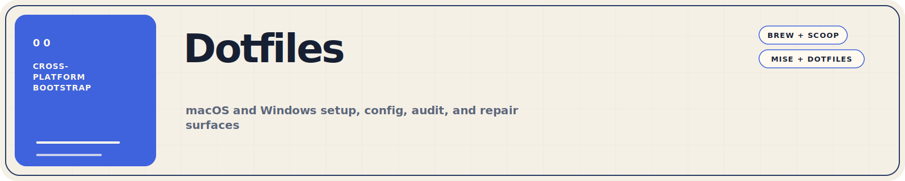
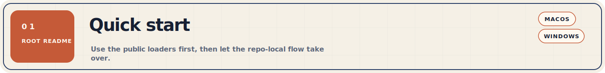
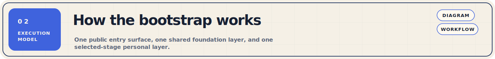
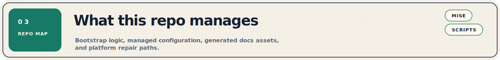
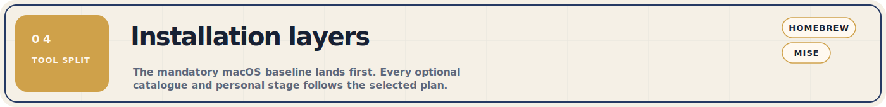
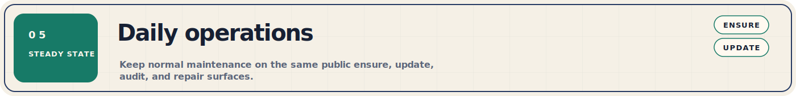
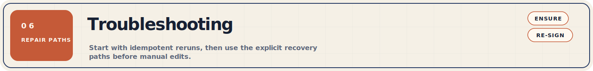
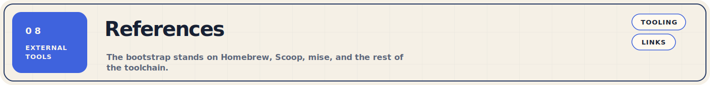

Cross-platform bootstrap and config repository for macOS, Linux, and Windows. The
public loaders take a fresh machine to a working shell, package manager,
runtime manager, and personal config with one command.

Use the linked docs by concern. Go to
[Other/scripts/README.md](Other/scripts/README.md) for the bootstrap, audit,
repair, and validation flows. Managed config mappings live in `mise/config.toml`
and the platform-specific `mise/config.*.toml` files. Use `Other/repository/`
for maintainer-only repository tooling such as README asset generation.

If you clone the repo to work on the docs assets, run `mise install` in the
repo root. The top-level `mise.toml` installs the local Python and D2 toolchain
used to generate the README headers and diagrams.



Start with the public loaders at the repository root. They make sure the repo
exists locally and then hand off to the correct repo-local bootstrap flow.

### macOS

Use the remote one-liner on a brand-new machine, or run the local loader from
an existing checkout.

```bash
# Fresh Mac: one interactive loader owns prerequisites and the selected plan.
curl -fsSL https://raw.githubusercontent.com/benjaminwestern/dotfiles/main/install.sh \
  | bash

# Clone first, then run (bypass any global HTTPS-to-SSH rewrite)
GIT_CONFIG_GLOBAL=/dev/null git clone \
  https://github.com/benjaminwestern/dotfiles ~/.dotfiles
~/.dotfiles/install.sh

# Routine repair or inspection
~/.dotfiles/install.sh ensure
~/.dotfiles/install.sh ensure --dry-run
~/.dotfiles/install.sh update
~/.dotfiles/install.sh audit --general
~/.dotfiles/install.sh audit --profile home
~/.dotfiles/install.sh audit --json
```

The macOS audit can report general current state without profile drift, or
compare that state against explicit `minimal`, `home`, or `work` defaults.
The repair dry-run uses the same checks and lists only changes an `ensure` run
would apply; it does not install, write preferences or state, change services,
or refresh the dotfiles remote.

The fresh-Mac loader is intentionally interactive. Stay in the same terminal
and answer its Gum plan, administrator-password, Apple installer, Homebrew,
mise, third-party trust, and licence prompts. It never requires a separate
prerequisite command. Full Xcode and Mac App Store application installation
remain explicitly user-managed after bootstrap.

The menu explains three editable presets. `home` is Ben's full personal
default; `work` adds Zscaler auto-detection; `minimal` is the neutral adopter
baseline. Every run gets Homebrew, standalone mise, and mise-managed Gum.
Ben's CLI packages, Brewfile apps/fonts, mise tools, and dotfiles are
independent options. Device name, Git author name/email, `~/code`, the optional
Downloads-to-iCloud link, and each macOS preference group are also chosen
independently. The signed-in macOS username is detected and never renamed.
New adopters receive a generated, user-owned `~/.gitconfig`; an existing config
is either replaced by explicit consent or preserved with a local identity
include. Ben's existing tracked symlink remains supported.
Vendor-self-updating casks such as Chrome stay declared for installation and
removal, while their own privileged updater—not Homebrew—owns version changes.

### Linux

```bash
# Fresh Ubuntu, Debian, Mint, Arch, CachyOS, or a supported derivative.
curl -fsSL https://raw.githubusercontent.com/benjaminwestern/dotfiles/main/install.sh \
  | bash

# Fully specified home-profile example for unattended plan selection.
curl -fsSL https://raw.githubusercontent.com/benjaminwestern/dotfiles/main/install.sh \
  | bash -s -- setup --profile home --shell fish --device-name dev-linux \
      --git-name "Ada Lovelace" --git-email ada@example.com --non-interactive

# Audit and idempotent repair after the checkout exists.
~/.dotfiles/install.sh audit --general
~/.dotfiles/install.sh audit --profile home
~/.dotfiles/install.sh audit --expect-state
~/.dotfiles/install.sh ensure --dry-run
```

The loader installs standalone mise and mise-managed Gum itself. System
packages remain declarative through mise's `apt` or `pacman` manager; desktop
applications use mise's system-wide Flatpak manager. `home` and `work` install
Ben's full tool and dotfile catalogues, create `~/code`, enable SSH, configure
Fish and Fisher, and make Chrome/Chromium the browser and PDF handler. On
Linux ARM64, Chromium is used because Google's Flatpak is x86_64-only.

The interactive Gum plan can edit every preset stage. For a non-interactive
run, provide the device name and Git identity on the command line or in the
documented environment variables. Administrator and login-shell prompts stay
visible; secrets are never command-line inputs. See
[`Other/bootstrap/BOOTSTRAP.md`](Other/bootstrap/BOOTSTRAP.md) for the complete
ordering, recovery, and validation contract.

### Windows

Use the `.cmd` loader on a brand-new machine or from an existing checkout.

```powershell
# Remote one-liner
curl.exe -fsSL -o "$env:TEMP\install.cmd" "https://raw.githubusercontent.com/benjaminwestern/dotfiles/main/install.cmd"
& "$env:TEMP\install.cmd" setup --profile work --personal

# Clone first, then run
git clone https://github.com/benjaminwestern/dotfiles $HOME\.dotfiles
& "$HOME\.dotfiles\install.cmd" setup --profile work --personal

# Routine repair or inspection
& "$HOME\.dotfiles\install.cmd" ensure
& "$HOME\.dotfiles\install.cmd" update
& "$HOME\.dotfiles\install.cmd" audit --populate-state
& "$HOME\.dotfiles\Other\scripts\windows\resign-windows.cmd"
```

> **Important**
> On Windows, use `install.cmd` or the repo-local `.cmd` entrypoints on a
> fresh machine. Do not start with the `.ps1` implementation files directly.



The repo keeps one public entry surface, one shared foundation layer, and one
selected-stage personal layer. On macOS, choosing any application, dotfile,
identity, layout, or system stage automatically hands off to that layer. This
keeps the normal path easy to explain and keeps audit, repair, and debugging
behind clear secondary entrypoints.

The diagram below is rendered from
[`assets/bootstrap-flow.d2`](assets/bootstrap-flow.d2).


[`Other/scripts/README.md`](Other/scripts/README.md) documents the detailed
bootstrap, foundation, audit, and repair flows, including the D2 diagrams for
each stage.



This repo separates bootstrap logic, managed configuration, and documentation
assets so each layer stays easy to reason about.

| Area | What it contains | Primary reference |
| --- | --- | --- |
| Repo root groups | Config source directories symlinked into `$HOME` by mise `[dotfiles]` | `mise/config.toml`, `mise/config.*.toml` |
| `Other/scripts/` | Repo-local operator entrypoints split into `macos/`, `linux/`, and `windows/` | [Other/scripts/README.md](Other/scripts/README.md) |
| `Other/repository/` | Maintainer-only repository tooling, including README asset generation | `Other/repository/` |
| `assets/` | D2 sources and rendered SVGs used by the READMEs | `assets/*.d2` |

The SVG header set under `assets/readme/` is generated by
`Other/repository/generate_readme_banners.py` through the repo-local
`mise run readme-assets` task.



The bootstrap keeps immediate tools and long-lived runtimes separate so the
shell comes online early and the heavier language toolchain install can follow
afterward.

- Every macOS profile receives Homebrew, standalone mise, and mise-managed Gum.
- Ben's command-line catalogues are optional mise `[bootstrap.packages]`
  stages: Homebrew on macOS and native `apt`/`pacman` packages on Linux. macOS
  keeps a separate Brewfile apps/fonts catalogue; Linux applications are
  declared as system Flatpaks through mise.
- The repo-local `mise.toml` installs the contributor toolchain for the README
  asset pipeline.
- The managed home config at `mise/config.toml` defines runtimes, tasks, and
  shell aliases. macOS links it at `~/.config/mise/` only when Ben's packages,
  tools, or dotfiles are selected; a neutral adopter run leaves existing mise
  config untouched.
- The personal layer applies only the application, dotfile, identity, layout,
  and system stages selected in the plan. Windows uses its own selective-copy
  profile extras.

Ben's application catalogue lives in `brew/Brewfile`; the macOS CLI catalogue
lives in `mise/config.macos.toml`; managed tools live in `mise/config.toml`.
The separate repo-local `mise.toml` is only the documentation contributor
toolchain.



Once a machine is online, the normal maintenance loop is short and stays on the
same public entrypoints.

```bash
# macOS
./install.sh ensure
./install.sh update
mise doctor
mise up
mise dotfiles status


# Linux
./install.sh ensure
./install.sh ensure --dry-run
./install.sh update
./install.sh audit --expect-state
```

```powershell
# Windows
& "$HOME\.dotfiles\install.cmd" ensure
& "$HOME\.dotfiles\install.cmd" update
& "$HOME\.dotfiles\install.cmd" audit --populate-state
& "$HOME\.dotfiles\Other\scripts\windows\resign-windows.cmd"
```



The bootstrap is idempotent, so the first response to most partial failures is
to re-run the same public entrypoint in `ensure` mode. Use these recovery paths
before you reach for manual edits.

- Re-run `./install.sh ensure` after a partial install and select the same plan;
  each stage converges independently.
- Restart your shell or terminal after shell-default changes.
- If `mise` is on disk but not on `PATH`, re-open the shell first, then run the
  correct `mise activate` command for your shell.
- Manual macOS recovery commands live in
  [Other/scripts/README.md](Other/scripts/README.md) for diagnosis after an
  interrupted installer; they are not prerequisites for the normal loader.
- Use [Other/scripts/README.md](Other/scripts/README.md) for direct wrapper
  help, audit sections, and the detailed platform flow diagrams.
- Use [Other/bootstrap/BOOTSTRAP.md](Other/bootstrap/BOOTSTRAP.md) for the full
  bootstrap ordering gotchas, recovery steps, and validation checklist.
- Use `mise dotfiles status` to inspect symlink state.
- Use `GIT_CONFIG_GLOBAL=/dev/null` before any recovery git operation that must
  use HTTPS while an existing Git config has an active GitHub SSH rewrite.

<a id="manual-installs"></a>
### Manual installs

These tools are not automated by the bootstrap. Install them manually on each
new machine.

<details>
<summary>agy (antigravity-cli)</summary>

Google's official terminal-first CLI for Antigravity agents. Installed via the
official script, which places a binary at `~/.local/bin/agy`.

```bash
curl -fsSL https://antigravity.google/cli/install.sh | bash
```

Also available as a brew cask (`brew install --cask antigravity-cli`) but
the install-script path is preferred to keep it alongside other `~/.local/bin`
tooling.

`~/.local/bin` is already on `PATH` via `config.fish`.

</details>

<details>
<summary>Cardo Update</summary>

Firmware update tool for the Cardo Pactalk motorcycle Bluetooth headset.
Downloaded from the Cardo Systems website at
[https://www.cardosystems.com/update/](https://www.cardosystems.com/update/).

Installs to `/Applications/Cardo Update.app`. Not available as a brew cask.

</details>

<details>
<summary>Parallels Desktop</summary>

Virtualisation for running Windows and Linux VMs on Apple Silicon. Installed
manually from [https://www.parallels.com/](https://www.parallels.com/).

Not available as a brew cask. Keep the license key in `Secrets/`.

</details>



These external tools define the bootstrap surfaces and config managers this
repo builds on.

- [Mise](https://mise.jdx.dev/)
- [Homebrew](https://brew.sh/)
- [Fish Shell](https://fishshell.com/)
- [Neovim](https://neovim.io/)
- [Kickstart.nvim](https://github.com/nvim-lua/kickstart.nvim)

## Licence

This is a personal dotfiles repository. Use it at your own risk. Some
configurations are based on Kickstart.nvim and remain under MIT.
