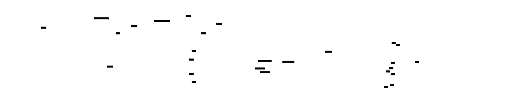
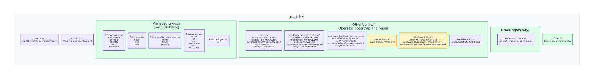

# 🏠 Dotfiles

Cross-platform development environment configuration for macOS, Windows, and
(future) Linux. One command takes a bare machine to a fully functional workspace
in under 15 minutes.

macOS uses [Tuckr](https://github.com/RaphGL/Tuckr) for dotfile symlinking,
while Windows uses native PowerShell plus Scoop and selective config copying.

## 🤔 What This Repo Does

This repository sets up a complete development environment from a fresh
installation to a fully functional workspace. The bootstrap follows a
**two-layer architecture** controlled by feature flags:

- **Foundation layer** installs the core tooling that any engineer needs —
  package manager, CLI utilities, shell activation, gum, mise, seed config, and
  Zscaler trust when detected. It is generic, repeatable, and safe to share
  across teams.
- **Personal layer** applies repository-specific preferences — dotfile
  symlinking, brew bundle, tuckr, shell default, macOS defaults, and Rosetta.
  Triggered by passing `--personal`.

The public entrypoints are `install.sh` for macOS and `install.cmd` for
Windows. Both loaders reuse an existing `~/.dotfiles` checkout when present,
clone it when missing, and fall back to a temporary GitHub archive when `git`
is unavailable.

Windows has an extra repo-local bootstrap layer because first-run execution can
start from Windows PowerShell 5.x and, on some machines, under an effective
`AllSigned` policy. `install.cmd` delegates to
`Other/scripts/bootstrap-windows.cmd`, which creates `LocalScoopSigner`,
signs the local Windows bootstrap scripts, and only then launches the selected
PowerShell target. The Windows foundation and audit scripts both load
`lib/windows-precursor.ps1`, which installs Scoop and PowerShell 7 when needed
and re-runs the same target under `pwsh`.

The current Windows flow also stages Zscaler trust before and after
`mise install`, activates `mise` via `pwsh --shims`, sets Windows Terminal's
default profile to `pwsh`, and ships `Other/scripts/resign-windows.cmd` as a
local repair path for signing drift. See
[Other/scripts/README.md](Other/scripts/README.md) for the full bootstrap
contract, file ownership, and platform-specific flow.

Both layers are fully idempotent, dry-runnable, and gated by feature flags that
resolve through a six-level precedence chain (CLI → env → state file → device
profile → interactive prompt → default).

### 📦 Managed by Homebrew (Brewfile)

**Core infrastructure tools** that need to be available immediately:

- **Shell** — Fish (with Fisher plugin manager)
- **Terminal** — Ghostty, Tmux (with TPM)
- **Editors** — Neovim
- **CLI Tools** — git, lazygit, zoxide, fzf, fd, ripgrep, jq, yq, gh, gitleaks, tree, htop
- **AI Tools** — terraform-mcp-server, mcp-toolbox, gemini-cli, claude-code, codex
- **System** — Aerospace (window manager), borders (gated by `HOMEBREW_GUI`)
- **Dotfile Manager** — tuckr

### 🔧 Managed by Mise (mise.toml)

**Development environments and language runtimes:**

- **Languages** — Go, Node.js, Deno, Bun, Python, Rust, Lua, Terraform
- **Go Tools** — cloud-sql-proxy, air, golangci-lint, gofumpt, swag, sqlc, d2, glow, freeze, vhs
- **Node Tools** — pnpm, dataform-cli, opencode-ai, playwright
- **Python Tools** — uv, pipx, sqlfluff
- **Cargo Tools** — tuckr (self-managing)

### 📝 Configuration Files

- **Shell** — Fish, Zsh, Bash configs with mise, zoxide, and worktrunk activation
- **Editors** — Neovim (based on Kickstart.nvim), Ghostty terminal
- **Tools** — Mise, Tmux, Yazi (file manager), Git, Opencode, Claude Code
- **System** — macOS defaults, Aerospace window manager

## 🚀 Quick Start (New Machine)

### Automated bootstrap (recommended)

The public loaders handle the repo checkout and then delegate into the
repo-local bootstrap layer. Use them for normal setup, ensure, update, and
audit runs.

**macOS**

```bash
# Remote one-liner
curl -fsSL https://raw.githubusercontent.com/benjaminwestern/dotfiles/main/install.sh \
  | bash -s -- setup --shell fish --profile work --personal

# Clone first, then run
git clone https://github.com/benjaminwestern/dotfiles ~/.dotfiles
~/.dotfiles/install.sh setup --shell fish --profile work --personal

# Minimal or repair flows
~/.dotfiles/install.sh setup --shell zsh --profile minimal --non-interactive
~/.dotfiles/install.sh ensure --personal
~/.dotfiles/install.sh update
~/.dotfiles/install.sh audit --json
```

**Windows**

```powershell
# Remote one-liner
curl.exe -fsSL -o "$env:TEMP\install.cmd" "https://raw.githubusercontent.com/benjaminwestern/dotfiles/main/install.cmd"
& "$env:TEMP\install.cmd" setup --profile work --personal

# Clone first, then run
git clone https://github.com/benjaminwestern/dotfiles $HOME\.dotfiles
& "$HOME\.dotfiles\install.cmd" setup --profile work --personal

# Audit and state discovery
& "$HOME\.dotfiles\install.cmd" audit --populate-state

# Local signing repair
& "$HOME\.dotfiles\Other\scripts\resign-windows.cmd"
```

<!-- prettier-ignore -->
> [!IMPORTANT]
> On Windows, use `install.cmd` or the repo-local `.cmd` entrypoints for a
> first run. Do not start with the bootstrap `.ps1` files directly on a fresh
> machine if local scripts may still be unsigned.

### How the bootstrap runs

The bootstrap has a simple public surface and a deeper repo-local execution
layer.

- `install.sh` and `install.cmd` are the only public entrypoints. They resolve
  the working checkout, export the requested mode and flags, and then hand off
  to the platform-specific bootstrap scripts.
- The repo-local scripts use one shared naming convention by purpose.
  macOS exposes `bootstrap-macos.zsh`, `foundation-macos.zsh`,
  `personal-bootstrap-macos.zsh`, and `audit-macos.zsh`. Windows exposes
  `bootstrap-windows.cmd`, `foundation-windows.cmd`, `audit-windows.cmd`,
  `personal-bootstrap-windows.cmd`, and `resign-windows.cmd`. On Windows,
  those `.cmd` entrypoints delegate to the same-named `.ps1`
  implementation files through `bootstrap-windows.cmd`.
- On macOS, `bootstrap-macos.zsh` is the repo-local entrypoint and
  `foundation-macos.zsh` runs the foundation sequence in this order:
  Homebrew, foundation packages, `mise`, managed shell activation, `mise` seed
  config, Zscaler trust, `mise` tools, validation, and optional personal
  bootstrap.
- On Windows, `bootstrap-windows.cmd` is the first repo-local entrypoint. It
  also sits behind `foundation-windows.cmd`, `audit-windows.cmd`,
  `personal-bootstrap-windows.cmd`, and `resign-windows.cmd`. It prepares
  `LocalScoopSigner`, signs the local `.ps1` bootstrap tree, and launches the
  corresponding PowerShell implementation.
- `foundation-windows.ps1` and `audit-windows.ps1` both load
  `lib/windows-precursor.ps1`. If the machine is still in Windows PowerShell
  5.x, the precursor installs Scoop and PowerShell 7, signs the local script
  tree, and re-runs the same target under `pwsh`.
- The Windows foundation sequence then runs Scoop, foundation packages, `mise`,
  managed PowerShell profile repair, current-shell `mise` activation, Windows
  Terminal default profile repair, `mise` seed config, stage-1 Zscaler trust,
  `mise install`, stage-2 Zscaler trust refresh, validation, and optional
  personal bootstrap.

Both platforms start with a pre-flight or current-state read so later steps can
skip healthy state and repair drift instead of reinstalling blindly. Every step
emits a status line and summary. Use `--dry-run` to preview the flow without
making any system changes.

**Total time:** ~10-15 minutes depending on internet connection.

### Manual Setup (Reference Only)

This section is kept for reference. The automated bootstrap above is the
recommended path. If you want to understand or verify each step:

```bash
# 1. Install Xcode Command Line Tools
xcode-select --install

# 2. Install Homebrew
/bin/bash -c "$(curl -fsSL https://raw.githubusercontent.com/Homebrew/install/HEAD/install.sh)"
eval "$(/opt/homebrew/bin/brew shellenv)"

# 3. Clone dotfiles
git clone https://github.com/benjaminwestern/dotfiles ~/.dotfiles
cd ~/.dotfiles

# 4. Convert git remote to SSH (for pushing updates)
git remote set-url origin git@github.com:benjaminwestern/dotfiles.git

# 5. Install all Homebrew packages
brew bundle

# 6. Set Fish as default shell
sudo sh -c 'echo /opt/homebrew/bin/fish >> /etc/shells'
chsh -s /opt/homebrew/bin/fish

# 7. Pre-create directories (prevents tuckr from symlinking entire directories)
mkdir -p ~/.ssh && chmod 700 ~/.ssh
mkdir -p ~/.config

# 8. Symlink dotfiles
tuckr add \*

# 9. Install Mise
curl https://mise.run | sh
export PATH="$HOME/.local/bin:$PATH"
eval "$(mise activate bash)"

# 10. Install all Mise tools
mise install

# 11. Apply macOS defaults
~/.dotfiles/Other/scripts/defaults-macos.sh "my-macbook"

# 12. Install Rosetta (Apple Silicon only)
/usr/sbin/softwareupdate --install-rosetta --agree-to-license
```

## 🏗️ Architecture

The bootstrap architecture below is rendered from
[`assets/bootstrap-architecture.d2`](assets/bootstrap-architecture.d2).



### Personal Phase Comparison

| macOS | Windows |
|-------|---------|
| Dotfiles repo clone/pull | Dotfiles repo clone/pull |
| Full brew bundle | Git config copy |
| Tuckr symlinks | SSH config copy |
| Shell default (fish/zsh) | Mise config copy |
| macOS system defaults | Opencode config copy |
| Rosetta 2 | PowerShell profile extras |

## 📦 What Gets Installed

Feature flags control what gets installed. The `--profile` flag selects a
device preset (work, home, or minimal), and individual flags can override any
preset value. See [Other/scripts/README.md](Other/scripts/README.md) for the
full feature flag catalogue and device profile presets.

### Immediate (Homebrew — ~5 mins)

- Fish shell with all completions
- Git, lazygit
- Modern CLI replacements — zoxide (cd), fzf (find), fd (find), ripgrep (grep)
- Data processing — jq (JSON), yq (YAML)
- AI tools — gemini-cli, claude-code, codex, terraform-mcp-server, mcp-toolbox
- Terminal — tmux, yazi
- GUI apps (gated by `HOMEBREW_GUI`) — ghostty, aerospace, borders, Chrome, VS Code, Docker Desktop, maccy, dbngin
- Security — gitleaks
- Development — neovim

### Development Tools (Mise — ~10 mins)

- All programming languages and their package managers
- Language-specific CLI tools (linters, formatters, etc.)
- Cloud tools (gcloud via mise plugin)
- Note: gemini-cli, codex, and amp are commented out in `config.toml` — now installed via Homebrew casks instead

## 📁 Repository Structure

The repository map below is rendered from
[`assets/repository-structure.d2`](assets/repository-structure.d2).



> 📖 **[Configs/README.md](Configs/README.md)** — What each config group
> contains, how tuckr and copy-based management work across platforms, and how
> to add a new config group.
>
> 📖 **[Other/scripts/README.md](Other/scripts/README.md)** — Full bootstrap
> reference: entrypoints, flags, file ownership, platform flow, state
> handling, audits, and repair paths.

## 🔧 Daily Usage

### After Bootstrap

1. Restart your shell session. On macOS, run `exec fish` or `exec zsh`. On
   Windows, reopen `pwsh` or Windows Terminal.
2. Run `mise doctor` to verify everything is working
3. **Setup Worktrunk** by running `wt config shell install`
4. Some macOS changes require a system restart, and Windows Terminal may need
   to be reopened after the default profile is repaired

### Managing Dotfiles

```bash
# Check symlink status
cd ~/.dotfiles && tuckr status

# Add new config group
tuckr add <group-name>

# Remove config group
tuckr rm <group-name>

# Push changes
git add -A
git commit -m "update: description"
git push
```

### Updating Tools

```bash
# Update Homebrew packages
brew update && brew upgrade

# Update Mise tools
mise up

# Update both (run via mise task)
mise run bundle-update
```

## ⚙️ Customisation

### Environment-Specific Brewfile Apps

The Brewfile supports conditional installs controlled by feature flags:

```bash
# For work machine (installs Edge, Teams)
export HOMEBREW_WORK_APPS=true
brew bundle

# For home machine (installs databases, Mac App Store apps)
export HOMEBREW_HOME_APPS=true
brew bundle
```

When using the bootstrap, these are set automatically based on the `--profile`
flag and the resolved `ENABLE_WORK_APPS` / `ENABLE_HOME_APPS` feature flags.

### Computer Name

Pass a custom name to the macOS defaults script:

```bash
~/.dotfiles/Other/scripts/defaults-macos.sh "work-macbook-pro"
```

This sets the hostname and appears in your shell prompt.

## 💡 Key Design Decisions

1. **Brew vs Mise Split** — Core shell tools (zoxide, fzf) are in the Brewfile
   so they are available before mise runs. Development tools (languages,
   compilers) are in mise for version management.

2. **Tuckr Instead of Stow** — Tuckr is a Rust-based stow replacement with
   better conflict detection and symlink tracking. It symlinks individual files
   when directories exist, preventing "directory absorption" issues.

3. **Pre-Created Directories** — The bootstrap creates `~/.ssh/`,
   `~/.config/`, and `~/.codex/` before running tuckr, ensuring only config
   files are symlinked (not entire directories that might contain other files).

4. **Fish as Default** — While zsh and bash configs are included, Fish is the
   primary shell with full mise and zoxide integration.

5. **Two-Layer Architecture** — The foundation layer is generic and
   customer-safe. The personal layer applies repository-specific preferences.
   This separation means the foundation can be shared across teams while
   personal customisations remain isolated.

6. **Feature Flag Resolution** — Settings are resolved through a six-level
   precedence chain (CLI flag, environment variable, state file, device profile,
   interactive prompt, hard-coded default) so the bootstrap is both flexible and
   repeatable.

7. **Mise Dual-Install Path** — mise is intentionally not bundled with the
   foundation Homebrew/Scoop packages. It can be installed via Homebrew
   (`brew install mise`), Scoop (`scoop install mise`), or the first-party
   shell installer (`curl https://mise.run | sh`). The bootstrap detects which
   method was used and handles updates accordingly. On Windows with AllSigned
   execution policy, Scoop is required so mise's `.ps1` shims can be signed.

## 🛠️ Troubleshooting

### Mise not found after install

```bash
export PATH="$HOME/.local/bin:$PATH"
eval "$(mise activate fish)"  # or zsh/bash
```

### Tuckr symlink issues

```bash
# Check status
tuckr status

# If conflicts, you can see what's not symlinked (shown in red)
# Then manually handle conflicts or use tuckr rm/add
```

### Bootstrap fails mid-way

The bootstrap script is idempotent — you can safely re-run it. It checks for
existing installations and skips completed steps. Use `./install.sh ensure` on
macOS or `install.cmd ensure` on Windows to repair a partially completed setup.

### Windows signing drift after updates

On Windows, Scoop or `mise` updates can leave new `.ps1` wrappers unsigned.
Under `AllSigned`, repair that state with the local re-sign entrypoint:

```powershell
.\Other\scripts\resign-windows.cmd

# Preview only
.\Other\scripts\resign-windows.cmd -DryRun
```

You can also use the repo-local bootstrap wrapper directly:

```powershell
.\Other\scripts\bootstrap-windows.cmd resign
```

Update mode still re-signs automatically when `AllSigned` is active:

```powershell
& "$HOME\.dotfiles\install.cmd" update
```

Under `RemoteSigned`, unsigned local scripts are acceptable and the audit
reports them as informational rather than as a failure.

## 🔄 Manual Recovery (Getting Things Online)

If the automated bootstrap fails or you need to manually set up a machine,
follow these steps in order:

### Step 1: Get Basic Tools

```bash
# Install Xcode Command Line Tools
xcode-select --install

# Install Homebrew
/bin/bash -c "$(curl -fsSL https://raw.githubusercontent.com/Homebrew/install/HEAD/install.sh)"
eval "$(/opt/homebrew/bin/brew shellenv)"

# Install minimal requirements
brew install git fish
```

### Step 2: Get Dotfiles

```bash
# Clone repository
git clone https://github.com/benjaminwestern/dotfiles ~/.dotfiles
cd ~/.dotfiles

# Convert to SSH (for pushing updates later)
git remote set-url origin git@github.com:benjaminwestern/dotfiles.git
```

### Step 3: Install Core Stack

```bash
# Install all Brewfile packages (takes ~5 mins)
brew bundle --file=~/.dotfiles/Configs/brew/Brewfile

# Install Mise
curl https://mise.run | sh
export PATH="$HOME/.local/bin:$PATH"
eval "$(mise activate bash)"
```

### Step 4: Setup Shell and Symlinks

```bash
# Add fish to allowed shells
sudo sh -c 'echo /opt/homebrew/bin/fish >> /etc/shells'
chsh -s /opt/homebrew/bin/fish

# Pre-create directories (prevents tuckr absorption issues)
mkdir -p ~/.ssh && chmod 700 ~/.ssh
mkdir -p ~/.config
mkdir -p ~/.codex

# Symlink all dotfiles
cd ~/.dotfiles && tuckr add \*
```

### Step 5: Install Dev Tools

```bash
# Install all mise-managed tools (takes ~10 mins)
mise install

# Verify installation
mise doctor
tuckr status
```

### Step 6: Finalise

```bash
# Apply macOS defaults
~/.dotfiles/Other/scripts/defaults-macos.sh "$(hostname -s)"

# Install Rosetta (Apple Silicon only)
/usr/sbin/softwareupdate --install-rosetta --agree-to-license

# Restart terminal
exec /opt/homebrew/bin/fish
```

### Verification Checklist

After manual setup, verify everything:

```bash
# Check shell
echo $SHELL  # Should be /opt/homebrew/bin/fish

# Check dotfiles
tuckr status

# Check tools
which zoxide fzf mise
mise list | head -10

# Check configs
ls -la ~/.zshrc ~/.bashrc ~/.gitconfig
```

## ⚠️ Unmanaged Tools

Some tools store configuration in files that also contain runtime state (session
data, metrics, tip history, etc.). These files cannot be cleanly symlinked by
tuckr because every session writes noisy, non-config data to them, polluting
git history with meaningless diffs.

### Claude Code (`~/.claude.json`)

Claude Code stores MCP server definitions in `~/.claude.json`, but this same
file also accumulates runtime state (startup counts, session metrics, feature
flags, OAuth tokens). There is no way to split MCP config into a separate file
— Claude Code only reads MCP servers from `~/.claude.json` or project-scoped
`.mcp.json` files.

**What is managed by tuckr:** `~/.claude/settings.json` (permissions,
environment variables, additional skill directories) is symlinked from
`Configs/claude/.claude/settings.json`.

**What is not managed:** `~/.claude.json` (MCP servers) must be configured
manually or injected via `jq`:

```bash
jq '.mcpServers = {
  "terraform": {
    "type": "stdio",
    "command": "terraform-mcp-server"
  },
  "google-developer-knowledge": {
    "type": "http",
    "url": "https://developerknowledge.googleapis.com/mcp",
    "headers": {
      "X-Goog-Api-Key": "${GOOGLE_MCP_DEV_SERVER_API_KEY}"
    }
  }
}' ~/.claude.json > /tmp/claude.json.tmp && mv /tmp/claude.json.tmp ~/.claude.json
```

The full set of MCP servers (terraform, google-developer-knowledge, atlassian,
firebase, chrome-dev-tools) mirrors the definitions in
`Configs/opencode/.config/opencode/opencode.json` and
`Configs/gemini/settings.json`. If you add a server to one tool, add it to the
others manually.

### Codex CLI (`~/.codex/`)

Codex stores its user configuration in `~/.codex/config.toml`, while runtime
state lives in separate files and directories such as `auth.json`,
`history.jsonl`, `session_index.jsonl`, `logs_*.sqlite`, `models_cache.json`,
and `shell_snapshots/`. That split makes Codex safe to manage with tuckr as a
single file instead of symlinking the entire `~/.codex/` directory.

**What is managed by tuckr:** `~/.codex/config.toml` is symlinked from
`Configs/codex/.codex/config.toml`. It contains the shared model defaults,
Codex-native approval and sandbox settings, trusted project roots, and the MCP
definitions that mirror Claude Code and Opencode as closely as Codex supports.

**What is not managed:** The rest of `~/.codex/` stays machine-local, including
authentication state, history, logs, caches, sessions, shell snapshots, and
any other local-only Codex artifacts.

## 📚 References

- [Tuckr](https://github.com/RaphGL/Tuckr) — Dotfile symlink manager
- [Mise](https://mise.jdx.dev/) — Development environment manager
- [Homebrew](https://brew.sh/) — macOS package manager
- [Fish Shell](https://fishshell.com/) — User-friendly shell
- [Neovim](https://neovim.io/) — Modern Vim editor
- [Kickstart.nvim](https://github.com/nvim-lua/kickstart.nvim) — Neovim configuration base
- [Scoop](https://scoop.sh/) — Windows command-line installer

## 📄 Licence

Personal dotfiles — use at your own risk. Some configurations based on
Kickstart.nvim (MIT).
