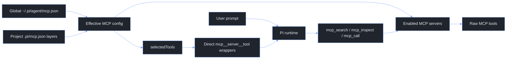

# Pi Agent Extensions

This directory contains the local Pi extensions used to add web search, web fetch, MCP routing, model-scoped system prompts, default-shell command expansion, and small command utilities without forking Pi itself.

The design goal is to stay close to Pi's native extension model. Extensions register Pi tools, slash commands, or lifecycle hooks, while the Pi runtime still owns sessions, model calls, rendering, and tool execution.

## Quick Start

The live extension directory is normally symlinked from the managed dotfiles source:

```sh
~/.pi/agent/extensions -> ~/.dotfiles/pi/extensions
```

After changing these files, refresh the dotfiles symlink:

```sh
cd ~/.dotfiles
mise dotfiles apply
```

Check Pi can still load the extensions:

```sh
PI_CODING_AGENT_DIR=~/.pi/agent pi --offline --list-models
```

The sandbox may warn about a Pi lock file when this check is run from restricted tooling. That warning is not an extension load failure.

## Extension Config Files

Keep Pi's core `settings.json` boring and valid for a no-extension Pi runner. Extension-owned configuration belongs in a sibling `<extension>.json` file instead of custom keys in `settings.json`.

Current extension-owned files:

| File | Owner | Purpose |
| --- | --- | --- |
| `mcp.json` | `mcp.ts` | Global MCP server catalogue and direct-tool selections. |

Global config lives at `~/.pi/agent/<extension>.json`. Project overrides live at `.pi/<extension>.json` and are discovered upward from the current working directory by extensions that support project layers. Merge semantics are: objects deep-merge, arrays and scalars replace, and `null` removes inherited object keys.

Use `settings.json` only for Pi-native settings such as model defaults, transport, packages, resource paths, theme, sessions, retry, and compaction.

## Extension Map

| File | Surface | Purpose |
| --- | --- | --- |
| `mcp.ts` | Tools and `/mcp` command | Routes enabled MCP servers through search, inspect, and call tools. Can expose selected MCP tools directly to the model. |
| `web.ts` | `websearch` and `webfetch` tools | Searches current web content through DuckDuckGo and fetches HTTP(S) URLs as bounded readable text. |
| `prompt-expansion.ts` | Prompt expansion | Adds `$:` autocomplete inside long prompts and expands `$:skill`, `$:prompt`, and `$:tool:<name>` markers before the prompt reaches the LLM. |
| `user-shell.ts` | Shell hooks and tools | Runs user-triggered `!`/`!!` shell commands and inline `!{command}` expansions through the user's default shell, registers a model-facing bash tool only when bash exists, and exposes a Windows PowerShell tool on Windows. |
| `zz-model-system.ts` | `before_agent_start` hook | Appends Markdown from `~/.pi/agent/model-system/` and project `.pi/model-system/` only when the current model matches the file convention. |
| `compact-footer.ts` | Footer renderer and status hooks | Replaces the default footer with a compact 2-row layout: row 1 shows cwd plus live git status and token speed; row 2 shows context usage plus model and thinking level. Owns git polling and streaming token-speed tracking directly. |
| `utils.ts` | Commands | Adds `/clear`, `/lshare`, and `/lshare-list` utility commands. |

## How Pi Prompt Exposure Works

Pi separates registration from exposure.

- A registered tool exists in the runtime and can be activated later.
- An active tool can be sent to the model as a callable tool.
- Active tools with `promptSnippet` and `promptGuidelines` are included in Pi's system prompt section.

This matters for MCP. The MCP extension can register many direct MCP tool wrappers, but only active tools are exposed to the model. The current MCP contract intentionally keeps direct tool exposure narrow.

## Historical: Skills Context Reduction

The removed `skills-context.ts` extension reduced intermediate system prompt size
using Pi's native `before_agent_start` hook. Keep this note so the approach is
quick to recreate if native skill exposure becomes too noisy again.

Pi already discovers skills before each model turn. The hook does not need to
re-scan files. It receives both:

- `event.systemPrompt`: the current generated prompt, including any changes from
  earlier `before_agent_start` hooks.
- `event.systemPromptOptions.skills`: structured skill metadata that Pi loaded
  from the normal skill discovery pipeline.

The old pattern was:

1. Let Pi load skills normally so `/skill:name` and explicit skill loading still
   work.
2. In `before_agent_start`, remove Pi's generated `<available_skills>...</available_skills>`
   block from `event.systemPrompt`.
3. Re-seed the prompt with a smaller custom routing block built from
   `event.systemPromptOptions.skills`.
4. Tell the model that the block is routing metadata only, and that it must read
   the relevant `SKILL.md` before following a skill.
5. Return the modified `systemPrompt` for that turn.

Minimal recreation:

```ts
import type { ExtensionAPI } from "@earendil-works/pi-coding-agent";

function stripNativeSkillsBlock(prompt: string): string {
  return prompt
    .replace(/\n?<available_skills>[\s\S]*?<\/available_skills>\n?/g, "\n")
    .replace(/\n{3,}/g, "\n\n")
    .trim();
}

function xml(value: string): string {
  return value
    .replaceAll("&", "&amp;")
    .replaceAll("<", "&lt;")
    .replaceAll(">", "&gt;")
    .replaceAll('"', "&quot;");
}

export default function skillsContext(pi: ExtensionAPI) {
  pi.on("before_agent_start", (event) => {
    const skills = event.systemPromptOptions.skills ?? [];
    if (!skills.length) return;

    const compactSkills = skills
      .map((skill) => {
        const description = skill.description ?? "";
        return `  <skill name="${xml(skill.name)}">${xml(description)}</skill>`;
      })
      .join("\n");

    const reducedPrompt = stripNativeSkillsBlock(event.systemPrompt);

    return {
      systemPrompt: `${reducedPrompt}

<available_skills compact="true">
${compactSkills}
</available_skills>

Skill metadata is for routing only. When a task matches a skill, read that
skill's SKILL.md before following it. Do not treat this compact list as the full
skill instructions.`,
    };
  });
}
```

To restore it:

This extension has been removed from the codebase. Native Pi skills remain the
default because they are simpler and progressive-disclosure friendly.

## MCP Extension

`mcp.ts` layers MCP configuration using the same convention as Pi project settings:

```text
~/.pi/agent/mcp.json       global toolbox: what exists by default
<ancestor>/.pi/mcp.json    project override layers, applied from outermost to nearest cwd
```

The effective MCP config is a deep merge where nearer project values win. Pi walks upward from the current working directory, loads every `.pi/mcp.json` it finds, applies them from outermost to nearest, and lets the global file keep most MCP servers disabled while a project opts into the small set it needs.

The extension provides two model-facing layers:

- Router tools are available to the model when at least one effective MCP server is enabled.
- Direct MCP tools are exposed only when an effective server lists raw tool names in `selectedTools`.

The router tools are:

| Tool | Purpose |
| --- | --- |
| `mcp_search` | Search enabled MCP servers for relevant tools. |
| `mcp_inspect` | Inspect a single MCP tool schema before calling it. |
| `mcp_call` | Call a tool on an enabled MCP server. |

Disabled servers are not available to the router and should not be launched.

### MCP Quick Start Examples

The convention is: keep a global MCP catalogue, disable most servers globally,
and enable the smallest useful set in each project with `.pi/mcp.json`.

Start inside a project:

```text
/mcp init
/mcp status
```

Then edit `.pi/mcp.json`, run `/mcp reload`, and verify with `/mcp status`.

#### Example 1: enable browser debugging for one repo

Use router-only mode first. The model can search, inspect, and call Chrome
DevTools tools through `mcp_search`, `mcp_inspect`, and `mcp_call`, but no raw
Chrome tools are always exposed in every prompt.

```jsonc
// .pi/mcp.json
{
  "servers": {
    "chrome-dev-tools": {
      "enabled": true
    }
  }
}
```

Useful follow-up commands:

```text
/mcp reload
/mcp search console errors
/mcp tools chrome-dev-tools
/mcp inspect chrome-dev-tools <tool>
/mcp call chrome-dev-tools <tool> { }
```

#### Example 2: Google documentation with direct search tools

Use direct exposure only for tools that are useful in most turns. Raw tool names
come from `/mcp tools <server>`.

```jsonc
// .pi/mcp.json
{
  "servers": {
    "google-developer-knowledge": {
      "enabled": true,
      "selectedTools": [
        "search_documents",
        "get_documents"
      ]
    }
  }
}
```

Effective direct tools exposed to the model:

```text
mcp__google-developer-knowledge__search_documents
mcp__google-developer-knowledge__get_documents
```

Leave `selectedTools` empty or omit it when router-only mode is enough.

#### Example 3: project-specific Google Cloud and Firebase environment

Keep the shared command globally, but remap environment variables per project.
Do not put secrets or credentials directly in JSON; point to host environment
variables with `$env:NAME`.

```jsonc
// .pi/mcp.json
{
  "servers": {
    "gcloud": {
      "enabled": true,
      "env": {
        "GOOGLE_CLOUD_PROJECT": "$env:MY_APP_GCP_PROJECT",
        "GOOGLE_APPLICATION_CREDENTIALS": "$env:MY_APP_GCP_CREDS"
      }
    },
    "firebase": {
      "enabled": true,
      "env": {
        "FIREBASE_PROJECT": "$env:MY_APP_FIREBASE_PROJECT"
      }
    }
  }
}
```

#### Example 4: Atlassian for one work repo

Enable the global Atlassian server only in repos that need Jira or Confluence.
The global config owns the command; the project override owns whether it is on
and which host environment variables feed it.

```jsonc
// .pi/mcp.json
{
  "servers": {
    "atlassian": {
      "enabled": true,
      "env": {
        "JIRA_URL": "$env:WORK_JIRA_URL",
        "JIRA_USERNAME": "$env:WORK_ATLASSIAN_USERNAME",
        "JIRA_API_TOKEN": "$env:WORK_ATLASSIAN_API_TOKEN",
        "CONFLUENCE_URL": "$env:WORK_CONFLUENCE_URL",
        "CONFLUENCE_USERNAME": "$env:WORK_ATLASSIAN_USERNAME",
        "CONFLUENCE_API_TOKEN": "$env:WORK_ATLASSIAN_API_TOKEN"
      }
    }
  }
}
```

#### Example 5: remove inherited config locally

Use `null` to remove an inherited object key from the effective config.

```jsonc
// .pi/mcp.json
{
  "servers": {
    "gcloud": {
      "enabled": true,
      "env": {
        "GOOGLE_APPLICATION_CREDENTIALS": null
      }
    }
  }
}
```

#### Example 6: add a new global server to the catalogue

Add full server definitions globally, usually disabled. Projects then opt in
with a tiny override.

```jsonc
// ~/.pi/agent/mcp.json
{
  "servers": {
    "my-internal-docs": {
      "type": "stdio",
      "description": "Search internal engineering docs through the docs MCP server.",
      "command": "npx",
      "args": ["-y", "@company/docs-mcp"],
      "env": {
        "DOCS_TOKEN": "$env:COMPANY_DOCS_TOKEN"
      },
      "enabled": false
    }
  }
}
```

Then opt in from a project:

```jsonc
// .pi/mcp.json
{
  "servers": {
    "my-internal-docs": {
      "enabled": true
    }
  }
}
```

### MCP Configuration Layers

Global config belongs in `~/.pi/agent/mcp.json`. Project config belongs in `.pi/mcp.json` at any useful project boundary. Pi walks upward from `ctx.cwd` and combines every project MCP file it finds, so monorepo root config and app-specific config can both participate.

Recommended workflow:

1. Define shared MCP servers globally.
2. Set most of them to `enabled: false` globally.
3. Run `/mcp init` at the project boundary that should own local overrides.
4. Add small project overrides to that `.pi/mcp.json`. Nearest overrides win when multiple project files are found.

Example global config:

```jsonc
{
  "servers": {
    "gcloud": {
      "type": "stdio",
      "description": "Run Google Cloud CLI workflows through gcloud MCP.",
      "command": "npx",
      "args": ["-y", "@google-cloud/gcloud-mcp"],
      "env": {
        "GOOGLE_CLOUD_PROJECT": "$env:DEFAULT_GCP_PROJECT",
        "GOOGLE_APPLICATION_CREDENTIALS": "$env:DEFAULT_GCP_CREDS"
      },
      "enabled": false
    }
  }
}
```

Example project override:

```jsonc
{
  "servers": {
    "gcloud": {
      "enabled": true,
      "env": {
        "GOOGLE_CLOUD_PROJECT": "$env:MY_APP_GCP_PROJECT",
        "FIREBASE_PROJECT": "$env:MY_APP_FIREBASE_PROJECT"
      },
      "selectedTools": ["list_projects"]
    }
  }
}
```

Effective result:

- `gcloud` is enabled for this project only.
- `command`, `args`, and unchanged env mappings are inherited from global config.
- `GOOGLE_CLOUD_PROJECT` uses the project-specific host env var.
- `FIREBASE_PROJECT` is added only for this project.
- `selectedTools` exposes `mcp__gcloud__list_projects` directly to the model.

### Merge Rules

| Field shape | Rule |
| --- | --- |
| Objects | Deep merge by key. Project values override global values. |
| `env`, `headers`, `envHeaders` | Deep merge by key, so projects can add or remap MCP process env/header inputs. |
| Scalars | Project value replaces global value. |
| Arrays | Project array replaces global array. This keeps `args`, `selectedTools`, and allow/deny lists predictable. |
| `null` object values | Remove the inherited key from the effective config. |

Unset an inherited env mapping with `null`:

```jsonc
{
  "servers": {
    "gcloud": {
      "env": {
        "GOOGLE_APPLICATION_CREDENTIALS": null
      }
    }
  }
}
```

This changes the MCP spawn configuration only. It does not modify shell environment variables. Values written as `$env:NAME` are resolved from the host environment; other string values are passed through as raw literals.

### Direct Tool Exposure

`selectedTools` is the intended user-facing direct exposure switch.

- If `selectedTools` is missing or empty, the server is router-only. The model can still use `mcp_search`, `mcp_inspect`, and `mcp_call` against that enabled server.
- If `selectedTools` contains tool names, those raw MCP tools are exposed as direct model-callable tools named `mcp__server__tool`.
- Pi discovers schemas and hydrates direct surfaces at startup or reload; `selectedTools` remains the durable user-facing config.

Supported server fields:

| Field | Meaning |
| --- | --- |
| `enabled` | Set to `false` to disable a server. Project config can override global `enabled` in either direction. |
| `type` | `stdio`, `remote`, `http`, `streamable-http`, or `sse`. If omitted, `command` implies `stdio`; otherwise remote HTTP is assumed. |
| `description` | Human and model-facing description used in MCP status and router guidance. |
| `command`, `args`, `cwd`, `env` | Stdio MCP process configuration. Environment values may reference `$env:NAME`. |
| `url`, `baseUrl`, `headers`, `envHeaders`, `apiKeyEnv` | Remote MCP configuration. Header values may reference `$env:NAME`; `envHeaders` maps header names to host env var names. |
| `timeoutMs` | Per-server timeout, clamped by the extension. |
| `enabledTools` / `allowedTools` | Optional allow-list for inventory results from that server. |
| `disabledTools` | Optional deny-list for inventory results from that server. |
| `selectedTools` | Optional direct-exposure list. These raw MCP tool names become `mcp__server__tool` wrappers. |

### MCP Commands

Use these commands inside Pi:

```text
/mcp
/mcp init
/mcp status
/mcp reload
/mcp search [query]
/mcp inspect <server> <tool>
/mcp call <server> <tool> [json args]
/mcp tools <server>
/mcp load <server> <tool>
/mcp unload <mcp__server__tool>
```

`/mcp init` creates `.pi/mcp.json` in the current working directory with an empty override scaffold.

`/mcp` opens the selector UI. It shows the effective merged server list, including global servers and all project layers found while walking upward. If any project `.pi/mcp.json` exists, the selector asks where to persist changes on the first toggle, not on open. The nearest project MCP file is recommended, and the current directory can be selected to create a local override. Choosing a project target writes small local overrides, so a global server can become project-local without copying the whole global definition.

`/mcp status` opens a detailed diagnostic report with all config layer paths, validation diagnostics, server source, env/header presence checks, loaded servers, searchable tools, selected direct tools, direct surfaces, and inventory errors. Long paths are middle-compacted so the head and tail stay visible. Diagnostics also flag direct tool namespace collisions and enabled servers that share the same MCP runtime target, which helps prevent duplicate MCP processes for one service.

`/mcp reload` clears cached inventory, closes MCP clients, reloads global and upward project configuration layers, and re-syncs active Pi tools.

### MCP Data Flow



## Web

`web.ts` registers the `websearch` and `webfetch` model tools.

### Web Search

`websearch` uses DuckDuckGo HTML search directly. It does not call MCP servers; use `mcp_search` for configured MCP-backed search providers.

Parameters:

| Parameter | Meaning |
| --- | --- |
| `query` | Search query. |
| `numResults` | Number of results, default `8`, max `10`. |

### Web Fetch

`webfetch` fetches HTTP(S) URLs and returns bounded text:

| Parameter | Meaning |
| --- | --- |
| `url` | HTTP or HTTPS URL to fetch. |
| `format` | `markdown`, `text`, or `html`. Defaults to markdown for HTML and text for other textual content. |
| `timeoutSeconds` | Request timeout, max `120`. |
| `maxCharacters` | Maximum returned characters. Long output keeps the head and tail and truncates the middle. |

The extension refuses non-HTTP(S) URLs, caps response bytes, strips noisy HTML, and returns a clear message for non-text content.

## Prompt Expansion

`prompt-expansion.ts` adds a middle-of-prompt command lane. Type `$:` anywhere in the editor to open completions for prompt templates, skills, and tools without moving to the start of the prompt. On submit:

- `$:skill:name` or `$:name` for a matching skill expands the skill file inline.
- `$:template` expands a prompt template inline.
- `$:tool:read` activates a registered tool and removes the marker.
- `${:template arg one "arg two"}` supports template arguments using Pi's `$1`, `$@`, `$ARGUMENTS`, and `${@:N[:L]}` substitutions.

Interactive slash commands that only make sense at the editor/UI level are represented as inline intent notes; run those as normal leading `/command` invocations when they need to mutate Pi UI state.

`user-shell.ts` expands inline `!{command}` snippets in user prompts before the prompt reaches the model.

Examples:

```text
What's in !{pwd}?
The current branch is !{git branch --show-current}.
My node version is !{node --version}.
```

The transformed prompt contains the command output in place of each `!{...}` expression. When the UI is available, the extension shows a short expansion summary notification.

Operational boundaries:

- Whole-line `!command` and `!!command` are left alone for Pi's native user-bash handling.
- Inline commands run through the configured user shell with a 30 second timeout.
- Failed commands are replaced with a `[bang error: ...]` marker so the model sees that expansion failed.
- Use this for small, read-style command substitutions. Avoid long-running, destructive, or noisy commands inside prompts.

## Compact Footer

`compact-footer.ts` owns the custom footer and its live status data. Row 1 shows the current directory on the left and git plus token speed on the right. Row 2 shows token/context usage on the left and model plus thinking level on the right.

The git segment refreshes on session start, input, tool completion, turn end, and a short interval. It shows:

```text
git  main ↑1 +2 ~3 ?1
```

Legend: `↑/↓` ahead/behind, `+` staged, `~` unstaged, `?` untracked. Clean repositories show `clean`; non-git directories hide the git segment.

The footer is zero-config. Git status is enabled by default, refreshes every 2.5 seconds, and each git command has a 2 second timeout. Non-git directories simply hide the git segment.

The speed segment estimates output speed from streaming deltas until provider usage arrives; at agent end it leaves the final tokens/second value.

## Model-scoped System Prompts

`zz-model-system.ts` appends model-specific Markdown to the system prompt during `before_agent_start`. It is intentionally named with a `zz-` prefix so it normally runs after other local prompt customisers.

Prompt files live in:

```text
~/.pi/agent/model-system/
<ancestor>/.pi/model-system/
```

Project files are layered from outermost ancestor to nearest project, after global files. For each directory, matching files are appended in this order:

1. `all.md` — every model
2. `<provider>.md` — every model from that provider
3. `<provider>/all.md` — every model from that provider, directory style
4. `<provider>/index.md` — every model from that provider, directory style
5. `<provider>/<model-id>.md` — exact model ID; model ID slashes may be real subdirectories
6. `<provider>/<model-id-with-slashes-as-__>.md` — exact model ID with `/` replaced by `__`
7. `<provider>__<model-id-with-slashes-as-__>.md` — flat exact-model file

Examples:

```text
~/.pi/agent/model-system/openai-codex.md
~/.pi/agent/model-system/openai-codex/all.md
~/.pi/agent/model-system/openai-codex/gpt-5.5.md
~/.pi/agent/model-system/google/gemini-3-pro-preview.md
~/.pi/agent/model-system/fireworks/accounts/fireworks/routers/kimi-k2p6-turbo.md
```

The extension registers no commands. It hot-loads matching files on every user turn, immediately before the provider request is built.

## Utilities

`utils.ts` adds small user utility commands:

```text
/clear
/lshare [filename]
/lshare-list
```

`/clear` is an alias for Pi's `/new` flow. `/lshare` exports the current session to `~/.pi/agent/exported-sessions/` as local HTML and opens it in the browser. `/lshare-list` opens that export directory.

`user-shell.ts` owns shell execution behaviour:

- User-triggered shell commands (`!`/`!!`) and inline `!{command}` snippets run through the user's default shell, detected from `PI_USER_SHELL`, `PI_USER_BASH_SHELL`, or `SHELL`.
- Supported shells are `fish`, `zsh`, `bash`, `pwsh`, and plain `sh`.
- Before user commands run, the extension refreshes mise with the shell-compatible form (`mise env -s fish | source`, `eval "$(mise env -s zsh)"`, `mise env -s pwsh | Invoke-Expression`, etc.).
- If `bash` exists, it registers the model-facing bash tool with `mise env -s bash` refresh before each command. If bash is missing, it does not register a misleading bash tool.
- On Windows, it always registers a `pwsh` model tool, which prefers PowerShell 7 (`pwsh.exe`) and falls back to Windows PowerShell 5.1 (`powershell.exe`). PowerShell commands refresh mise with `mise env -s pwsh` when mise is installed.
- If both bash and `pwsh` are available on Windows, prompt guidance prefers bash for normal cross-platform shell work and treats `pwsh` as a Windows-native escape hatch. If bash is missing, `pwsh` becomes the recommended model-facing shell tool.
- Before agent start, it appends short system prompt notes for the shell paths that are actually active.

## Operational Notes

Keep extension behaviour boring and explicit.

- Prefer slash commands for user-driven actions.
- Prefer Pi model tools only when the model should call the capability autonomously.
- Keep MCP direct tool exposure small by using `selectedTools` only for tools that deserve to appear in every turn's model tool surface.
- Prefer global server definitions plus small project overrides over copying complete MCP server blocks into each repository.
- Do not add extension-only keys to `settings.json`; use `<extension>.json` so `pi --no-extensions` can still consume core settings cleanly.
- Use `/mcp status` before debugging model behaviour. It shows config layers, server source, enabled state, inventory failures, and exposed direct tools.
- Use `PI_CODING_AGENT_DIR=~/.pi/agent pi --offline --list-models` after editing extensions to catch load-time failures quickly.
